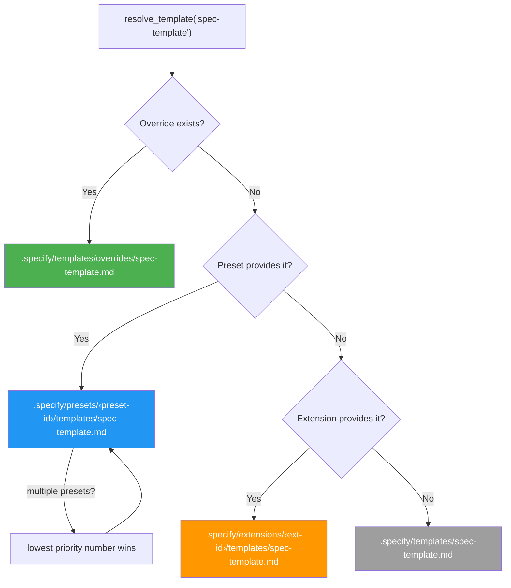
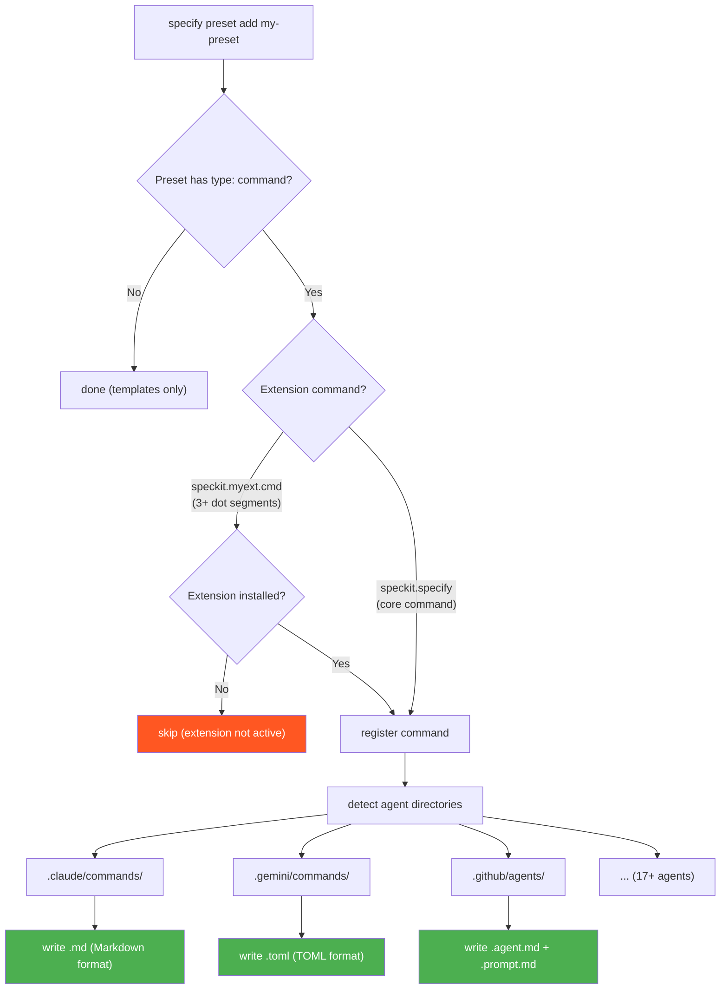
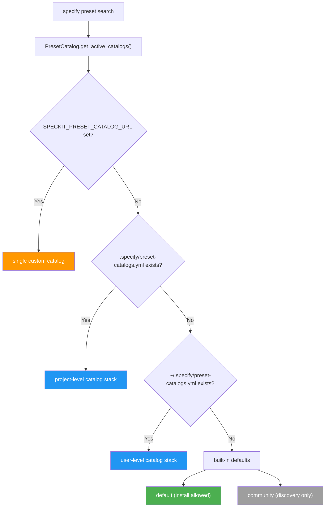

# SDD Kit.md

~~~~~
---
url: https://github.blog/ai-and-ml/generative-ai/spec-driven-development-with-ai-get-started-with-a-new-open-source-toolkit/
date: September 2, 2025
author: Den Delimarsky
---

# Spec-driven development with AI: Get started with a new open source toolkit

As coding agents have grown more powerful, a pattern has emerged: you describe your goal, get a block of code back, and often… it looks right, but doesn’t quite work. This “vibe-coding” approach can be great for quick prototypes, but less reliable when building serious, mission-critical applications or working with existing codebases.

Sometimes the code doesn’t compile. Sometimes it solves part of the problem but misses the actual intent. The stack or architecture may not be what you’d choose.

The issue isn’t the coding agent’s coding ability, but our approach. We treat coding agents like search engines when we should be treating them more like literal-minded pair programmers. They excel at pattern recognition but still need unambiguous instructions.

That’s why we’re rethinking specifications — not as static documents, but as living, executable artifacts that evolve with the project. Specs become the shared source of truth. When something doesn’t make sense, you go back to the spec; when a project grows complex, you refine it; when tasks feel too large, you break them down.

Spec Kit, our new open sourced toolkit for spec-driven development, provides a structured process to bring spec-driven development to your coding agent workflows with tools including GitHub Copilot, Claude Code, and Gemini CLI.

> [!NOTE] 💡 **What is spec-driven development?**
> 
> Instead of coding first and writing docs later, in spec-driven development, you start with a (you guessed it) spec. This is a contract for how your code should behave and becomes the source of truth your tools and AI agents use to generate, test, and validate code. The result is less guesswork, fewer surprises, and higher-quality code.

## What is the spec-driven process with Spec Kit?

[Spec Kit](https://github.com/github/spec-kit) makes your specification the center of your engineering process. Instead of writing a spec and setting it aside, the spec drives the implementation, checklists, and task breakdowns.  Your primary role is to steer; the coding agent does the bulk of the writing.

It works in four phases with clear checkpoints. But here’s the key insight: each phase has a specific job, and you don’t move to the next one until the current task is fully validated. 

Here’s how the process breaks down:

1. **Specify**: You provide a high-level description of what you’re building and why, and the coding agent generates a detailed specification. This isn’t about technical stacks or app design. It’s about user journeys, experiences, and what success looks like. Who will use this? What problem does it solve for them? How will they interact with it? What outcomes matter? Think of it as mapping the user experience you want to create, and letting the coding agent flesh out the details. Crucially, this becomes a living artifact that evolves as you learn more about your users and their needs.

2. **Plan**: Now you get technical. In this phase, you provide the coding agent with your desired stack, architecture, and constraints, and the coding agent generates a comprehensive technical plan. If your company standardizes on certain technologies, this is where you say so. If you’re integrating with legacy systems, have compliance requirements, or have performance targets you need to hit … all of that goes here. You can also ask for multiple plan variations to compare and contrast different approaches. If you make your internal docs available to the coding agent, it can integrate your architectural patterns and standards directly into the plan. After all, a coding agent needs to understand the rules of the game before it starts playing.

3. **Tasks**: The coding agent takes the spec and the plan and breaks them down into actual work. It generates small, reviewable chunks that each solve a specific piece of the puzzle. Each task should be something you can implement and test in isolation; this is crucial because it gives the coding agent a way to validate its work and stay on track, almost like a test-driven development process for your AI agent. Instead of “build authentication,” you get concrete tasks like “create a user registration endpoint that validates email format.”

4. **Implement**: Your coding agent tackles the tasks one by one (or in parallel, where applicable). But here’s what’s different: instead of reviewing thousand-line code dumps, you, the developer, review focused changes that solve specific problems. The coding agent knows what it’s supposed to build because the specification told it. It knows how to build it because the plan told it. And it knows exactly what to work on because the task told it.

Crucially, your role isn’t just to steer. It’s to verify. At each phase, you reflect and refine. Does the spec capture what you actually want to build? Does the plan account for real-world constraints? Are there omissions or edge cases the AI missed? The process builds in explicit checkpoints for you to critique what’s been generated, spot gaps, and course correct before moving forward. The AI generates the artifacts; you ensure they’re right.

## How to use Spec Kit in your agentic workflows

Spec Kit works with coding agents like GitHub Copilot, Claude Code, and Gemini CLI. The key is to use a series of simple commands to steer the coding agent, which then does the hard work of generating the artifacts for you.

Setting it up is straightforward. First, install the `specify` command-line tool. This tool initializes your project and sets up the necessary structure.

```plaintext
uvx --from git+https://github.com/github/spec-kit.git specify init <PROJECT_NAME>
```

Once your project is initialized, use the `/specify` command to provide a high-level prompt, and the coding agent generates the full spec. Focus on the “what” and “why” of your project, not the technical details.

Next, use the `/plan` command to steer the coding agent to create a technical implementation plan. Here, you provide the high-level technical direction, and the coding agent will generate a detailed plan that respects your architecture and constraints.

Finally, use the `/tasks` command to make the coding agent break down the specification and plan into a list of actionable tasks. Your coding agent will then use this list to implement the project requirements.

This structured workflow turns vague prompts into clear intent that coding agents can reliably execute.

But why does this approach succeed where vague prompting fails?

## Why this works

This approach succeeds where “just prompting the AI” fails due to a basic truth about how language models work: they’re exceptional at pattern completion, but not at mind reading. A vague prompt like “add photo sharing to my app” forces the model to guess at  potentially thousands of unstated requirements. The AI will make reasonable assumptions, and some will be wrong (and you often won’t discover which aren’t quite right until deep into your implementation).

By contrast, providing a clear specification up front, along with a technical plan and focused tasks, gives the coding agent more clarity, improving its overall efficacy. Instead of guessing at your needs, it knows what to build, how to build it, and in what sequence.

This is why the approach works across different technology stacks. Whether you’re building in Python, JavaScript, or Go, the fundamental challenge is the same: translating your intent into working code. The specification captures the intent clearly, the plan translates it into technical decisions, the tasks break it into implementable pieces, and your AI coding agent handles the actual coding.

For larger organizations, this solves another critical problem: Where do you put all your requirements around security policies, compliance rules, design system constraints, and integration needs? Often, these things either live in someone’s head, are buried in a wiki that nobody reads, or are scattered across Slack conversations that are impossible to find later.

With Spec Kit, all of that stuff goes in the specification and the plan, where the AI can actually use it. Your security requirements aren’t afterthoughts; they’re baked into the spec from day one. And your design system isn’t something you bolt on later. It’s part of the technical plan that guides implementation.

The iterative nature of this approach is what gives it power. Where traditional development locks you into early decisions, spec-driven makes changing course simple: just update the spec, regenerate the plan, and let the coding agent handle the rest.

## 3 places this approach works really well

Spec-driven development is especially useful in three scenarios:

1. **Greenfield (zero-to-one)**: When you’re starting a new project, it’s tempting to just start coding. But a small amount of upfront work to create a spec and a plan ensures the AI builds what you actually intend, not just a generic solution based on common patterns.
2. **Feature work in existing systems (N-to-N+1)**: This is where spec-driven development is most powerful. Adding features to a complex, existing codebase is hard. By creating a spec for the new feature, you force clarity on how it should interact with the existing system. The plan then encodes the architectural constraints, ensuring the new code feels native to the project instead of a bolted-on addition. This makes ongoing development faster and safer. To make this work, advanced context engineering practices might be needed — we’ll cover those separately.
3. **Legacy modernization**: When you need to rebuild a legacy system, the original intent is often lost to time. With the spec-driven development process offered in Spec Kit, you can capture the essential business logic in a modern spec, design a fresh architecture in the plan, and then let the AI rebuild the system from the ground up, without carrying forward inherited technical debt.

The core benefit is separating the stable “what” from the flexible “how,” enabling iterative development without expensive rewrites. This allows you to build multiple versions and experiment quickly.

## Where we’re headed

We’re moving from “code is the source of truth” to “intent is the source of truth.” With AI the specification becomes the source of truth and determines what gets built. 

This isn’t because documentation became more important. It’s because AI makes specifications executable. When your spec turns into working code automatically, it determines what gets built.

Spec Kit is our experiment in making that transition real. We open sourced it because this approach is bigger than any one tool or company. The real innovation is the process. There is more here that we’ll cover soon, specifically around how you can combine spec-driven development practices with context engineering to build more advanced capabilities in your AI toolkit.

And we’d love to hear how it works for you and what we can improve! If you’re building with spec-driven patterns, [share your experience](https://github.com/github/spec-kit/issues) with us. We’re particularly curious about:

- **Making the workflow more engaging and usable**: Reading walls of text can be tedious. How do we make this process genuinely enjoyable?
- **Possible VS Code integrations**: We’re exploring ways to bring this workflow directly into VS Code. What would feel most natural to you?
- **Comparing and diffing multiple implementations**: Iterating and diffing between implementations opens up creative possibilities. What would be most valuable here?
- **Managing specs and tasks at scale in your organization**: Managing lots of Markdown files can get overwhelming. What would help you stay organized and focused?
~~~~~

# spec-kit/README.md

~~~~~
---
url: https://github.com/github/spec-kit/blob/main/README.md
---
<div align="center">
    
    <h1>🌱 Spec Kit</h1>
    <h3><em>Build high-quality software faster.</em></h3>
</div>

<p align="center">
    <strong>An open source toolkit that allows you to focus on product scenarios and predictable outcomes instead of vibe coding every piece from scratch.</strong>
</p>

<p align="center">
    <a href="https://github.com/github/spec-kit/actions/workflows/release.yml"></a>
    <a href="https://github.com/github/spec-kit/stargazers"></a>
    <a href="https://github.com/github/spec-kit/blob/main/LICENSE"></a>
    <a href="https://github.github.io/spec-kit/"></a>
</p>

---

## Table of Contents

- [🤔 What is Spec-Driven Development?](#-what-is-spec-driven-development)
- [⚡ Get Started](#-get-started)
- [📽️ Video Overview](#️-video-overview)
- [🧩 Community Extensions](#-community-extensions)
- [🎨 Community Presets](#-community-presets)
- [🚶 Community Walkthroughs](#-community-walkthroughs)
- [🛠️ Community Friends](#️-community-friends)
- [🤖 Supported AI Agents](#-supported-ai-agents)
- [🔧 Specify CLI Reference](#-specify-cli-reference)
- [🧩 Making Spec Kit Your Own: Extensions & Presets](#-making-spec-kit-your-own-extensions--presets)
- [📚 Core Philosophy](#-core-philosophy)
- [🌟 Development Phases](#-development-phases)
- [🎯 Experimental Goals](#-experimental-goals)
- [🔧 Prerequisites](#-prerequisites)
- [📖 Learn More](#-learn-more)
- [📋 Detailed Process](#-detailed-process)
- [🔍 Troubleshooting](#-troubleshooting)
- [💬 Support](#-support)
- [🙏 Acknowledgements](#-acknowledgements)
- [📄 License](#-license)

## 🤔 What is Spec-Driven Development?

Spec-Driven Development **flips the script** on traditional software development. For decades, code has been king — specifications were just scaffolding we built and discarded once the "real work" of coding began. Spec-Driven Development changes this: **specifications become executable**, directly generating working implementations rather than just guiding them.

## ⚡ Get Started

### 1. Install Specify CLI

Choose your preferred installation method:

#### Option 1: Persistent Installation (Recommended)

Install once and use everywhere. Pin a specific release tag for stability (check [Releases](https://github.com/github/spec-kit/releases) for the latest):

```bash
# Install a specific stable release (recommended — replace vX.Y.Z with the latest tag)
uv tool install specify-cli --from git+https://github.com/github/spec-kit.git@vX.Y.Z

# Or install latest from main (may include unreleased changes)
uv tool install specify-cli --from git+https://github.com/github/spec-kit.git
```

Then use the tool directly:

```bash
# Create new project
specify init <PROJECT_NAME>

# Or initialize in existing project
specify init . --ai claude
# or
specify init --here --ai claude

# Check installed tools
specify check
```

To upgrade Specify, see the [Upgrade Guide](./docs/upgrade.md) for detailed instructions. Quick upgrade:

```bash
uv tool install specify-cli --force --from git+https://github.com/github/spec-kit.git@vX.Y.Z
```

#### Option 2: One-time Usage

Run directly without installing:

```bash
# Create new project (pinned to a stable release — replace vX.Y.Z with the latest tag)
uvx --from git+https://github.com/github/spec-kit.git@vX.Y.Z specify init <PROJECT_NAME>

# Or initialize in existing project
uvx --from git+https://github.com/github/spec-kit.git@vX.Y.Z specify init . --ai claude
# or
uvx --from git+https://github.com/github/spec-kit.git@vX.Y.Z specify init --here --ai claude
```

**Benefits of persistent installation:**

- Tool stays installed and available in PATH
- No need to create shell aliases
- Better tool management with `uv tool list`, `uv tool upgrade`, `uv tool uninstall`
- Cleaner shell configuration

#### Option 3: Enterprise / Air-Gapped Installation

If your environment blocks access to PyPI or GitHub, see the [Enterprise / Air-Gapped Installation](./docs/installation.md#enterprise--air-gapped-installation) guide for step-by-step instructions on using `pip download` to create portable, OS-specific wheel bundles on a connected machine.

### 2. Establish project principles

Launch your AI assistant in the project directory. Most agents expose spec-kit as `/speckit.*` slash commands; Codex CLI in skills mode uses `$speckit-*` instead.

Use the **`/speckit.constitution`** command to create your project's governing principles and development guidelines that will guide all subsequent development.

```bash
/speckit.constitution Create principles focused on code quality, testing standards, user experience consistency, and performance requirements
```

### 3. Create the spec

Use the **`/speckit.specify`** command to describe what you want to build. Focus on the **what** and **why**, not the tech stack.

```bash
/speckit.specify Build an application that can help me organize my photos in separate photo albums. Albums are grouped by date and can be re-organized by dragging and dropping on the main page. Albums are never in other nested albums. Within each album, photos are previewed in a tile-like interface.
```

### 4. Create a technical implementation plan

Use the **`/speckit.plan`** command to provide your tech stack and architecture choices.

```bash
/speckit.plan The application uses Vite with minimal number of libraries. Use vanilla HTML, CSS, and JavaScript as much as possible. Images are not uploaded anywhere and metadata is stored in a local SQLite database.
```

### 5. Break down into tasks

Use **`/speckit.tasks`** to create an actionable task list from your implementation plan.

```bash
/speckit.tasks
```

### 6. Execute implementation

Use **`/speckit.implement`** to execute all tasks and build your feature according to the plan.

```bash
/speckit.implement
```

For detailed step-by-step instructions, see our [comprehensive guide](./spec-driven.md).

## 📽️ Video Overview

Want to see Spec Kit in action? Watch our [video overview](https://www.youtube.com/watch?v=a9eR1xsfvHg&pp=0gcJCckJAYcqIYzv)!

[](https://www.youtube.com/watch?v=a9eR1xsfvHg&pp=0gcJCckJAYcqIYzv)

## 🧩 Community Extensions

The following community-contributed extensions are available in [`catalog.community.json`](extensions/catalog.community.json):

**Categories:**

- `docs` — reads, validates, or generates spec artifacts
- `code` — reviews, validates, or modifies source code
- `process` — orchestrates workflow across phases
- `integration` — syncs with external platforms
- `visibility` — reports on project health or progress

**Effect:**

- `Read-only` — produces reports without modifying files
- `Read+Write` — modifies files, creates artifacts, or updates specs

| Extension | Purpose | Category | Effect | URL |
|-----------|---------|----------|--------|-----|
| AI-Driven Engineering (AIDE) | A structured 7-step workflow for building new projects from scratch with AI assistants — from vision through implementation | `process` | Read+Write | [aide](https://github.com/mnriem/spec-kit-extensions/tree/main/aide) |
| Archive Extension | Archive merged features into main project memory. | `docs` | Read+Write | [spec-kit-archive](https://github.com/stn1slv/spec-kit-archive) |
| Azure DevOps Integration | Sync user stories and tasks to Azure DevOps work items using OAuth authentication | `integration` | Read+Write | [spec-kit-azure-devops](https://github.com/pragya247/spec-kit-azure-devops) |
| Checkpoint Extension | Commit the changes made during the middle of the implementation, so you don't end up with just one very large commit at the end | `code` | Read+Write | [spec-kit-checkpoint](https://github.com/aaronrsun/spec-kit-checkpoint) |
| Cleanup Extension | Post-implementation quality gate that reviews changes, fixes small issues (scout rule), creates tasks for medium issues, and generates analysis for large issues | `code` | Read+Write | [spec-kit-cleanup](https://github.com/dsrednicki/spec-kit-cleanup) |
| Cognitive Squad | Multi-agent cognitive system with Triadic Model: understanding, internalization, application — with quality gates, backpropagation verification, and self-healing | `docs` | Read+Write | [cognitive-squad](https://github.com/Testimonial/cognitive-squad) |
| Conduct Extension | Orchestrates spec-kit phases via sub-agent delegation to reduce context pollution. | `process` | Read+Write | [spec-kit-conduct-ext](https://github.com/twbrandon7/spec-kit-conduct-ext) |
| DocGuard — CDD Enforcement | Canonical-Driven Development enforcement. Validates, scores, and traces project documentation with automated checks, AI-driven workflows, and spec-kit hooks. Zero NPM runtime dependencies. | `docs` | Read+Write | [spec-kit-docguard](https://github.com/raccioly/docguard) |
| Extensify | Create and validate extensions and extension catalogs | `process` | Read+Write | [extensify](https://github.com/mnriem/spec-kit-extensions/tree/main/extensify) |
| Fleet Orchestrator | Orchestrate a full feature lifecycle with human-in-the-loop gates across all SpecKit phases | `process` | Read+Write | [spec-kit-fleet](https://github.com/sharathsatish/spec-kit-fleet) |
| Iterate | Iterate on spec documents with a two-phase define-and-apply workflow — refine specs mid-implementation and go straight back to building | `docs` | Read+Write | [spec-kit-iterate](https://github.com/imviancagrace/spec-kit-iterate) |
| Jira Integration | Create Jira Epics, Stories, and Issues from spec-kit specifications and task breakdowns with configurable hierarchy and custom field support | `integration` | Read+Write | [spec-kit-jira](https://github.com/mbachorik/spec-kit-jira) |
| Learning Extension | Generate educational guides from implementations and enhance clarifications with mentoring context | `docs` | Read+Write | [spec-kit-learn](https://github.com/imviancagrace/spec-kit-learn) |
| MAQA — Multi-Agent & Quality Assurance | Coordinator → feature → QA agent workflow with parallel worktree-based implementation. Language-agnostic. Auto-detects installed board plugins. Optional CI gate. | `process` | Read+Write | [spec-kit-maqa-ext](https://github.com/GenieRobot/spec-kit-maqa-ext) |
| MAQA Azure DevOps Integration | Azure DevOps Boards integration for MAQA — syncs User Stories and Task children as features progress | `integration` | Read+Write | [spec-kit-maqa-azure-devops](https://github.com/GenieRobot/spec-kit-maqa-azure-devops) |
| MAQA CI/CD Gate | Auto-detects GitHub Actions, CircleCI, GitLab CI, and Bitbucket Pipelines. Blocks QA handoff until pipeline is green. | `process` | Read+Write | [spec-kit-maqa-ci](https://github.com/GenieRobot/spec-kit-maqa-ci) |
| MAQA GitHub Projects Integration | GitHub Projects v2 integration for MAQA — syncs draft issues and Status columns as features progress | `integration` | Read+Write | [spec-kit-maqa-github-projects](https://github.com/GenieRobot/spec-kit-maqa-github-projects) |
| MAQA Jira Integration | Jira integration for MAQA — syncs Stories and Subtasks as features progress through the board | `integration` | Read+Write | [spec-kit-maqa-jira](https://github.com/GenieRobot/spec-kit-maqa-jira) |
| MAQA Linear Integration | Linear integration for MAQA — syncs issues and sub-issues across workflow states as features progress | `integration` | Read+Write | [spec-kit-maqa-linear](https://github.com/GenieRobot/spec-kit-maqa-linear) |
| MAQA Trello Integration | Trello board integration for MAQA — populates board from specs, moves cards, real-time checklist ticking | `integration` | Read+Write | [spec-kit-maqa-trello](https://github.com/GenieRobot/spec-kit-maqa-trello) |
| Onboard | Contextual onboarding and progressive growth for developers new to spec-kit projects. Explains specs, maps dependencies, validates understanding, and guides the next step | `process` | Read+Write | [spec-kit-onboard](https://github.com/dmux/spec-kit-onboard) |
| Plan Review Gate | Require spec.md and plan.md to be merged via MR/PR before allowing task generation | `process` | Read-only | [spec-kit-plan-review-gate](https://github.com/luno/spec-kit-plan-review-gate) |
| Presetify | Create and validate presets and preset catalogs | `process` | Read+Write | [presetify](https://github.com/mnriem/spec-kit-extensions/tree/main/presetify) |
| Project Health Check | Diagnose a Spec Kit project and report health issues across structure, agents, features, scripts, extensions, and git | `visibility` | Read-only | [spec-kit-doctor](https://github.com/KhawarHabibKhan/spec-kit-doctor) |
| Project Status | Show current SDD workflow progress — active feature, artifact status, task completion, workflow phase, and extensions summary | `visibility` | Read-only | [spec-kit-status](https://github.com/KhawarHabibKhan/spec-kit-status) |
| Ralph Loop | Autonomous implementation loop using AI agent CLI | `code` | Read+Write | [spec-kit-ralph](https://github.com/Rubiss/spec-kit-ralph) |
| Reconcile Extension | Reconcile implementation drift by surgically updating feature artifacts. | `docs` | Read+Write | [spec-kit-reconcile](https://github.com/stn1slv/spec-kit-reconcile) |
| Retrospective Extension | Post-implementation retrospective with spec adherence scoring, drift analysis, and human-gated spec updates | `docs` | Read+Write | [spec-kit-retrospective](https://github.com/emi-dm/spec-kit-retrospective) |
| Review Extension | Post-implementation comprehensive code review with specialized agents for code quality, comments, tests, error handling, type design, and simplification | `code` | Read-only | [spec-kit-review](https://github.com/ismaelJimenez/spec-kit-review) |
| SDD Utilities | Resume interrupted workflows, validate project health, and verify spec-to-task traceability | `process` | Read+Write | [speckit-utils](https://github.com/mvanhorn/speckit-utils) |
| Spec Sync | Detect and resolve drift between specs and implementation. AI-assisted resolution with human approval | `docs` | Read+Write | [spec-kit-sync](https://github.com/bgervin/spec-kit-sync) |
| Understanding | Automated requirements quality analysis — 31 deterministic metrics against IEEE/ISO standards with experimental energy-based ambiguity detection | `docs` | Read-only | [understanding](https://github.com/Testimonial/understanding) |
| V-Model Extension Pack | Enforces V-Model paired generation of development specs and test specs with full traceability | `docs` | Read+Write | [spec-kit-v-model](https://github.com/leocamello/spec-kit-v-model) |
| Verify Extension | Post-implementation quality gate that validates implemented code against specification artifacts | `code` | Read-only | [spec-kit-verify](https://github.com/ismaelJimenez/spec-kit-verify) |
| Verify Tasks Extension | Detect phantom completions: tasks marked [X] in tasks.md with no real implementation | `code` | Read-only | [spec-kit-verify-tasks](https://github.com/datastone-inc/spec-kit-verify-tasks) |

To submit your own extension, see the [Extension Publishing Guide](extensions/EXTENSION-PUBLISHING-GUIDE.md).

## 🎨 Community Presets

The following community-contributed presets customize how Spec Kit behaves — overriding templates, commands, and terminology without changing any tooling. Presets are available in [`catalog.community.json`](presets/catalog.community.json):

| Preset | Purpose | Provides | Requires | URL |
|--------|---------|----------|----------|-----|
| AIDE In-Place Migration | Adapts the AIDE extension workflow for in-place technology migrations (X → Y pattern) — adds migration objectives, verification gates, knowledge documents, and behavioral equivalence criteria | 2 templates, 8 commands | AIDE extension | [spec-kit-presets](https://github.com/mnriem/spec-kit-presets) |
| Pirate Speak (Full) | Transforms all Spec Kit output into pirate speak — specs become "Voyage Manifests", plans become "Battle Plans", tasks become "Crew Assignments" | 6 templates, 9 commands | — | [spec-kit-presets](https://github.com/mnriem/spec-kit-presets) |

To build and publish your own preset, see the [Presets Publishing Guide](presets/PUBLISHING.md).

## 🚶 Community Walkthroughs

See Spec-Driven Development in action across different scenarios with these community-contributed walkthroughs:

- **[Greenfield .NET CLI tool](https://github.com/mnriem/spec-kit-dotnet-cli-demo)** — Builds a Timezone Utility as a .NET single-binary CLI tool from a blank directory, covering the full spec-kit workflow: constitution, specify, plan, tasks, and multi-pass implement using GitHub Copilot agents.

- **[Greenfield Spring Boot + React platform](https://github.com/mnriem/spec-kit-spring-react-demo)** — Builds an LLM performance analytics platform (REST API, graphs, iteration tracking) from scratch using Spring Boot, embedded React, PostgreSQL, and Docker Compose, with a clarify step and a cross-artifact consistency analysis pass included.

- **[Brownfield ASP.NET CMS extension](https://github.com/mnriem/spec-kit-aspnet-brownfield-demo)** — Extends an existing open-source .NET CMS (CarrotCakeCMS-Core, ~307,000 lines of C#, Razor, SQL, JavaScript, and config files) with two new features — cross-platform Docker Compose infrastructure and a token-authenticated headless REST API — demonstrating how spec-kit fits into existing codebases without prior specs or a constitution.

- **[Brownfield Java runtime extension](https://github.com/mnriem/spec-kit-java-brownfield-demo)** — Extends an existing open-source Jakarta EE runtime (Piranha, ~420,000 lines of Java, XML, JSP, HTML, and config files across 180 Maven modules) with a password-protected Server Admin Console, demonstrating spec-kit on a large multi-module Java project with no prior specs or constitution.

- **[Brownfield Go / React dashboard demo](https://github.com/mnriem/spec-kit-go-brownfield-demo)** — Demonstrates spec-kit driven entirely from the **terminal using GitHub Copilot CLI**. Extends NASA's open-source Hermes ground support system (Go) with a lightweight React-based web telemetry dashboard, showing that the full constitution → specify → plan → tasks → implement workflow works from the terminal.

- **[Greenfield Spring Boot MVC with a custom preset](https://github.com/mnriem/spec-kit-pirate-speak-preset-demo)** — Builds a Spring Boot MVC application from scratch using a custom pirate-speak preset, demonstrating how presets can reshape the entire spec-kit experience: specifications become "Voyage Manifests," plans become "Battle Plans," and tasks become "Crew Assignments" — all generated in full pirate vernacular without changing any tooling.

- **[Greenfield Spring Boot + React with a custom extension](https://github.com/mnriem/spec-kit-aide-extension-demo)** — Walks through the **AIDE extension**, a community extension that adds an alternative spec-driven workflow to spec-kit with high-level specs (vision) and low-level specs (work items) organized in a 7-step iterative lifecycle: vision → roadmap → progress tracking → work queue → work items → execution → feedback loops. Uses a family trading platform (Spring Boot 4, React 19, PostgreSQL, Docker Compose) as the scenario to illustrate how the extension mechanism lets you plug in a different style of spec-driven development without changing any core tooling — truly utilizing the "Kit" in Spec Kit.

## 🛠️ Community Friends

Community projects that extend, visualize, or build on Spec Kit:

- **[cc-sdd](https://github.com/rhuss/cc-sdd)** - A Claude Code plugin that adds composable traits on top of Spec Kit with [Superpowers](https://github.com/obra/superpowers)-based quality gates, spec/code review, git worktree isolation, and parallel implementation via agent teams.

- **[Spec Kit Assistant](https://marketplace.visualstudio.com/items?itemName=rfsales.speckit-assistant)** — A VS Code extension that provides a visual orchestrator for the full SDD workflow (constitution → specification → planning → tasks → implementation) with phase status visualization, an interactive task checklist, DAG visualization, and support for Claude, Gemini, GitHub Copilot, and OpenAI backends. Requires the `specify` CLI in your PATH.

## 🤖 Supported AI Agents

| Agent                                                                    | Support | Notes                                                                                                                                                                                                                                                                                       |
| ------------------------------------------------------------------------ | ------- | ------------------------------------------------------------------------------------------------------------------------------------------------------------------------------------------------------------------------------------------------------------------------------------------- |
| [Qoder CLI](https://qoder.com/cli)                                       | ✅       |                                                                                                                                                                                                                                                                                             |
| [Kiro CLI](https://kiro.dev/docs/cli/)                                   | ✅       | Use `--ai kiro-cli` (alias: `--ai kiro`)                                                                                                                                                                                                                                                    |
| [Amp](https://ampcode.com/)                                              | ✅       |                                                                                                                                                                                                                                                                                             |
| [Auggie CLI](https://docs.augmentcode.com/cli/overview)                  | ✅       |                                                                                                                                                                                                                                                                                             |
| [Claude Code](https://www.anthropic.com/claude-code)                     | ✅       |                                                                                                                                                                                                                                                                                             |
| [CodeBuddy CLI](https://www.codebuddy.ai/cli)                            | ✅       |                                                                                                                                                                                                                                                                                             |
| [Codex CLI](https://github.com/openai/codex)                             | ✅       | Requires `--ai-skills`. Codex recommends [skills](https://developers.openai.com/codex/skills) and treats [custom prompts](https://developers.openai.com/codex/custom-prompts) as deprecated. Spec-kit installs Codex skills into `.agents/skills` and invokes them as `$speckit-<command>`. |
| [Cursor](https://cursor.sh/)                                             | ✅       |                                                                                                                                                                                                                                                                                             |
| [Gemini CLI](https://github.com/google-gemini/gemini-cli)                | ✅       |                                                                                                                                                                                                                                                                                             |
| [GitHub Copilot](https://code.visualstudio.com/)                         | ✅       |                                                                                                                                                                                                                                                                                             |
| [IBM Bob](https://www.ibm.com/products/bob)                              | ✅       | IDE-based agent with slash command support                                                                                                                                                                                                                                                  |
| [Jules](https://jules.google.com/)                                       | ✅       |                                                                                                                                                                                                                                                                                             |
| [Kilo Code](https://github.com/Kilo-Org/kilocode)                        | ✅       |                                                                                                                                                                                                                                                                                             |
| [opencode](https://opencode.ai/)                                         | ✅       |                                                                                                                                                                                                                                                                                             |
| [Pi Coding Agent](https://pi.dev)                                        | ✅       | Pi doesn't have MCP support out of the box, so `taskstoissues` won't work as intended. MCP support can be added via [extensions](https://github.com/badlogic/pi-mono/tree/main/packages/coding-agent#extensions)                                                                            |
| [Qwen Code](https://github.com/QwenLM/qwen-code)                         | ✅       |                                                                                                                                                                                                                                                                                             |
| [Roo Code](https://roocode.com/)                                         | ✅       |                                                                                                                                                                                                                                                                                             |
| [SHAI (OVHcloud)](https://github.com/ovh/shai)                           | ✅       |                                                                                                                                                                                                                                                                                             |
| [Tabnine CLI](https://docs.tabnine.com/main/getting-started/tabnine-cli) | ✅       |                                                                                                                                                                                                                                                                                             |
| [Mistral Vibe](https://github.com/mistralai/mistral-vibe)                | ✅       |                                                                                                                                                                                                                                                                                             |
| [Kimi Code](https://code.kimi.com/)                                      | ✅       |                                                                                                                                                                                                                                                                                             |
| [iFlow CLI](https://docs.iflow.cn/en/cli/quickstart)                     | ✅       |                                                                                                                                                                                                                                                                                             |
| [Windsurf](https://windsurf.com/)                                        | ✅       |                                                                                                                                                                                                                                                                                             |
| [Junie](https://junie.jetbrains.com/)                                    | ✅       |                                                                                                                                                                                                                                                                                             |
| [Antigravity (agy)](https://antigravity.google/)                         | ✅       | Requires `--ai-skills`                                                                                                                                                                                                                                                                      |
| [Trae](https://www.trae.ai/)                                             | ✅       |                                                                                                                                                                                                                                                                                             |
| Generic                                                                  | ✅       | Bring your own agent — use `--ai generic --ai-commands-dir <path>` for unsupported agents                                                                                                                                                                                                   |

## Available Slash Commands

After running `specify init`, your AI coding agent will have access to these slash commands for structured development. If `--ai-skills` flag is indicated, agent skills are installed instead of slash-command prompt files.

#### Core Commands

Essential commands for the Spec-Driven Development workflow:

| Command                 | Agent Skill             | Description                                                              |
| ----------------------- | ----------------------- | ------------------------------------------------------------------------ |
| `/speckit.constitution` | `$speckit-constitution` | Create or update project governing principles and development guidelines |
| `/speckit.specify`      | `$speckit-plan`         | Define what you want to build (requirements and user stories)            |
| `/speckit.plan`         | `$speckit-tasks`        | Create technical implementation plans with your chosen tech stack        |
| `/speckit.tasks`        | `$speckit-tasks`        | Generate actionable task lists for implementation                        |
| `/speckit.implement`    | `$speckit-implement`    | Execute all tasks to build the feature according to the plan             |

#### Optional Commands

Additional commands for enhanced quality and validation:

| Command              | Description                                                                                                                          |
| -------------------- | ------------------------------------------------------------------------------------------------------------------------------------ |
| `/speckit.clarify`   | Clarify underspecified areas (recommended before `/speckit.plan`; formerly `/quizme`)                                                |
| `/speckit.analyze`   | Cross-artifact consistency & coverage analysis (run after `/speckit.tasks`, before `/speckit.implement`)                             |
| `/speckit.checklist` | Generate custom quality checklists that validate requirements completeness, clarity, and consistency (like "unit tests for English") |

## 🔧 Specify CLI Reference

The `specify` tool is invoked as

```
specify <COMMAND> <SUBCOMMAND> <OPTIONS>
```

and supports the following commands:

### Commands

| Command     | Description                                                                                                                                                                                                                                                                                                                                  |
| ----------- | -------------------------------------------------------------------------------------------------------------------------------------------------------------------------------------------------------------------------------------------------------------------------------------------------------------------------------------------- |
| `init`      | Initialize a new Specify project from the latest template.                                                                                                                                                                                                                                                                                   |
| `check`     | Check for installed tools: `git` plus all CLI-based agents configured in `AGENT_CONFIG` (for example: `claude`, `gemini`, `code`/`code-insiders`, `cursor-agent`, `windsurf`, `junie`, `qwen`, `opencode`, `codex`, `kiro-cli`, `shai`, `qodercli`, `vibe`, `kimi`, `iflow`, `pi`, etc.). This command does not have any additional options. |
| `extension` | Manage extensions                                                                                                                                                                                                                                                                                                                            |
| `preset`    | Manage presets                                                                                                                                                                                                                                                                                                                               |

### `specify init` Arguments & Options

```
specify init <PROJECT_NAME> <OPTIONS>
```

| Argument/Option        | Type     | Description                                                                                                                                                                                                                                                                                                                                                                               |
| ---------------------- | -------- | ----------------------------------------------------------------------------------------------------------------------------------------------------------------------------------------------------------------------------------------------------------------------------------------------------------------------------------------------------------------------------------------- |
| `<PROJECT_NAME>`       | Argument | Name for your new project directory (optional if using `--here`, or use `.` for current directory)                                                                                                                                                                                                                                                                                        |
| `--ai`                 | Option   | AI assistant to use (see `AGENT_CONFIG` for the full, up-to-date list). Common options include: `claude`, `gemini`, `copilot`, `cursor-agent`, `qwen`, `opencode`, `codex`, `windsurf`, `junie`, `kilocode`, `auggie`, `roo`, `codebuddy`, `amp`, `shai`, `kiro-cli` (`kiro` alias), `agy`, `bob`, `qodercli`, `vibe`, `kimi`, `iflow`, `pi`, or `generic` (requires `--ai-commands-dir`) |
| `--ai-commands-dir`    | Option   | Directory for agent command files (required with `--ai generic`, e.g. `.myagent/commands/`)                                                                                                                                                                                                                                                                                               |
| `--script`             | Option   | Script variant to use: `sh` (bash/zsh) or `ps` (PowerShell)                                                                                                                                                                                                                                                                                                                               |
| `--ignore-agent-tools` | Flag     | Skip checks for AI agent tools like Claude Code                                                                                                                                                                                                                                                                                                                                           |
| `--no-git`             | Flag     | Skip git repository initialization                                                                                                                                                                                                                                                                                                                                                        |
| `--here`               | Flag     | Initialize project in the current directory instead of creating a new one                                                                                                                                                                                                                                                                                                                 |
| `--force`              | Flag     | Force merge/overwrite when initializing in current directory (skip confirmation)                                                                                                                                                                                                                                                                                                          |
| `--skip-tls`           | Flag     | Skip SSL/TLS verification (not recommended)                                                                                                                                                                                                                                                                                                                                               |
| `--debug`              | Flag     | Enable detailed debug output for troubleshooting                                                                                                                                                                                                                                                                                                                                          |
| `--github-token`       | Option   | GitHub token for API requests (or set GH_TOKEN/GITHUB_TOKEN env variable)                                                                                                                                                                                                                                                                                                                 |
| `--ai-skills`          | Flag     | Install Prompt.MD templates as agent skills in agent-specific `skills/` directory (requires `--ai`). Extension commands are also auto-registered as skills when extensions are added later.                                                                                                                                                                                               |
| `--branch-numbering`   | Option   | Branch numbering strategy: `sequential` (default — `001`, `002`, `003`) or `timestamp` (`YYYYMMDD-HHMMSS`). Timestamp mode is useful for distributed teams to avoid numbering conflicts                                                                                                                                                                                                   |

### Examples

```bash
# Basic project initialization
specify init my-project

# Initialize with specific AI assistant
specify init my-project --ai claude

# Initialize with Cursor support
specify init my-project --ai cursor-agent

# Initialize with Qoder support
specify init my-project --ai qodercli

# Initialize with Windsurf support
specify init my-project --ai windsurf

# Initialize with Kiro CLI support
specify init my-project --ai kiro-cli

# Initialize with Amp support
specify init my-project --ai amp

# Initialize with SHAI support
specify init my-project --ai shai

# Initialize with Mistral Vibe support
specify init my-project --ai vibe

# Initialize with IBM Bob support
specify init my-project --ai bob

# Initialize with Pi Coding Agent support
specify init my-project --ai pi

# Initialize with Codex CLI support
specify init my-project --ai codex --ai-skills

# Initialize with Antigravity support
specify init my-project --ai agy --ai-skills

# Initialize with an unsupported agent (generic / bring your own agent)
specify init my-project --ai generic --ai-commands-dir .myagent/commands/

# Initialize with PowerShell scripts (Windows/cross-platform)
specify init my-project --ai copilot --script ps

# Initialize in current directory
specify init . --ai copilot
# or use the --here flag
specify init --here --ai copilot

# Force merge into current (non-empty) directory without confirmation
specify init . --force --ai copilot
# or
specify init --here --force --ai copilot

# Skip git initialization
specify init my-project --ai gemini --no-git

# Enable debug output for troubleshooting
specify init my-project --ai claude --debug

# Use GitHub token for API requests (helpful for corporate environments)
specify init my-project --ai claude --github-token ghp_your_token_here

# Install agent skills with the project
specify init my-project --ai claude --ai-skills

# Initialize in current directory with agent skills
specify init --here --ai gemini --ai-skills

# Use timestamp-based branch numbering (useful for distributed teams)
specify init my-project --ai claude --branch-numbering timestamp

# Check system requirements
specify check
```

### Environment Variables

| Variable          | Description                                                                                                                                                                                                                                                                                            |
| ----------------- | ------------------------------------------------------------------------------------------------------------------------------------------------------------------------------------------------------------------------------------------------------------------------------------------------------ |
| `SPECIFY_FEATURE` | Override feature detection for non-Git repositories. Set to the feature directory name (e.g., `001-photo-albums`) to work on a specific feature when not using Git branches.<br/>\*\*Must be set in the context of the agent you're working with prior to using `/speckit.plan` or follow-up commands. |

## 🧩 Making Spec Kit Your Own: Extensions & Presets

Spec Kit can be tailored to your needs through two complementary systems — **extensions** and **presets** — plus project-local overrides for one-off adjustments:

| Priority | Component Type                                    | Location                          |
| -------: | ------------------------------------------------- | --------------------------------- |
|      ⬆ 1 | Project-Local Overrides                           | `.specify/templates/overrides/`   |
|        2 | Presets — Customize core & extensions             | `.specify/presets//templates/`    |
|        3 | Extensions — Add new capabilities                 | `.specify/extensions//templates/` |
|      ⬇ 4 | Spec Kit Core — Built-in SDD commands & templates | `.specify/templates/`             |

- **Templates** are resolved at **runtime** — Spec Kit walks the stack top-down and uses the first match.
- Project-local overrides (`.specify/templates/overrides/`) let you make one-off adjustments for a single project without creating a full preset.
- **Extension/preset commands** are applied at **install time** — when you run `specify extension add` or `specify preset add`, command files are written into agent directories (e.g., `.claude/commands/`).
- If multiple presets or extensions provide the same command, the highest-priority version wins. On removal, the next-highest-priority version is restored automatically.
- If no overrides or customizations exist, Spec Kit uses its core defaults.

### Extensions — Add New Capabilities

Use **extensions** when you need functionality that goes beyond Spec Kit's core. Extensions introduce new commands and templates — for example, adding domain-specific workflows that are not covered by the built-in SDD commands, integrating with external tools, or adding entirely new development phases. They expand *what Spec Kit can do*.

```bash
# Search available extensions
specify extension search

# Install an extension
specify extension add <extension-name>
```

For example, extensions could add Jira integration, post-implementation code review, V-Model test traceability, or project health diagnostics.

See the [Extensions README](./extensions/README.md) for the full guide and how to build and publish your own. Browse the [community extensions](#-community-extensions) above for what's available.

### Presets — Customize Existing Workflows

Use **presets** when you want to change *how* Spec Kit works without adding new capabilities. Presets override the templates and commands that ship with the core *and* with installed extensions — for example, enforcing a compliance-oriented spec format, using domain-specific terminology, or applying organizational standards to plans and tasks. They customize the artifacts and instructions that Spec Kit and its extensions produce.

```bash
# Search available presets
specify preset search

# Install a preset
specify preset add <preset-name>
```

For example, presets could restructure spec templates to require regulatory traceability, adapt the workflow to fit the methodology you use (e.g., Agile, Kanban, Waterfall, jobs-to-be-done, or domain-driven design), add mandatory security review gates to plans, enforce test-first task ordering, or localize the entire workflow to a different language. The [pirate-speak demo](https://github.com/mnriem/spec-kit-pirate-speak-preset-demo) shows just how deep the customization can go. Multiple presets can be stacked with priority ordering.

See the [Presets README](./presets/README.md) for the full guide, including resolution order, priority, and how to create your own.

### When to Use Which

| Goal | Use |
| --- | --- |
| Add a brand-new command or workflow | Extension |
| Customize the format of specs, plans, or tasks | Preset |
| Integrate an external tool or service | Extension |
| Enforce organizational or regulatory standards | Preset |
| Ship reusable domain-specific templates | Either — presets for template overrides, extensions for templates bundled with new commands |

## 📚 Core Philosophy

Spec-Driven Development is a structured process that emphasizes:

- **Intent-driven development** where specifications define the "*what*" before the "*how*"
- **Rich specification creation** using guardrails and organizational principles
- **Multi-step refinement** rather than one-shot code generation from prompts
- **Heavy reliance** on advanced AI model capabilities for specification interpretation

## 🌟 Development Phases

| Phase                                    | Focus                    | Key Activities                                                                                                                                                     |
| ---------------------------------------- | ------------------------ | ------------------------------------------------------------------------------------------------------------------------------------------------------------------ |
| **0-to-1 Development** ("Greenfield")    | Generate from scratch    | <ul><li>Start with high-level requirements</li><li>Generate specifications</li><li>Plan implementation steps</li><li>Build production-ready applications</li></ul> |
| **Creative Exploration**                 | Parallel implementations | <ul><li>Explore diverse solutions</li><li>Support multiple technology stacks & architectures</li><li>Experiment with UX patterns</li></ul>                         |
| **Iterative Enhancement** ("Brownfield") | Brownfield modernization | <ul><li>Add features iteratively</li><li>Modernize legacy systems</li><li>Adapt processes</li></ul>                                                                |

## 🎯 Experimental Goals

Our research and experimentation focus on:

### Technology independence

- Create applications using diverse technology stacks
- Validate the hypothesis that Spec-Driven Development is a process not tied to specific technologies, programming languages, or frameworks

### Enterprise constraints

- Demonstrate mission-critical application development
- Incorporate organizational constraints (cloud providers, tech stacks, engineering practices)
- Support enterprise design systems and compliance requirements

### User-centric development

- Build applications for different user cohorts and preferences
- Support various development approaches (from vibe-coding to AI-native development)

### Creative & iterative processes

- Validate the concept of parallel implementation exploration
- Provide robust iterative feature development workflows
- Extend processes to handle upgrades and modernization tasks

## 🔧 Prerequisites

- **Linux/macOS/Windows**
- [Supported](#-supported-ai-agents) AI coding agent.
- [uv](https://docs.astral.sh/uv/) for package management
- [Python 3.11+](https://www.python.org/downloads/)
- [Git](https://git-scm.com/downloads)

If you encounter issues with an agent, please open an issue so we can refine the integration.

## 📖 Learn More

- **[Complete Spec-Driven Development Methodology](./spec-driven.md)** - Deep dive into the full process
- **[Detailed Walkthrough](#-detailed-process)** - Step-by-step implementation guide

---

## 📋 Detailed Process

You can use the Specify CLI to bootstrap your project, which will bring in the required artifacts in your environment. Run:

```bash
specify init <project_name>
```

Or initialize in the current directory:

```bash
specify init .
# or use the --here flag
specify init --here
# Skip confirmation when the directory already has files
specify init . --force
# or
specify init --here --force
```


You will be prompted to select the AI agent you are using. You can also proactively specify it directly in the terminal:

```bash
specify init <project_name> --ai claude
specify init <project_name> --ai gemini
specify init <project_name> --ai copilot

# Or in current directory:
specify init . --ai claude
specify init . --ai codex --ai-skills

# or use --here flag
specify init --here --ai claude
specify init --here --ai codex --ai-skills

# Force merge into a non-empty current directory
specify init . --force --ai claude

# or
specify init --here --force --ai claude
```

The CLI will check if you have Claude Code, Gemini CLI, Cursor CLI, Qwen CLI, opencode, Codex CLI, Qoder CLI, Tabnine CLI, Kiro CLI, Pi, or Mistral Vibe installed. If you do not, or you prefer to get the templates without checking for the right tools, use `--ignore-agent-tools` with your command:

```bash
specify init <project_name> --ai claude --ignore-agent-tools
```

### **STEP 1:** Establish project principles

Go to the project folder and run your AI agent. In our example, we're using `claude`.


You will know that things are configured correctly if you see the `/speckit.constitution`, `/speckit.specify`, `/speckit.plan`, `/speckit.tasks`, and `/speckit.implement` commands available.

The first step should be establishing your project's governing principles using the `/speckit.constitution` command. This helps ensure consistent decision-making throughout all subsequent development phases:

```text
/speckit.constitution Create principles focused on code quality, testing standards, user experience consistency, and performance requirements. Include governance for how these principles should guide technical decisions and implementation choices.
```

This step creates or updates the `.specify/memory/constitution.md` file with your project's foundational guidelines that the AI agent will reference during specification, planning, and implementation phases.

### **STEP 2:** Create project specifications

With your project principles established, you can now create the functional specifications. Use the `/speckit.specify` command and then provide the concrete requirements for the project you want to develop.

> [!IMPORTANT]
> Be as explicit as possible about *what* you are trying to build and *why*. **Do not focus on the tech stack at this point**.

An example prompt:

```text
Develop Taskify, a team productivity platform. It should allow users to create projects, add team members, assign tasks, comment and move tasks between boards in Kanban style. In this initial phase for this feature, let's call it "Create Taskify", let's have multiple users but the users will be declared ahead of time, predefined. I want five users in two different categories, one product manager and four engineers. Let's create three different sample projects. Let's have the standard Kanban columns for the status of each task, such as "To Do", "In Progress", "In Review", and "Done". There will be no login for this application as this is just the very first testing thing to ensure that our basic features are set up. For each task in the UI for a task card, you should be able to change the current status of the task between the different columns in the Kanban work board. You should be able to leave an unlimited number of comments for a particular card. You should be able to, from that task card, assign one of the valid users. When you first launch Taskify, it's going to give you a list of the five users to pick from. There will be no password required. When you click on a user, you go into the main view, which displays the list of projects. When you click on a project, you open the Kanban board for that project. You're going to see the columns. You'll be able to drag and drop cards back and forth between different columns. You will see any cards that are assigned to you, the currently logged in user, in a different color from all the other ones, so you can quickly see yours. You can edit any comments that you make, but you can't edit comments that other people made. You can delete any comments that you made, but you can't delete comments anybody else made.
```

After this prompt is entered, you should see Claude Code kick off the planning and spec drafting process. Claude Code will also trigger some of the built-in scripts to set up the repository.

Once this step is completed, you should have a new branch created (e.g., `001-create-taskify`), as well as a new specification in the `specs/001-create-taskify` directory.

The produced specification should contain a set of user stories and functional requirements, as defined in the template.

At this stage, your project folder contents should resemble the following:

```text
└── .specify
    ├── memory
    │  └── constitution.md
    ├── scripts
    │  ├── check-prerequisites.sh
    │  ├── common.sh
    │  ├── create-new-feature.sh
    │  ├── setup-plan.sh
    │  └── update-claude-md.sh
    ├── specs
    │  └── 001-create-taskify
    │      └── spec.md
    └── templates
        ├── plan-template.md
        ├── spec-template.md
        └── tasks-template.md
```

### **STEP 3:** Functional specification clarification (required before planning)

With the baseline specification created, you can go ahead and clarify any of the requirements that were not captured properly within the first shot attempt.

You should run the structured clarification workflow **before** creating a technical plan to reduce rework downstream.

Preferred order:

1. Use `/speckit.clarify` (structured) – sequential, coverage-based questioning that records answers in a Clarifications section.
2. Optionally follow up with ad-hoc free-form refinement if something still feels vague.

If you intentionally want to skip clarification (e.g., spike or exploratory prototype), explicitly state that so the agent doesn't block on missing clarifications.

Example free-form refinement prompt (after `/speckit.clarify` if still needed):

```text
For each sample project or project that you create there should be a variable number of tasks between 5 and 15
tasks for each one randomly distributed into different states of completion. Make sure that there's at least
one task in each stage of completion.
```

You should also ask Claude Code to validate the **Review & Acceptance Checklist**, checking off the things that are validated/pass the requirements, and leave the ones that are not unchecked. The following prompt can be used:

```text
Read the review and acceptance checklist, and check off each item in the checklist if the feature spec meets the criteria. Leave it empty if it does not.
```

It's important to use the interaction with Claude Code as an opportunity to clarify and ask questions around the specification - **do not treat its first attempt as final**.

### **STEP 4:** Generate a plan

You can now be specific about the tech stack and other technical requirements. You can use the `/speckit.plan` command that is built into the project template with a prompt like this:

```text
We are going to generate this using .NET Aspire, using Postgres as the database. The frontend should use Blazor server with drag-and-drop task boards, real-time updates. There should be a REST API created with a projects API, tasks API, and a notifications API.
```

The output of this step will include a number of implementation detail documents, with your directory tree resembling this:

```text
.
├── CLAUDE.md
├── memory
│  └── constitution.md
├── scripts
│  ├── check-prerequisites.sh
│  ├── common.sh
│  ├── create-new-feature.sh
│  ├── setup-plan.sh
│  └── update-claude-md.sh
├── specs
│  └── 001-create-taskify
│      ├── contracts
│      │  ├── api-spec.json
│      │  └── signalr-spec.md
│      ├── data-model.md
│      ├── plan.md
│      ├── quickstart.md
│      ├── research.md
│      └── spec.md
└── templates
    ├── CLAUDE-template.md
    ├── plan-template.md
    ├── spec-template.md
    └── tasks-template.md
```

Check the `research.md` document to ensure that the right tech stack is used, based on your instructions. You can ask Claude Code to refine it if any of the components stand out, or even have it check the locally-installed version of the platform/framework you want to use (e.g., .NET).

Additionally, you might want to ask Claude Code to research details about the chosen tech stack if it's something that is rapidly changing (e.g., .NET Aspire, JS frameworks), with a prompt like this:

```text
I want you to go through the implementation plan and implementation details, looking for areas that could benefit from additional research as .NET Aspire is a rapidly changing library. For those areas that you identify that require further research, I want you to update the research document with additional details about the specific versions that we are going to be using in this Taskify application and spawn parallel research tasks to clarify any details using research from the web.
```

During this process, you might find that Claude Code gets stuck researching the wrong thing - you can help nudge it in the right direction with a prompt like this:

```text
I think we need to break this down into a series of steps. First, identify a list of tasks that you would need to do during implementation that you're not sure of or would benefit from further research. Write down a list of those tasks. And then for each one of these tasks, I want you to spin up a separate research task so that the net results is we are researching all of those very specific tasks in parallel. What I saw you doing was it looks like you were researching .NET Aspire in general and I don't think that's gonna do much for us in this case. That's way too untargeted research. The research needs to help you solve a specific targeted question.
```

> [!NOTE]
> Claude Code might be over-eager and add components that you did not ask for. Ask it to clarify the rationale and the source of the change.

### **STEP 5:** Have Claude Code validate the plan

With the plan in place, you should have Claude Code run through it to make sure that there are no missing pieces. You can use a prompt like this:

```text
Now I want you to go and audit the implementation plan and the implementation detail files. Read through it with an eye on determining whether or not there is a sequence of tasks that you need to be doing that are obvious from reading this. Because I don't know if there's enough here. For example, when I look at the core implementation, it would be useful to reference the appropriate places in the implementation details where it can find the information as it walks through each step in the core implementation or in the refinement.
```

This helps refine the implementation plan and helps you avoid potential blind spots that Claude Code missed in its planning cycle. Once the initial refinement pass is complete, ask Claude Code to go through the checklist once more before you can get to the implementation.

You can also ask Claude Code (if you have the [GitHub CLI](https://docs.github.com/en/github-cli/github-cli) installed) to go ahead and create a pull request from your current branch to `main` with a detailed description, to make sure that the effort is properly tracked.

> [!NOTE]
> Before you have the agent implement it, it's also worth prompting Claude Code to cross-check the details to see if there are any over-engineered pieces (remember - it can be over-eager). If over-engineered components or decisions exist, you can ask Claude Code to resolve them. Ensure that Claude Code follows the [constitution](base/memory/constitution.md) as the foundational piece that it must adhere to when establishing the plan.

### **STEP 6:** Generate task breakdown with /speckit.tasks

With the implementation plan validated, you can now break down the plan into specific, actionable tasks that can be executed in the correct order. Use the `/speckit.tasks` command to automatically generate a detailed task breakdown from your implementation plan:

```text
/speckit.tasks
```

This step creates a `tasks.md` file in your feature specification directory that contains:

- **Task breakdown organized by user story** - Each user story becomes a separate implementation phase with its own set of tasks
- **Dependency management** - Tasks are ordered to respect dependencies between components (e.g., models before services, services before endpoints)
- **Parallel execution markers** - Tasks that can run in parallel are marked with `[P]` to optimize development workflow
- **File path specifications** - Each task includes the exact file paths where implementation should occur
- **Test-driven development structure** - If tests are requested, test tasks are included and ordered to be written before implementation
- **Checkpoint validation** - Each user story phase includes checkpoints to validate independent functionality

The generated tasks.md provides a clear roadmap for the `/speckit.implement` command, ensuring systematic implementation that maintains code quality and allows for incremental delivery of user stories.

### **STEP 7:** Implementation

Once ready, use the `/speckit.implement` command to execute your implementation plan:

```text
/speckit.implement
```

The `/speckit.implement` command will:

- Validate that all prerequisites are in place (constitution, spec, plan, and tasks)
- Parse the task breakdown from `tasks.md`
- Execute tasks in the correct order, respecting dependencies and parallel execution markers
- Follow the TDD approach defined in your task plan
- Provide progress updates and handle errors appropriately

> [!IMPORTANT]
> The AI agent will execute local CLI commands (such as `dotnet`, `npm`, etc.) - make sure you have the required tools installed on your machine.

Once the implementation is complete, test the application and resolve any runtime errors that may not be visible in CLI logs (e.g., browser console errors). You can copy and paste such errors back to your AI agent for resolution.

---
~~~~~

# spec-kit/spec-driven.md

~~~~~
---
url: https://github.com/github/spec-kit/blob/main/spec-driven.md
---

# Specification-Driven Development (SDD)

## The Power Inversion

For decades, code has been king. Specifications served code—they were the scaffolding we built and then discarded once the "real work" of coding began. We wrote PRDs to guide development, created design docs to inform implementation, drew diagrams to visualize architecture. But these were always subordinate to the code itself. Code was truth. Everything else was, at best, good intentions. Code was the source of truth, and as it moved forward, specs rarely kept pace. As the asset (code) and the implementation are one, it's not easy to have a parallel implementation without trying to build from the code.

Spec-Driven Development (SDD) inverts this power structure. Specifications don't serve code—code serves specifications. The Product Requirements Document (PRD) isn't a guide for implementation; it's the source that generates implementation. Technical plans aren't documents that inform coding; they're precise definitions that produce code. This isn't an incremental improvement to how we build software. It's a fundamental rethinking of what drives development.

The gap between specification and implementation has plagued software development since its inception. We've tried to bridge it with better documentation, more detailed requirements, stricter processes. These approaches fail because they accept the gap as inevitable. They try to narrow it but never eliminate it. SDD eliminates the gap by making specifications and their concrete implementation plans born from the specification executable. When specifications and implementation plans generate code, there is no gap—only transformation.

This transformation is now possible because AI can understand and implement complex specifications, and create detailed implementation plans. But raw AI generation without structure produces chaos. SDD provides that structure through specifications and subsequent implementation plans that are precise, complete, and unambiguous enough to generate working systems. The specification becomes the primary artifact. Code becomes its expression (as an implementation from the implementation plan) in a particular language and framework.

In this new world, maintaining software means evolving specifications. The intent of the development team is expressed in natural language ("**intent-driven development**"), design assets, core principles and other guidelines. The **lingua franca** of development moves to a higher level, and code is the last-mile approach.

Debugging means fixing specifications and their implementation plans that generate incorrect code. Refactoring means restructuring for clarity. The entire development workflow reorganizes around specifications as the central source of truth, with implementation plans and code as the continuously regenerated output. Updating apps with new features or creating a new parallel implementation because we are creative beings, means revisiting the specification and creating new implementation plans. This process is therefore a 0 -> 1, (1', ..), 2, 3, N.

The development team focuses in on their creativity, experimentation, their critical thinking.

## The SDD Workflow in Practice

The workflow begins with an idea—often vague and incomplete. Through iterative dialogue with AI, this idea becomes a comprehensive PRD. The AI asks clarifying questions, identifies edge cases, and helps define precise acceptance criteria. What might take days of meetings and documentation in traditional development happens in hours of focused specification work. This transforms the traditional SDLC—requirements and design become continuous activities rather than discrete phases. This is supportive of a **team process**, where team-reviewed specifications are expressed and versioned, created in branches, and merged.

When a product manager updates acceptance criteria, implementation plans automatically flag affected technical decisions. When an architect discovers a better pattern, the PRD updates to reflect new possibilities.

Throughout this specification process, research agents gather critical context. They investigate library compatibility, performance benchmarks, and security implications. Organizational constraints are discovered and applied automatically—your company's database standards, authentication requirements, and deployment policies seamlessly integrate into every specification.

From the PRD, AI generates implementation plans that map requirements to technical decisions. Every technology choice has documented rationale. Every architectural decision traces back to specific requirements. Throughout this process, consistency validation continuously improves quality. AI analyzes specifications for ambiguity, contradictions, and gaps—not as a one-time gate, but as an ongoing refinement.

Code generation begins as soon as specifications and their implementation plans are stable enough, but they do not have to be "complete." Early generations might be exploratory—testing whether the specification makes sense in practice. Domain concepts become data models. User stories become API endpoints. Acceptance scenarios become tests. This merges development and testing through specification—test scenarios aren't written after code, they're part of the specification that generates both implementation and tests.

The feedback loop extends beyond initial development. Production metrics and incidents don't just trigger hotfixes—they update specifications for the next regeneration. Performance bottlenecks become new non-functional requirements. Security vulnerabilities become constraints that affect all future generations. This iterative dance between specification, implementation, and operational reality is where true understanding emerges and where the traditional SDLC transforms into a continuous evolution.

## Why SDD Matters Now

Three trends make SDD not just possible but necessary:

First, AI capabilities have reached a threshold where natural language specifications can reliably generate working code. This isn't about replacing developers—it's about amplifying their effectiveness by automating the mechanical translation from specification to implementation. It can amplify exploration and creativity, support "start-over" easily, and support addition, subtraction, and critical thinking.

Second, software complexity continues to grow exponentially. Modern systems integrate dozens of services, frameworks, and dependencies. Keeping all these pieces aligned with original intent through manual processes becomes increasingly difficult. SDD provides systematic alignment through specification-driven generation. Frameworks may evolve to provide AI-first support, not human-first support, or architect around reusable components.

Third, the pace of change accelerates. Requirements change far more rapidly today than ever before. Pivoting is no longer exceptional—it's expected. Modern product development demands rapid iteration based on user feedback, market conditions, and competitive pressures. Traditional development treats these changes as disruptions. Each pivot requires manually propagating changes through documentation, design, and code. The result is either slow, careful updates that limit velocity, or fast, reckless changes that accumulate technical debt.

SDD can support what-if/simulation experiments: "If we need to re-implement or change the application to promote a business need to sell more T-shirts, how would we implement and experiment for that?"

SDD transforms requirement changes from obstacles into normal workflow. When specifications drive implementation, pivots become systematic regenerations rather than manual rewrites. Change a core requirement in the PRD, and affected implementation plans update automatically. Modify a user story, and corresponding API endpoints regenerate. This isn't just about initial development—it's about maintaining engineering velocity through inevitable changes.

## Core Principles

**Specifications as the Lingua Franca**: The specification becomes the primary artifact. Code becomes its expression in a particular language and framework. Maintaining software means evolving specifications.

**Executable Specifications**: Specifications must be precise, complete, and unambiguous enough to generate working systems. This eliminates the gap between intent and implementation.

**Continuous Refinement**: Consistency validation happens continuously, not as a one-time gate. AI analyzes specifications for ambiguity, contradictions, and gaps as an ongoing process.

**Research-Driven Context**: Research agents gather critical context throughout the specification process, investigating technical options, performance implications, and organizational constraints.

**Bidirectional Feedback**: Production reality informs specification evolution. Metrics, incidents, and operational learnings become inputs for specification refinement.

**Branching for Exploration**: Generate multiple implementation approaches from the same specification to explore different optimization targets—performance, maintainability, user experience, cost.

## Implementation Approaches

Today, practicing SDD requires assembling existing tools and maintaining discipline throughout the process. The methodology can be practiced with:

- AI assistants for iterative specification development
- Research agents for gathering technical context
- Code generation tools for translating specifications to implementation
- Version control systems adapted for specification-first workflows
- Consistency checking through AI analysis of specification documents

The key is treating specifications as the source of truth, with code as the generated output that serves the specification rather than the other way around.

## Streamlining SDD with Commands

The SDD methodology is significantly enhanced through three powerful commands that automate the specification → planning → tasking workflow:

### The `/speckit.specify` Command

This command transforms a simple feature description (the user-prompt) into a complete, structured specification with automatic repository management:

1. **Automatic Feature Numbering**: Scans existing specs to determine the next feature number (e.g., 001, 002, 003)
2. **Branch Creation**: Generates a semantic branch name from your description and creates it automatically
3. **Template-Based Generation**: Copies and customizes the feature specification template with your requirements
4. **Directory Structure**: Creates the proper `specs/[branch-name]/` structure for all related documents

### The `/speckit.plan` Command

Once a feature specification exists, this command creates a comprehensive implementation plan:

1. **Specification Analysis**: Reads and understands the feature requirements, user stories, and acceptance criteria
2. **Constitutional Compliance**: Ensures alignment with project constitution and architectural principles
3. **Technical Translation**: Converts business requirements into technical architecture and implementation details
4. **Detailed Documentation**: Generates supporting documents for data models, API contracts, and test scenarios
5. **Quickstart Validation**: Produces a quickstart guide capturing key validation scenarios

### The `/speckit.tasks` Command

After a plan is created, this command analyzes the plan and related design documents to generate an executable task list:

1. **Inputs**: Reads `plan.md` (required) and, if present, `data-model.md`, `contracts/`, and `research.md`
2. **Task Derivation**: Converts contracts, entities, and scenarios into specific tasks
3. **Parallelization**: Marks independent tasks `[P]` and outlines safe parallel groups
4. **Output**: Writes `tasks.md` in the feature directory, ready for execution by a Task agent

### Example: Building a Chat Feature

Here's how these commands transform the traditional development workflow:

**Traditional Approach:**

```text
1. Write a PRD in a document (2-3 hours)
2. Create design documents (2-3 hours)
3. Set up project structure manually (30 minutes)
4. Write technical specifications (3-4 hours)
5. Create test plans (2 hours)
Total: ~12 hours of documentation work
```

**SDD with Commands Approach:**

```bash
# Step 1: Create the feature specification (5 minutes)
/speckit.specify Real-time chat system with message history and user presence

# This automatically:
# - Creates branch "003-chat-system"
# - Generates specs/003-chat-system/spec.md
# - Populates it with structured requirements

# Step 2: Generate implementation plan (5 minutes)
/speckit.plan WebSocket for real-time messaging, PostgreSQL for history, Redis for presence

# Step 3: Generate executable tasks (5 minutes)
/speckit.tasks

# This automatically creates:
# - specs/003-chat-system/plan.md
# - specs/003-chat-system/research.md (WebSocket library comparisons)
# - specs/003-chat-system/data-model.md (Message and User schemas)
# - specs/003-chat-system/contracts/ (WebSocket events, REST endpoints)
# - specs/003-chat-system/quickstart.md (Key validation scenarios)
# - specs/003-chat-system/tasks.md (Task list derived from the plan)
```

In 15 minutes, you have:

- A complete feature specification with user stories and acceptance criteria
- A detailed implementation plan with technology choices and rationale
- API contracts and data models ready for code generation
- Comprehensive test scenarios for both automated and manual testing
- All documents properly versioned in a feature branch

### The Power of Structured Automation

These commands don't just save time—they enforce consistency and completeness:

1. **No Forgotten Details**: Templates ensure every aspect is considered, from non-functional requirements to error handling
2. **Traceable Decisions**: Every technical choice links back to specific requirements
3. **Living Documentation**: Specifications stay in sync with code because they generate it
4. **Rapid Iteration**: Change requirements and regenerate plans in minutes, not days

The commands embody SDD principles by treating specifications as executable artifacts rather than static documents. They transform the specification process from a necessary evil into the driving force of development.

### Template-Driven Quality: How Structure Constrains LLMs for Better Outcomes

The true power of these commands lies not just in automation, but in how the templates guide LLM behavior toward higher-quality specifications. The templates act as sophisticated prompts that constrain the LLM's output in productive ways:

#### 1. **Preventing Premature Implementation Details**

The feature specification template explicitly instructs:

```text
- ✅ Focus on WHAT users need and WHY
- ❌ Avoid HOW to implement (no tech stack, APIs, code structure)
```

This constraint forces the LLM to maintain proper abstraction levels. When an LLM might naturally jump to "implement using React with Redux," the template keeps it focused on "users need real-time updates of their data." This separation ensures specifications remain stable even as implementation technologies change.

#### 2. **Forcing Explicit Uncertainty Markers**

Both templates mandate the use of `[NEEDS CLARIFICATION]` markers:

```text
When creating this spec from a user prompt:

1. **Mark all ambiguities**: Use [NEEDS CLARIFICATION: specific question]
2. **Don't guess**: If the prompt doesn't specify something, mark it
```

This prevents the common LLM behavior of making plausible but potentially incorrect assumptions. Instead of guessing that a "login system" uses email/password authentication, the LLM must mark it as `[NEEDS CLARIFICATION: auth method not specified - email/password, SSO, OAuth?]`.

#### 3. **Structured Thinking Through Checklists**

The templates include comprehensive checklists that act as "unit tests" for the specification:

```markdown
### Requirement Completeness

- [ ] No [NEEDS CLARIFICATION] markers remain
- [ ] Requirements are testable and unambiguous
- [ ] Success criteria are measurable
```

These checklists force the LLM to self-review its output systematically, catching gaps that might otherwise slip through. It's like giving the LLM a quality assurance framework.

#### 4. **Constitutional Compliance Through Gates**

The implementation plan template enforces architectural principles through phase gates:

```markdown
### Phase -1: Pre-Implementation Gates

#### Simplicity Gate (Article VII)

- [ ] Using ≤3 projects?
- [ ] No future-proofing?

#### Anti-Abstraction Gate (Article VIII)

- [ ] Using framework directly?
- [ ] Single model representation?
```

These gates prevent over-engineering by making the LLM explicitly justify any complexity. If a gate fails, the LLM must document why in the "Complexity Tracking" section, creating accountability for architectural decisions.

#### 5. **Hierarchical Detail Management**

The templates enforce proper information architecture:

```text
**IMPORTANT**: This implementation plan should remain high-level and readable. Any code samples, detailed algorithms, or extensive technical specifications must be placed in the appropriate `implementation-details/` file
```

This prevents the common problem of specifications becoming unreadable code dumps. The LLM learns to maintain appropriate detail levels, extracting complexity to separate files while keeping the main document navigable.

#### 6. **Test-First Thinking**

The implementation template enforces test-first development:

```text
### File Creation Order

1. Create `contracts/` with API specifications
2. Create test files in order: contract → integration → e2e → unit
3. Create source files to make tests pass
```

This ordering constraint ensures the LLM thinks about testability and contracts before implementation, leading to more robust and verifiable specifications.

#### 7. **Preventing Speculative Features**

Templates explicitly discourage speculation:

```text
- [ ] No speculative or "might need" features
- [ ] All phases have clear prerequisites and deliverables
```

This stops the LLM from adding "nice to have" features that complicate implementation. Every feature must trace back to a concrete user story with clear acceptance criteria.

### The Compound Effect

These constraints work together to produce specifications that are:

- **Complete**: Checklists ensure nothing is forgotten
- **Unambiguous**: Forced clarification markers highlight uncertainties
- **Testable**: Test-first thinking baked into the process
- **Maintainable**: Proper abstraction levels and information hierarchy
- **Implementable**: Clear phases with concrete deliverables

The templates transform the LLM from a creative writer into a disciplined specification engineer, channeling its capabilities toward producing consistently high-quality, executable specifications that truly drive development.

## The Constitutional Foundation: Enforcing Architectural Discipline

At the heart of SDD lies a constitution—a set of immutable principles that govern how specifications become code. The constitution (`memory/constitution.md`) acts as the architectural DNA of the system, ensuring that every generated implementation maintains consistency, simplicity, and quality.

### The Nine Articles of Development

The constitution defines nine articles that shape every aspect of the development process:

#### Article I: Library-First Principle

Every feature must begin as a standalone library—no exceptions. This forces modular design from the start:

```text
Every feature in Specify MUST begin its existence as a standalone library. No feature shall be implemented directly within application code without first being abstracted into a reusable library component.
```

This principle ensures that specifications generate modular, reusable code rather than monolithic applications. When the LLM generates an implementation plan, it must structure features as libraries with clear boundaries and minimal dependencies.

#### Article II: CLI Interface Mandate

Every library must expose its functionality through a command-line interface:

```text
All CLI interfaces MUST:

- Accept text as input (via stdin, arguments, or files)
- Produce text as output (via stdout)
- Support JSON format for structured data exchange
```

This enforces observability and testability. The LLM cannot hide functionality inside opaque classes—everything must be accessible and verifiable through text-based interfaces.

#### Article III: Test-First Imperative

The most transformative article—no code before tests:

```text
This is NON-NEGOTIABLE: All implementation MUST follow strict Test-Driven Development. No implementation code shall be written before:

1. Unit tests are written
2. Tests are validated and approved by the user
3. Tests are confirmed to FAIL (Red phase)
```

This completely inverts traditional AI code generation. Instead of generating code and hoping it works, the LLM must first generate comprehensive tests that define behavior, get them approved, and only then generate implementation.

#### Articles VII & VIII: Simplicity and Anti-Abstraction

These paired articles combat over-engineering:

```text
Section 7.3: Minimal Project Structure

- Maximum 3 projects for initial implementation
- Additional projects require documented justification

Section 8.1: Framework Trust

- Use framework features directly rather than wrapping them
```

When an LLM might naturally create elaborate abstractions, these articles force it to justify every layer of complexity. The implementation plan template's "Phase -1 Gates" directly enforce these principles.

#### Article IX: Integration-First Testing

Prioritizes real-world testing over isolated unit tests:

```text
Tests MUST use realistic environments:

- Prefer real databases over mocks
- Use actual service instances over stubs
- Contract tests mandatory before implementation
```

This ensures generated code works in practice, not just in theory.

### Constitutional Enforcement Through Templates

The implementation plan template operationalizes these articles through concrete checkpoints:

```markdown
### Phase -1: Pre-Implementation Gates

#### Simplicity Gate (Article VII)

- [ ] Using ≤3 projects?
- [ ] No future-proofing?

#### Anti-Abstraction Gate (Article VIII)

- [ ] Using framework directly?
- [ ] Single model representation?

#### Integration-First Gate (Article IX)

- [ ] Contracts defined?
- [ ] Contract tests written?
```

These gates act as compile-time checks for architectural principles. The LLM cannot proceed without either passing the gates or documenting justified exceptions in the "Complexity Tracking" section.

### The Power of Immutable Principles

The constitution's power lies in its immutability. While implementation details can evolve, the core principles remain constant. This provides:

1. **Consistency Across Time**: Code generated today follows the same principles as code generated next year
2. **Consistency Across LLMs**: Different AI models produce architecturally compatible code
3. **Architectural Integrity**: Every feature reinforces rather than undermines the system design
4. **Quality Guarantees**: Test-first, library-first, and simplicity principles ensure maintainable code

### Constitutional Evolution

While principles are immutable, their application can evolve:

```text
Section 4.2: Amendment Process

Modifications to this constitution require:

- Explicit documentation of the rationale for change
- Review and approval by project maintainers
- Backwards compatibility assessment
```

This allows the methodology to learn and improve while maintaining stability. The constitution shows its own evolution with dated amendments, demonstrating how principles can be refined based on real-world experience.

### Beyond Rules: A Development Philosophy

The constitution isn't just a rulebook—it's a philosophy that shapes how LLMs think about code generation:

- **Observability Over Opacity**: Everything must be inspectable through CLI interfaces
- **Simplicity Over Cleverness**: Start simple, add complexity only when proven necessary
- **Integration Over Isolation**: Test in real environments, not artificial ones
- **Modularity Over Monoliths**: Every feature is a library with clear boundaries

By embedding these principles into the specification and planning process, SDD ensures that generated code isn't just functional — it's maintainable, testable, and architecturally sound. The constitution transforms AI from a code generator into an architectural partner that respects and reinforces system design principles.

## The Transformation

This isn't about replacing developers or automating creativity. It's about amplifying human capability by automating mechanical translation. It's about creating a tight feedback loop where specifications, research, and code evolve together, each iteration bringing deeper understanding and better alignment between intent and implementation.

Software development needs better tools for maintaining alignment between intent and implementation. SDD provides the methodology for achieving this alignment through executable specifications that generate code rather than merely guiding it.
~~~~~

# spec-kit/docs/index.md

~~~~~
---
url: https://github.com/github/spec-kit/blob/main/docs/index.md
---

# Spec Kit

*Build high-quality software faster.*

**An effort to allow organizations to focus on product scenarios rather than writing undifferentiated code with the help of Spec-Driven Development.**

## What is Spec-Driven Development?

Spec-Driven Development **flips the script** on traditional software development. For decades, code has been king — specifications were just scaffolding we built and discarded once the "real work" of coding began. Spec-Driven Development changes this: **specifications become executable**, directly generating working implementations rather than just guiding them.

## Getting Started

- [Installation Guide](installation.md)
- [Quick Start Guide](quickstart.md)
- [Upgrade Guide](upgrade.md)
- [Local Development](local-development.md)

## Core Philosophy

Spec-Driven Development is a structured process that emphasizes:

- **Intent-driven development** where specifications define the "*what*" before the "*how*"
- **Rich specification creation** using guardrails and organizational principles
- **Multi-step refinement** rather than one-shot code generation from prompts
- **Heavy reliance** on advanced AI model capabilities for specification interpretation

## Development Phases

| Phase | Focus | Key Activities |
|-------|-------|----------------|
| **0-to-1 Development** ("Greenfield") | Generate from scratch | <ul><li>Start with high-level requirements</li><li>Generate specifications</li><li>Plan implementation steps</li><li>Build production-ready applications</li></ul> |
| **Creative Exploration** | Parallel implementations | <ul><li>Explore diverse solutions</li><li>Support multiple technology stacks & architectures</li><li>Experiment with UX patterns</li></ul> |
| **Iterative Enhancement** ("Brownfield") | Brownfield modernization | <ul><li>Add features iteratively</li><li>Modernize legacy systems</li><li>Adapt processes</li></ul> |

## Experimental Goals

Our research and experimentation focus on:

### Technology Independence

- Create applications using diverse technology stacks
- Validate the hypothesis that Spec-Driven Development is a process not tied to specific technologies, programming languages, or frameworks

### Enterprise Constraints

- Demonstrate mission-critical application development
- Incorporate organizational constraints (cloud providers, tech stacks, engineering practices)
- Support enterprise design systems and compliance requirements

### User-Centric Development

- Build applications for different user cohorts and preferences
- Support various development approaches (from vibe-coding to AI-native development)

### Creative & Iterative Processes

- Validate the concept of parallel implementation exploration
- Provide robust iterative feature development workflows
- Extend processes to handle upgrades and modernization tasks

## Contributing

Please see our [Contributing Guide](https://github.com/github/spec-kit/blob/main/CONTRIBUTING.md) for information on how to contribute to this project.

## Support

For support, please check our [Support Guide](https://github.com/github/spec-kit/blob/main/SUPPORT.md) or open an issue on GitHub.
~~~~~

# spec-kit/docs/quickstart.md

~~~~~
---
url: https://github.com/github/spec-kit/blob/main/docs/quickstart.md
---

# Quick Start Guide

This guide will help you get started with Spec-Driven Development using Spec Kit.

> [!NOTE]
> All automation scripts now provide both Bash (`.sh`) and PowerShell (`.ps1`) variants. The `specify` CLI auto-selects based on OS unless you pass `--script sh|ps`.

## The 6-Step Process

> [!TIP]
> **Context Awareness**: Spec Kit commands automatically detect the active feature based on your current Git branch (e.g., `001-feature-name`). To switch between different specifications, simply switch Git branches.

### Step 1: Install Specify

**In your terminal**, run the `specify` CLI command to initialize your project:

```bash
# Create a new project directory
uvx --from git+https://github.com/github/spec-kit.git specify init <PROJECT_NAME>

# OR initialize in the current directory
uvx --from git+https://github.com/github/spec-kit.git specify init .
```

Pick script type explicitly (optional):

```bash
uvx --from git+https://github.com/github/spec-kit.git specify init <PROJECT_NAME> --script ps  # Force PowerShell
uvx --from git+https://github.com/github/spec-kit.git specify init <PROJECT_NAME> --script sh  # Force POSIX shell
```

### Step 2: Define Your Constitution

**In your AI Agent's chat interface**, use the `/speckit.constitution` slash command to establish the core rules and principles for your project. You should provide your project's specific principles as arguments.

```markdown
/speckit.constitution This project follows a "Library-First" approach. All features must be implemented as standalone libraries first. We use TDD strictly. We prefer functional programming patterns.
```

### Step 3: Create the Spec

**In the chat**, use the `/speckit.specify` slash command to describe what you want to build. Focus on the **what** and **why**, not the tech stack.

```markdown
/speckit.specify Build an application that can help me organize my photos in separate photo albums. Albums are grouped by date and can be re-organized by dragging and dropping on the main page. Albums are never in other nested albums. Within each album, photos are previewed in a tile-like interface.
```

### Step 4: Refine the Spec

**In the chat**, use the `/speckit.clarify` slash command to identify and resolve ambiguities in your specification. You can provide specific focus areas as arguments.

```bash
/speckit.clarify Focus on security and performance requirements.
```

### Step 5: Create a Technical Implementation Plan

**In the chat**, use the `/speckit.plan` slash command to provide your tech stack and architecture choices.

```markdown
/speckit.plan The application uses Vite with minimal number of libraries. Use vanilla HTML, CSS, and JavaScript as much as possible. Images are not uploaded anywhere and metadata is stored in a local SQLite database.
```

### Step 6: Break Down and Implement

**In the chat**, use the `/speckit.tasks` slash command to create an actionable task list.

```markdown
/speckit.tasks
```

Optionally, validate the plan with `/speckit.analyze`:

```markdown
/speckit.analyze
```

Then, use the `/speckit.implement` slash command to execute the plan.

```markdown
/speckit.implement
```

> [!TIP]
> **Phased Implementation**: For complex projects, implement in phases to avoid overwhelming the agent's context. Start with core functionality, validate it works, then add features incrementally.

## Detailed Example: Building Taskify

Here's a complete example of building a team productivity platform:

### Step 1: Define Constitution

Initialize the project's constitution to set ground rules:

```markdown
/speckit.constitution Taskify is a "Security-First" application. All user inputs must be validated. We use a microservices architecture. Code must be fully documented.
```

### Step 2: Define Requirements with `/speckit.specify`

```text
Develop Taskify, a team productivity platform. It should allow users to create projects, add team members,
assign tasks, comment and move tasks between boards in Kanban style. In this initial phase for this feature,
let's call it "Create Taskify," let's have multiple users but the users will be declared ahead of time, predefined.
I want five users in two different categories, one product manager and four engineers. Let's create three
different sample projects. Let's have the standard Kanban columns for the status of each task, such as "To Do,"
"In Progress," "In Review," and "Done." There will be no login for this application as this is just the very
first testing thing to ensure that our basic features are set up.
```

### Step 3: Refine the Specification

Use the `/speckit.clarify` command to interactively resolve any ambiguities in your specification. You can also provide specific details you want to ensure are included.

```bash
/speckit.clarify I want to clarify the task card details. For each task in the UI for a task card, you should be able to change the current status of the task between the different columns in the Kanban work board. You should be able to leave an unlimited number of comments for a particular card. You should be able to, from that task card, assign one of the valid users.
```

You can continue to refine the spec with more details using `/speckit.clarify`:

```bash
/speckit.clarify When you first launch Taskify, it's going to give you a list of the five users to pick from. There will be no password required. When you click on a user, you go into the main view, which displays the list of projects. When you click on a project, you open the Kanban board for that project. You're going to see the columns. You'll be able to drag and drop cards back and forth between different columns. You will see any cards that are assigned to you, the currently logged in user, in a different color from all the other ones, so you can quickly see yours. You can edit any comments that you make, but you can't edit comments that other people made. You can delete any comments that you made, but you can't delete comments anybody else made.
```

### Step 4: Validate the Spec

Validate the specification checklist using the `/speckit.checklist` command:

```bash
/speckit.checklist
```

### Step 5: Generate Technical Plan with `/speckit.plan`

Be specific about your tech stack and technical requirements:

```bash
/speckit.plan We are going to generate this using .NET Aspire, using Postgres as the database. The frontend should use Blazor server with drag-and-drop task boards, real-time updates. There should be a REST API created with a projects API, tasks API, and a notifications API.
```

### Step 6: Define Tasks

Generate an actionable task list using the `/speckit.tasks` command:

```bash
/speckit.tasks
```

### Step 7: Validate and Implement

Have your AI agent audit the implementation plan using `/speckit.analyze`:

```bash
/speckit.analyze
```

Finally, implement the solution:

```bash
/speckit.implement
```

> [!TIP]
> **Phased Implementation**: For large projects like Taskify, consider implementing in phases (e.g., Phase 1: Basic project/task structure, Phase 2: Kanban functionality, Phase 3: Comments and assignments). This prevents context saturation and allows for validation at each stage.

## Key Principles

- **Be explicit** about what you're building and why
- **Don't focus on tech stack** during specification phase
- **Iterate and refine** your specifications before implementation
- **Validate** the plan before coding begins
- **Let the AI agent handle** the implementation details

## Next Steps

- Read the [complete methodology](https://github.com/github/spec-kit/blob/main/spec-driven.md) for in-depth guidance
- Check out [more examples](https://github.com/github/spec-kit/tree/main/templates) in the repository
- Explore the [source code on GitHub](https://github.com/github/spec-kit)
~~~~~

# spec-kit/extensions/EXTENSION-API-REFERENCE.md

~~~~~
---
url: https://github.com/github/spec-kit/blob/main/extensions/EXTENSION-API-REFERENCE.md
---

# Extension API Reference

Technical reference for Spec Kit extension system APIs and manifest schema.

## Table of Contents

1. [Extension Manifest](#extension-manifest)
2. [Python API](#python-api)
3. [Command File Format](#command-file-format)
4. [Configuration Schema](#configuration-schema)
5. [Hook System](#hook-system)
6. [CLI Commands](#cli-commands)

---

## Extension Manifest

### Schema Version 1.0

File: `extension.yml`

```yaml
schema_version: "1.0"  # Required

extension:
  id: string           # Required, pattern: ^[a-z0-9-]+$
  name: string         # Required, human-readable name
  version: string      # Required, semantic version (X.Y.Z)
  description: string  # Required, brief description (<200 chars)
  author: string       # Required
  repository: string   # Required, valid URL
  license: string      # Required (e.g., "MIT", "Apache-2.0")
  homepage: string     # Optional, valid URL

requires:
  speckit_version: string  # Required, version specifier (>=X.Y.Z)
  tools:                   # Optional, array of tool requirements
    - name: string         # Tool name
      version: string      # Optional, version specifier
      required: boolean    # Optional, default: false

provides:
  commands:              # Required, at least one command
    - name: string       # Required, pattern: ^speckit\.[a-z0-9-]+\.[a-z0-9-]+$
      file: string       # Required, relative path to command file
      description: string # Required
      aliases: [string]  # Optional, same pattern as name; namespace must match extension.id and must not shadow core or installed extension commands

  config:                # Optional, array of config files
    - name: string       # Config file name
      template: string   # Template file path
      description: string
      required: boolean  # Default: false

hooks:                   # Optional, event hooks
  event_name:            # e.g., "after_specify", "after_plan", "after_tasks", "after_implement"
    command: string      # Command to execute
    optional: boolean    # Default: true
    prompt: string       # Prompt text for optional hooks
    description: string  # Hook description
    condition: string    # Optional, condition expression

tags:                    # Optional, array of tags (2-10 recommended)
  - string

defaults:                # Optional, default configuration values
  key: value             # Any YAML structure
```

### Field Specifications

#### `extension.id`

- **Type**: string
- **Pattern**: `^[a-z0-9-]+$`
- **Description**: Unique extension identifier
- **Examples**: `jira`, `linear`, `azure-devops`
- **Invalid**: `Jira`, `my_extension`, `extension.id`

#### `extension.version`

- **Type**: string
- **Format**: Semantic versioning (X.Y.Z)
- **Description**: Extension version
- **Examples**: `1.0.0`, `0.9.5`, `2.1.3`
- **Invalid**: `v1.0`, `1.0`, `1.0.0-beta`

#### `requires.speckit_version`

- **Type**: string
- **Format**: Version specifier
- **Description**: Required spec-kit version range
- **Examples**:
  - `>=0.1.0` - Any version 0.1.0 or higher
  - `>=0.1.0,<2.0.0` - Version 0.1.x or 1.x
  - `==0.1.0` - Exactly 0.1.0
- **Invalid**: `0.1.0`, `>= 0.1.0` (space), `latest`

#### `provides.commands[].name`

- **Type**: string
- **Pattern**: `^speckit\.[a-z0-9-]+\.[a-z0-9-]+$`
- **Description**: Namespaced command name
- **Format**:  `speckit.{extension-id}.{command-name}`
- **Examples**: `speckit.jira.specstoissues`, `speckit.linear.sync`
- **Invalid**: `jira.specstoissues`, `speckit.command`, `speckit.jira.CreateIssues`

#### `hooks`

- **Type**: object
- **Keys**: Event names (e.g., `after_specify`, `after_plan`, `after_tasks`, `after_implement`, `before_commit`)
- **Description**: Hooks that execute at lifecycle events
- **Events**: Defined by core spec-kit commands

---

## Python API

### ExtensionManifest

**Module**: `specify_cli.extensions`

```python
from specify_cli.extensions import ExtensionManifest

manifest = ExtensionManifest(Path("extension.yml"))
```

**Properties**:

```python
manifest.id                        # str: Extension ID
manifest.name                      # str: Extension name
manifest.version                   # str: Version
manifest.description               # str: Description
manifest.requires_speckit_version  # str: Required spec-kit version
manifest.commands                  # List[Dict]: Command definitions
manifest.hooks                     # Dict: Hook definitions
```

**Methods**:

```python
manifest.get_hash()  # str: SHA256 hash of manifest file
```

**Exceptions**:

```python
ValidationError       # Invalid manifest structure
CompatibilityError    # Incompatible with current spec-kit version
```

### ExtensionRegistry

**Module**: `specify_cli.extensions`

```python
from specify_cli.extensions import ExtensionRegistry

registry = ExtensionRegistry(extensions_dir)
```

**Methods**:

```python
# Add extension to registry
registry.add(extension_id: str, metadata: dict)

# Remove extension from registry
registry.remove(extension_id: str)

# Get extension metadata
metadata = registry.get(extension_id: str)  # Optional[dict]

# List all extensions
extensions = registry.list()  # Dict[str, dict]

# Check if installed
is_installed = registry.is_installed(extension_id: str)  # bool
```

**Registry Format**:

```json
{
  "schema_version": "1.0",
  "extensions": {
    "jira": {
      "version": "1.0.0",
      "source": "catalog",
      "manifest_hash": "sha256...",
      "enabled": true,
      "registered_commands": ["speckit.jira.specstoissues", ...],
      "installed_at": "2026-01-28T..."
    }
  }
}
```

### ExtensionManager

**Module**: `specify_cli.extensions`

```python
from specify_cli.extensions import ExtensionManager

manager = ExtensionManager(project_root)
```

**Methods**:

```python
# Install from directory
manifest = manager.install_from_directory(
    source_dir: Path,
    speckit_version: str,
    register_commands: bool = True
)  # Returns: ExtensionManifest

# Install from ZIP
manifest = manager.install_from_zip(
    zip_path: Path,
    speckit_version: str
)  # Returns: ExtensionManifest

# Remove extension
success = manager.remove(
    extension_id: str,
    keep_config: bool = False
)  # Returns: bool

# List installed extensions
extensions = manager.list_installed()  # List[Dict]

# Get extension manifest
manifest = manager.get_extension(extension_id: str)  # Optional[ExtensionManifest]

# Check compatibility
manager.check_compatibility(
    manifest: ExtensionManifest,
    speckit_version: str
)  # Raises: CompatibilityError if incompatible
```

### CatalogEntry

**Module**: `specify_cli.extensions`

Represents a single catalog in the active catalog stack.

```python
from specify_cli.extensions import CatalogEntry

entry = CatalogEntry(
    url="https://example.com/catalog.json",
    name="default",
    priority=1,
    install_allowed=True,
    description="Built-in catalog of installable extensions",
)
```

**Fields**:

| Field | Type | Description |
|-------|------|-------------|
| `url` | `str` | Catalog URL (must use HTTPS, or HTTP for localhost) |
| `name` | `str` | Human-readable catalog name |
| `priority` | `int` | Sort order (lower = higher priority, wins on conflicts) |
| `install_allowed` | `bool` | Whether extensions from this catalog can be installed |
| `description` | `str` | Optional human-readable description of the catalog (default: empty) |

### ExtensionCatalog

**Module**: `specify_cli.extensions`

```python
from specify_cli.extensions import ExtensionCatalog

catalog = ExtensionCatalog(project_root)
```

**Class attributes**:

```python
ExtensionCatalog.DEFAULT_CATALOG_URL    # default catalog URL
ExtensionCatalog.COMMUNITY_CATALOG_URL  # community catalog URL
```

**Methods**:

```python
# Get the ordered list of active catalogs
entries = catalog.get_active_catalogs()  # List[CatalogEntry]

# Fetch catalog (primary catalog, backward compat)
catalog_data = catalog.fetch_catalog(force_refresh: bool = False)  # Dict

# Search extensions across all active catalogs
# Each result includes _catalog_name and _install_allowed
results = catalog.search(
    query: Optional[str] = None,
    tag: Optional[str] = None,
    author: Optional[str] = None,
    verified_only: bool = False
)  # Returns: List[Dict]  — each dict includes _catalog_name, _install_allowed

# Get extension info (searches all active catalogs)
# Returns None if not found; includes _catalog_name and _install_allowed
ext_info = catalog.get_extension_info(extension_id: str)  # Optional[Dict]

# Check cache validity (primary catalog)
is_valid = catalog.is_cache_valid()  # bool

# Clear all catalog caches
catalog.clear_cache()
```

**Result annotation fields**:

Each extension dict returned by `search()` and `get_extension_info()` includes:

| Field | Type | Description |
|-------|------|-------------|
| `_catalog_name` | `str` | Name of the source catalog |
| `_install_allowed` | `bool` | Whether installation is allowed from this catalog |

**Catalog config file** (`.specify/extension-catalogs.yml`):

```yaml
catalogs:
  - name: "default"
    url: "https://raw.githubusercontent.com/github/spec-kit/main/extensions/catalog.json"
    priority: 1
    install_allowed: true
    description: "Built-in catalog of installable extensions"
  - name: "community"
    url: "https://raw.githubusercontent.com/github/spec-kit/main/extensions/catalog.community.json"
    priority: 2
    install_allowed: false
    description: "Community-contributed extensions (discovery only)"
```

### HookExecutor

**Module**: `specify_cli.extensions`

```python
from specify_cli.extensions import HookExecutor

hook_executor = HookExecutor(project_root)
```

**Methods**:

```python
# Get project config
config = hook_executor.get_project_config()  # Dict

# Save project config
hook_executor.save_project_config(config: Dict)

# Register hooks
hook_executor.register_hooks(manifest: ExtensionManifest)

# Unregister hooks
hook_executor.unregister_hooks(extension_id: str)

# Get hooks for event
hooks = hook_executor.get_hooks_for_event(event_name: str)  # List[Dict]

# Check if hook should execute
should_run = hook_executor.should_execute_hook(hook: Dict)  # bool

# Format hook message
message = hook_executor.format_hook_message(
    event_name: str,
    hooks: List[Dict]
)  # str
```

### CommandRegistrar

**Module**: `specify_cli.extensions`

```python
from specify_cli.extensions import CommandRegistrar

registrar = CommandRegistrar()
```

**Methods**:

```python
# Register commands for Claude Code
registered = registrar.register_commands_for_claude(
    manifest: ExtensionManifest,
    extension_dir: Path,
    project_root: Path
)  # Returns: List[str] (command names)

# Parse frontmatter
frontmatter, body = registrar.parse_frontmatter(content: str)

# Render frontmatter
yaml_text = registrar.render_frontmatter(frontmatter: Dict)  # str
```

---

## Command File Format

### Universal Command Format

**File**: `commands/{command-name}.md`

```markdown
---
description: "Command description"
tools:
  - 'mcp-server/tool_name'
  - 'other-mcp-server/other_tool'
---

# Command Title

Command documentation in Markdown.

## Prerequisites

1. Requirement 1
2. Requirement 2

## User Input

$ARGUMENTS

## Steps

### Step 1: Description

Instruction text...

\`\`\`bash
# Shell commands
\`\`\`

### Step 2: Another Step

More instructions...

## Configuration Reference

Information about configuration options.

## Notes

Additional notes and tips.
```

### Frontmatter Fields

```yaml
description: string   # Required, brief command description
tools: [string]       # Optional, MCP tools required
```

### Special Variables

- `$ARGUMENTS` - Placeholder for user-provided arguments
- Extension context automatically injected:

  ```markdown
  <!-- Extension: {extension-id} -->
  <!-- Config: .specify/extensions/{extension-id}/ -->
  ```

---

## Configuration Schema

### Extension Config File

**File**: `.specify/extensions/{extension-id}/{extension-id}-config.yml`

Extensions define their own config schema. Common patterns:

```yaml
# Connection settings
connection:
  url: string
  api_key: string

# Project settings
project:
  key: string
  workspace: string

# Feature flags
features:
  enabled: boolean
  auto_sync: boolean

# Defaults
defaults:
  labels: [string]
  assignee: string

# Custom fields
field_mappings:
  internal_name: "external_field_id"
```

### Config Layers

1. **Extension Defaults** (from `extension.yml` `defaults` section)
2. **Project Config** (`{extension-id}-config.yml`)
3. **Local Override** (`{extension-id}-config.local.yml`, gitignored)
4. **Environment Variables** (`SPECKIT_{EXTENSION}_*`)

### Environment Variable Pattern

Format: `SPECKIT_{EXTENSION}_{KEY}`

Examples:

- `SPECKIT_JIRA_PROJECT_KEY`
- `SPECKIT_LINEAR_API_KEY`
- `SPECKIT_GITHUB_TOKEN`

---

## Hook System

### Hook Definition

**In extension.yml**:

```yaml
hooks:
  after_tasks:
    command: "speckit.jira.specstoissues"
    optional: true
    prompt: "Create Jira issues from tasks?"
    description: "Automatically create Jira hierarchy"
    condition: null
```

### Hook Events

Standard events (defined by core):

- `before_specify` - Before specification generation
- `after_specify` - After specification generation
- `before_plan` - Before implementation planning
- `after_plan` - After implementation planning
- `before_tasks` - Before task generation
- `after_tasks` - After task generation
- `before_implement` - Before implementation
- `after_implement` - After implementation
- `before_commit` - Before git commit *(planned - not yet wired into core templates)*
- `after_commit` - After git commit *(planned - not yet wired into core templates)*

### Hook Configuration

**In `.specify/extensions.yml`**:

```yaml
hooks:
  after_tasks:
    - extension: jira
      command: speckit.jira.specstoissues
      enabled: true
      optional: true
      prompt: "Create Jira issues from tasks?"
      description: "..."
      condition: null
```

### Hook Message Format

```markdown
## Extension Hooks

**Optional Hook**: {extension}
Command: `/{command}`
Description: {description}

Prompt: {prompt}
To execute: `/{command}`
```

Or for mandatory hooks:

```markdown
**Automatic Hook**: {extension}
Executing: `/{command}`
EXECUTE_COMMAND: {command}
```

---

## CLI Commands

### extension list

**Usage**: `specify extension list [OPTIONS]`

**Options**:

- `--available` - Show available extensions from catalog
- `--all` - Show both installed and available

**Output**: List of installed extensions with metadata

### extension catalog list

**Usage**: `specify extension catalog list`

Lists all active catalogs in the current catalog stack, showing name, description, URL, priority, and `install_allowed` status.

### extension catalog add

**Usage**: `specify extension catalog add URL [OPTIONS]`

**Options**:

- `--name NAME` - Catalog name (required)
- `--priority INT` - Priority (lower = higher priority, default: 10)
- `--install-allowed / --no-install-allowed` - Allow installs from this catalog (default: false)
- `--description TEXT` - Optional description of the catalog

**Arguments**:

- `URL` - Catalog URL (must use HTTPS)

Adds a catalog entry to `.specify/extension-catalogs.yml`.

### extension catalog remove

**Usage**: `specify extension catalog remove NAME`

**Arguments**:

- `NAME` - Catalog name to remove

Removes a catalog entry from `.specify/extension-catalogs.yml`.

### extension add

**Usage**: `specify extension add EXTENSION [OPTIONS]`

**Options**:

- `--from URL` - Install from custom URL
- `--dev PATH` - Install from local directory

**Arguments**:

- `EXTENSION` - Extension name or URL

**Note**: Extensions from catalogs with `install_allowed: false` cannot be installed via this command.

### extension remove

**Usage**: `specify extension remove EXTENSION [OPTIONS]`

**Options**:

- `--keep-config` - Preserve config files
- `--force` - Skip confirmation

**Arguments**:

- `EXTENSION` - Extension ID

### extension search

**Usage**: `specify extension search [QUERY] [OPTIONS]`

Searches all active catalogs simultaneously. Results include source catalog name and install_allowed status.

**Options**:

- `--tag TAG` - Filter by tag
- `--author AUTHOR` - Filter by author
- `--verified` - Show only verified extensions

**Arguments**:

- `QUERY` - Optional search query

### extension info

**Usage**: `specify extension info EXTENSION`

Shows source catalog and install_allowed status.

**Arguments**:

- `EXTENSION` - Extension ID

### extension update

**Usage**: `specify extension update [EXTENSION]`

**Arguments**:

- `EXTENSION` - Optional, extension ID (default: all)

### extension enable

**Usage**: `specify extension enable EXTENSION`

**Arguments**:

- `EXTENSION` - Extension ID

### extension disable

**Usage**: `specify extension disable EXTENSION`

**Arguments**:

- `EXTENSION` - Extension ID

---

## Exceptions

### ValidationError

Raised when extension manifest validation fails.

```python
from specify_cli.extensions import ValidationError

try:
    manifest = ExtensionManifest(path)
except ValidationError as e:
    print(f"Invalid manifest: {e}")
```

### CompatibilityError

Raised when extension is incompatible with current spec-kit version.

```python
from specify_cli.extensions import CompatibilityError

try:
    manager.check_compatibility(manifest, "0.1.0")
except CompatibilityError as e:
    print(f"Incompatible: {e}")
```

### ExtensionError

Base exception for all extension-related errors.

```python
from specify_cli.extensions import ExtensionError

try:
    manager.install_from_directory(path, "0.1.0")
except ExtensionError as e:
    print(f"Extension error: {e}")
```

---

## Version Functions

### version_satisfies

Check if a version satisfies a specifier.

```python
from specify_cli.extensions import version_satisfies

# True if 1.2.3 satisfies >=1.0.0,<2.0.0
satisfied = version_satisfies("1.2.3", ">=1.0.0,<2.0.0")  # bool
```

---

## File System Layout

```text
.specify/
├── extensions/
│   ├── .registry               # Extension registry (JSON)
│   ├── .cache/                 # Catalog cache
│   │   ├── catalog.json
│   │   └── catalog-metadata.json
│   ├── .backup/                # Config backups
│   │   └── {ext}-{config}.yml
│   ├── {extension-id}/         # Extension directory
│   │   ├── extension.yml       # Manifest
│   │   ├── {ext}-config.yml    # User config
│   │   ├── {ext}-config.local.yml  # Local overrides (gitignored)
│   │   ├── {ext}-config.template.yml  # Template
│   │   ├── commands/           # Command files
│   │   │   └── *.md
│   │   ├── scripts/            # Helper scripts
│   │   │   └── *.sh
│   │   ├── docs/               # Documentation
│   │   └── README.md
│   └── extensions.yml          # Project extension config
└── scripts/                    # (existing spec-kit)

.claude/
└── commands/
    └── speckit.{ext}.{cmd}.md  # Registered commands
```

---

*Last Updated: 2026-01-28*
*API Version: 1.0*
*Spec Kit Version: 0.1.0*
~~~~~

# spec-kit/extensions/EXTENSION-DEVELOPMENT-GUIDE.md

~~~~~
---
url: https://github.com/github/spec-kit/blob/main/extensions/EXTENSION-DEVELOPMENT-GUIDE.md
---

# Extension Development Guide

A guide for creating Spec Kit extensions.

---

## Quick Start

### 1. Create Extension Directory

```bash
mkdir my-extension
cd my-extension
```

### 2. Create `extension.yml` Manifest

```yaml
schema_version: "1.0"

extension:
  id: "my-ext"                          # Lowercase, alphanumeric + hyphens only
  name: "My Extension"
  version: "1.0.0"                      # Semantic versioning
  description: "My custom extension"
  author: "Your Name"
  repository: "https://github.com/you/spec-kit-my-ext"
  license: "MIT"

requires:
  speckit_version: ">=0.1.0"            # Minimum spec-kit version
  tools:                                # Optional: External tools required
    - name: "my-tool"
      required: true
      version: ">=1.0.0"
  commands:                             # Optional: Core commands needed
    - "speckit.tasks"

provides:
  commands:
    - name: "speckit.my-ext.hello"      # Must follow pattern: speckit.{ext-id}.{cmd}
      file: "commands/hello.md"
      description: "Say hello"
      aliases: ["speckit.my-ext.hi"]    # Optional aliases, same pattern

  config:                               # Optional: Config files
    - name: "my-ext-config.yml"
      template: "my-ext-config.template.yml"
      description: "Extension configuration"
      required: false

hooks:                                  # Optional: Integration hooks
  after_tasks:
    command: "speckit.my-ext.hello"
    optional: true
    prompt: "Run hello command?"

tags:                                   # Optional: For catalog search
  - "example"
  - "utility"
```

### 3. Create Commands Directory

```bash
mkdir commands
```

### 4. Create Command File

**File**: `commands/hello.md`

```markdown
---
description: "Say hello command"
tools:                              # Optional: AI tools this command uses
  - 'some-tool/function'
scripts:                            # Optional: Helper scripts
  sh: ../../scripts/bash/helper.sh
  ps: ../../scripts/powershell/helper.ps1
---

# Hello Command

This command says hello!

## User Input

$ARGUMENTS

## Steps

1. Greet the user
2. Show extension is working

```bash
echo "Hello from my extension!"
echo "Arguments: $ARGUMENTS"
```

## Extension Configuration

Load extension config from `.specify/extensions/my-ext/my-ext-config.yml`.

### 5. Test Locally

```bash
cd /path/to/spec-kit-project
specify extension add --dev /path/to/my-extension
```

### 6. Verify Installation

```bash
specify extension list

# Should show:
#  ✓ My Extension (v1.0.0)
#     My custom extension
#     Commands: 1 | Hooks: 1 | Status: Enabled
```

### 7. Test Command

If using Claude:

```bash
claude
> /speckit.my-ext.hello world
```

The command will be available in `.claude/commands/speckit.my-ext.hello.md`.

---

## Manifest Schema Reference

### Required Fields

#### `schema_version`

Extension manifest schema version. Currently: `"1.0"`

#### `extension`

Extension metadata block.

**Required sub-fields**:

- `id`: Extension identifier (lowercase, alphanumeric, hyphens)
- `name`: Human-readable name
- `version`: Semantic version (e.g., "1.0.0")
- `description`: Short description

**Optional sub-fields**:

- `author`: Extension author
- `repository`: Source code URL
- `license`: SPDX license identifier
- `homepage`: Extension homepage URL

#### `requires`

Compatibility requirements.

**Required sub-fields**:

- `speckit_version`: Semantic version specifier (e.g., ">=0.1.0,<2.0.0")

**Optional sub-fields**:

- `tools`: External tools required (array of tool objects)
- `commands`: Core spec-kit commands needed (array of command names)
- `scripts`: Core scripts required (array of script names)

#### `provides`

What the extension provides.

**Required sub-fields**:

- `commands`: Array of command objects (must have at least one)

**Command object**:

- `name`: Command name (must match `speckit.{ext-id}.{command}`)
- `file`: Path to command file (relative to extension root)
- `description`: Command description (optional)
- `aliases`: Alternative command names (optional, array; each must match `speckit.{ext-id}.{command}`)

### Optional Fields

#### `hooks`

Integration hooks for automatic execution.

Available hook points:

- `after_tasks`: After `/speckit.tasks` completes
- `after_implement`: After `/speckit.implement` completes (future)

Hook object:

- `command`: Command to execute (must be in `provides.commands`)
- `optional`: If true, prompt user before executing
- `prompt`: Prompt text for optional hooks
- `description`: Hook description
- `condition`: Execution condition (future)

#### `tags`

Array of tags for catalog discovery.

#### `defaults`

Default extension configuration values.

#### `config_schema`

JSON Schema for validating extension configuration.

---

## Command File Format

### Frontmatter (YAML)

```yaml
---
description: "Command description"          # Required
tools:                                      # Optional
  - 'tool-name/function'
scripts:                                    # Optional
  sh: ../../scripts/bash/helper.sh
  ps: ../../scripts/powershell/helper.ps1
---
```

### Body (Markdown)

Use standard Markdown with special placeholders:

- `$ARGUMENTS`: User-provided arguments
- `{SCRIPT}`: Replaced with script path during registration

**Example**:

````markdown
## Steps

1. Parse arguments
2. Execute logic

```bash
args="$ARGUMENTS"
echo "Running with args: $args"
```
````

### Script Path Rewriting

Extension commands use relative paths that get rewritten during registration:

**In extension**:

```yaml
scripts:
  sh: ../../scripts/bash/helper.sh
```

**After registration**:

```yaml
scripts:
  sh: .specify/scripts/bash/helper.sh
```

This allows scripts to reference core spec-kit scripts.

---

## Configuration Files

### Config Template

**File**: `my-ext-config.template.yml`

```yaml
# My Extension Configuration
# Copy this to my-ext-config.yml and customize

# Example configuration
api:
  endpoint: "https://api.example.com"
  timeout: 30

features:
  feature_a: true
  feature_b: false

credentials:
  # DO NOT commit credentials!
  # Use environment variables instead
  api_key: "${MY_EXT_API_KEY}"
```

### Config Loading

In your command, load config with layered precedence:

1. Extension defaults (`extension.yml` → `defaults`)
2. Project config (`.specify/extensions/my-ext/my-ext-config.yml`)
3. Local overrides (`.specify/extensions/my-ext/my-ext-config.local.yml` - gitignored)
4. Environment variables (`SPECKIT_MY_EXT_*`)

**Example loading script**:

```bash
#!/usr/bin/env bash
EXT_DIR=".specify/extensions/my-ext"

# Load and merge config
config=$(yq eval '.' "$EXT_DIR/my-ext-config.yml" -o=json)

# Apply env overrides
if [ -n "${SPECKIT_MY_EXT_API_KEY:-}" ]; then
  config=$(echo "$config" | jq ".api.api_key = \"$SPECKIT_MY_EXT_API_KEY\"")
fi

echo "$config"
```

---

## Excluding Files with `.extensionignore`

Extension authors can create a `.extensionignore` file in the extension root to exclude files and folders from being copied when a user installs the extension with `specify extension add`. This is useful for keeping development-only files (tests, CI configs, docs source, etc.) out of the installed copy.

### Format

The file uses `.gitignore`-compatible patterns (one per line), powered by the [`pathspec`](https://pypi.org/project/pathspec/) library:

- Blank lines are ignored
- Lines starting with `#` are comments
- `*` matches anything **except** `/` (does not cross directory boundaries)
- `**` matches zero or more directories (e.g., `docs/**/*.draft.md`)
- `?` matches any single character except `/`
- A trailing `/` restricts a pattern to directories only
- Patterns containing `/` (other than a trailing slash) are anchored to the extension root
- Patterns without `/` match at any depth in the tree
- `!` negates a previously excluded pattern (re-includes a file)
- Backslashes in patterns are normalised to forward slashes for cross-platform compatibility
- The `.extensionignore` file itself is always excluded automatically

### Example

```gitignore
# .extensionignore

# Development files
tests/
.github/
.gitignore

# Build artifacts
__pycache__/
*.pyc
dist/

# Documentation source (keep only the built README)
docs/
CONTRIBUTING.md
```

### Pattern Matching

| Pattern | Matches | Does NOT match |
|---------|---------|----------------|
| `*.pyc` | Any `.pyc` file in any directory | — |
| `tests/` | The `tests` directory (and all its contents) | A file named `tests` |
| `docs/*.draft.md` | `docs/api.draft.md` (directly inside `docs/`) | `docs/sub/api.draft.md` (nested) |
| `.env` | The `.env` file at any level | — |
| `!README.md` | Re-includes `README.md` even if matched by an earlier pattern | — |
| `docs/**/*.draft.md` | `docs/api.draft.md`, `docs/sub/api.draft.md` | — |

### Unsupported Features

The following `.gitignore` features are **not applicable** in this context:

- **Multiple `.extensionignore` files**: Only a single file at the extension root is supported (`.gitignore` supports files in subdirectories)
- **`$GIT_DIR/info/exclude` and `core.excludesFile`**: These are Git-specific and have no equivalent here
- **Negation inside excluded directories**: Because file copying uses `shutil.copytree`, excluding a directory prevents recursion into it entirely. A negation pattern cannot re-include a file inside a directory that was itself excluded. For example, the combination `tests/` followed by `!tests/important.py` will **not** preserve `tests/important.py` — the `tests/` directory is skipped at the root level and its contents are never evaluated. To work around this, exclude the directory's contents individually instead of the directory itself (e.g., `tests/*.pyc` and `tests/.cache/` rather than `tests/`).

---

## Validation Rules

### Extension ID

- **Pattern**: `^[a-z0-9-]+$`
- **Valid**: `my-ext`, `tool-123`, `awesome-plugin`
- **Invalid**: `MyExt` (uppercase), `my_ext` (underscore), `my ext` (space)

### Extension Version

- **Format**: Semantic versioning (MAJOR.MINOR.PATCH)
- **Valid**: `1.0.0`, `0.1.0`, `2.5.3`
- **Invalid**: `1.0`, `v1.0.0`, `1.0.0-beta`

### Command Name

- **Pattern**: `^speckit\.[a-z0-9-]+\.[a-z0-9-]+$`
- **Valid**: `speckit.my-ext.hello`, `speckit.tool.cmd`
- **Invalid**: `my-ext.hello` (missing prefix), `speckit.hello` (no extension namespace)

### Command File Path

- **Must be** relative to extension root
- **Valid**: `commands/hello.md`, `commands/subdir/cmd.md`
- **Invalid**: `/absolute/path.md`, `../outside.md`

---

## Testing Extensions

### Manual Testing

1. **Create test extension**
2. **Install locally**:

   ```bash
   specify extension add --dev /path/to/extension
   ```

3. **Verify installation**:

   ```bash
   specify extension list
   ```

4. **Test commands** with your AI agent
5. **Check command registration**:

   ```bash
   ls .claude/commands/speckit.my-ext.*
   ```

6. **Remove extension**:

   ```bash
   specify extension remove my-ext
   ```

### Automated Testing

Create tests for your extension:

```python
# tests/test_my_extension.py
import pytest
from pathlib import Path
from specify_cli.extensions import ExtensionManifest

def test_manifest_valid():
    """Test extension manifest is valid."""
    manifest = ExtensionManifest(Path("extension.yml"))
    assert manifest.id == "my-ext"
    assert len(manifest.commands) >= 1

def test_command_files_exist():
    """Test all command files exist."""
    manifest = ExtensionManifest(Path("extension.yml"))
    for cmd in manifest.commands:
        cmd_file = Path(cmd["file"])
        assert cmd_file.exists(), f"Command file not found: {cmd_file}"
```

---

## Distribution

### Option 1: GitHub Repository

1. **Create repository**: `spec-kit-my-ext`
2. **Add files**:

   ```text
   spec-kit-my-ext/
   ├── extension.yml
   ├── commands/
   ├── scripts/
   ├── docs/
   ├── README.md
   ├── LICENSE
   └── CHANGELOG.md
   ```

3. **Create release**: Tag with version (e.g., `v1.0.0`)
4. **Install from repo**:

   ```bash
   git clone https://github.com/you/spec-kit-my-ext
   specify extension add --dev spec-kit-my-ext/
   ```

### Option 2: ZIP Archive (Future)

Create ZIP archive and host on GitHub Releases:

```bash
zip -r spec-kit-my-ext-1.0.0.zip extension.yml commands/ scripts/ docs/
```

Users install with:

```bash
specify extension add --from https://github.com/.../spec-kit-my-ext-1.0.0.zip
```

### Option 3: Community Reference Catalog

Submit to the community catalog for public discovery:

1. **Fork** spec-kit repository
2. **Add entry** to `extensions/catalog.community.json`
3. **Update** the Community Extensions table in `README.md` with your extension
4. **Create PR** following the [Extension Publishing Guide](EXTENSION-PUBLISHING-GUIDE.md)
5. **After merge**, your extension becomes available:
   - Users can browse `catalog.community.json` to discover your extension
   - Users copy the entry to their own `catalog.json`
   - Users install with: `specify extension add my-ext` (from their catalog)

See the [Extension Publishing Guide](EXTENSION-PUBLISHING-GUIDE.md) for detailed submission instructions.

---

## Best Practices

### Naming Conventions

- **Extension ID**: Use descriptive, hyphenated names (`jira-integration`, not `ji`)
- **Commands**: Use verb-noun pattern (`create-issue`, `sync-status`)
- **Config files**: Match extension ID (`jira-config.yml`)

### Documentation

- **README.md**: Overview, installation, usage
- **CHANGELOG.md**: Version history
- **docs/**: Detailed guides
- **Command descriptions**: Clear, concise

### Versioning

- **Follow SemVer**: `MAJOR.MINOR.PATCH`
- **MAJOR**: Breaking changes
- **MINOR**: New features
- **PATCH**: Bug fixes

### Security

- **Never commit secrets**: Use environment variables
- **Validate input**: Sanitize user arguments
- **Document permissions**: What files/APIs are accessed

### Compatibility

- **Specify version range**: Don't require exact version
- **Test with multiple versions**: Ensure compatibility
- **Graceful degradation**: Handle missing features

---

## Example Extensions

### Minimal Extension

Smallest possible extension:

```yaml
# extension.yml
schema_version: "1.0"
extension:
  id: "minimal"
  name: "Minimal Extension"
  version: "1.0.0"
  description: "Minimal example"
requires:
  speckit_version: ">=0.1.0"
provides:
  commands:
    - name: "speckit.minimal.hello"
      file: "commands/hello.md"
```

````markdown
<!-- commands/hello.md -->
---
description: "Hello command"
---

# Hello World

```bash
echo "Hello, $ARGUMENTS!"
```
````

### Extension with Config

Extension using configuration:

```yaml
# extension.yml
# ... metadata ...
provides:
  config:
    - name: "tool-config.yml"
      template: "tool-config.template.yml"
      required: true
```

```yaml
# tool-config.template.yml
api_endpoint: "https://api.example.com"
timeout: 30
```

````markdown
<!-- commands/use-config.md -->
# Use Config

Load config:
```bash
config_file=".specify/extensions/tool/tool-config.yml"
endpoint=$(yq eval '.api_endpoint' "$config_file")
echo "Using endpoint: $endpoint"
```
````

### Extension with Hooks

Extension that runs automatically:

```yaml
# extension.yml
hooks:
  after_tasks:
    command: "speckit.auto.analyze"
    optional: false  # Always run
    description: "Analyze tasks after generation"
```

---

## Troubleshooting

### Extension won't install

**Error**: `Invalid extension ID`

- **Fix**: Use lowercase, alphanumeric + hyphens only

**Error**: `Extension requires spec-kit >=0.2.0`

- **Fix**: Update spec-kit with `uv tool install specify-cli --force`

**Error**: `Command file not found`

- **Fix**: Ensure command files exist at paths specified in manifest

### Commands not registered

**Symptom**: Commands don't appear in AI agent

**Check**:

1. `.claude/commands/` directory exists
2. Extension installed successfully
3. Commands registered in registry:

   ```bash
   cat .specify/extensions/.registry
   ```

**Fix**: Reinstall extension to trigger registration

### Config not loading

**Check**:

1. Config file exists: `.specify/extensions/{ext-id}/{ext-id}-config.yml`
2. YAML syntax is valid: `yq eval '.' config.yml`
3. Environment variables set correctly

---

## Getting Help

- **Issues**: Report bugs at GitHub repository
- **Discussions**: Ask questions in GitHub Discussions
- **Examples**: See `spec-kit-jira` for full-featured example (Phase B)

---

## Next Steps

1. **Create your extension** following this guide
2. **Test locally** with `--dev` flag
3. **Share with community** (GitHub, catalog)
4. **Iterate** based on feedback

Happy extending! 🚀
~~~~~

# spec-kit/extensions/EXTENSION-PUBLISHING-GUIDE.md

~~~~~
---
url: https://github.com/github/spec-kit/blob/main/extensions/EXTENSION-PUBLISHING-GUIDE.md
---

# Extension Publishing Guide

This guide explains how to publish your extension to the Spec Kit extension catalog, making it discoverable by `specify extension search`.

## Table of Contents

1. [Prerequisites](#prerequisites)
2. [Prepare Your Extension](#prepare-your-extension)
3. [Submit to Catalog](#submit-to-catalog)
4. [Verification Process](#verification-process)
5. [Release Workflow](#release-workflow)
6. [Best Practices](#best-practices)

---

## Prerequisites

Before publishing an extension, ensure you have:

1. **Valid Extension**: A working extension with a valid `extension.yml` manifest
2. **Git Repository**: Extension hosted on GitHub (or other public git hosting)
3. **Documentation**: README.md with installation and usage instructions
4. **License**: Open source license file (MIT, Apache 2.0, etc.)
5. **Versioning**: Semantic versioning (e.g., 1.0.0)
6. **Testing**: Extension tested on real projects

---

## Prepare Your Extension

### 1. Extension Structure

Ensure your extension follows the standard structure:

```text
your-extension/
├── extension.yml              # Required: Extension manifest
├── README.md                  # Required: Documentation
├── LICENSE                    # Required: License file
├── CHANGELOG.md               # Recommended: Version history
├── .gitignore                 # Recommended: Git ignore rules
│
├── commands/                  # Extension commands
│   ├── command1.md
│   └── command2.md
│
├── config-template.yml        # Config template (if needed)
│
└── docs/                      # Additional documentation
    ├── usage.md
    └── examples/
```

### 2. extension.yml Validation

Verify your manifest is valid:

```yaml
schema_version: "1.0"

extension:
  id: "your-extension"           # Unique lowercase-hyphenated ID
  name: "Your Extension Name"     # Human-readable name
  version: "1.0.0"                # Semantic version
  description: "Brief description (one sentence)"
  author: "Your Name or Organization"
  repository: "https://github.com/your-org/spec-kit-your-extension"
  license: "MIT"
  homepage: "https://github.com/your-org/spec-kit-your-extension"

requires:
  speckit_version: ">=0.1.0"    # Required spec-kit version

provides:
  commands:                       # List all commands
    - name: "speckit.your-extension.command"
      file: "commands/command.md"
      description: "Command description"

tags:                             # 2-5 relevant tags
  - "category"
  - "tool-name"
```

**Validation Checklist**:

- ✅ `id` is lowercase with hyphens only (no underscores, spaces, or special characters)
- ✅ `version` follows semantic versioning (X.Y.Z)
- ✅ `description` is concise (under 100 characters)
- ✅ `repository` URL is valid and public
- ✅ All command files exist in the extension directory
- ✅ Tags are lowercase and descriptive

### 3. Create GitHub Release

Create a GitHub release for your extension version:

```bash
# Tag the release
git tag v1.0.0
git push origin v1.0.0

# Create release on GitHub
# Go to: https://github.com/your-org/spec-kit-your-extension/releases/new
# - Tag: v1.0.0
# - Title: v1.0.0 - Release Name
# - Description: Changelog/release notes
```

The release archive URL will be:

```text
https://github.com/your-org/spec-kit-your-extension/archive/refs/tags/v1.0.0.zip
```

### 4. Test Installation

Test that users can install from your release:

```bash
# Test dev installation
specify extension add --dev /path/to/your-extension

# Test from GitHub archive
specify extension add --from https://github.com/your-org/spec-kit-your-extension/archive/refs/tags/v1.0.0.zip
```

---

## Submit to Catalog

### Understanding the Catalogs

Spec Kit uses a dual-catalog system. For details about how catalogs work, see the main [Extensions README](README.md#extension-catalogs).

**For extension publishing**: All community extensions should be added to `catalog.community.json`. Users browse this catalog and copy extensions they trust into their own `catalog.json`.

### 1. Fork the spec-kit Repository

```bash
# Fork on GitHub
# https://github.com/github/spec-kit/fork

# Clone your fork
git clone https://github.com/YOUR-USERNAME/spec-kit.git
cd spec-kit
```

### 2. Add Extension to Community Catalog

Edit `extensions/catalog.community.json` and add your extension:

```json
{
  "schema_version": "1.0",
  "updated_at": "2026-01-28T15:54:00Z",
  "catalog_url": "https://raw.githubusercontent.com/github/spec-kit/main/extensions/catalog.community.json",
  "extensions": {
    "your-extension": {
      "name": "Your Extension Name",
      "id": "your-extension",
      "description": "Brief description of your extension",
      "author": "Your Name",
      "version": "1.0.0",
      "download_url": "https://github.com/your-org/spec-kit-your-extension/archive/refs/tags/v1.0.0.zip",
      "repository": "https://github.com/your-org/spec-kit-your-extension",
      "homepage": "https://github.com/your-org/spec-kit-your-extension",
      "documentation": "https://github.com/your-org/spec-kit-your-extension/blob/main/docs/",
      "changelog": "https://github.com/your-org/spec-kit-your-extension/blob/main/CHANGELOG.md",
      "license": "MIT",
      "requires": {
        "speckit_version": ">=0.1.0",
        "tools": [
          {
            "name": "required-mcp-tool",
            "version": ">=1.0.0",
            "required": true
          }
        ]
      },
      "provides": {
        "commands": 3,
        "hooks": 1
      },
      "tags": [
        "category",
        "tool-name",
        "feature"
      ],
      "verified": false,
      "downloads": 0,
      "stars": 0,
      "created_at": "2026-01-28T00:00:00Z",
      "updated_at": "2026-01-28T00:00:00Z"
    }
  }
}
```

**Important**:

- Set `verified: false` (maintainers will verify)
- Set `downloads: 0` and `stars: 0` (auto-updated later)
- Use current timestamp for `created_at` and `updated_at`
- Update the top-level `updated_at` to current time

### 3. Update Community Extensions Table

Add your extension to the Community Extensions table in the project root `README.md`:

```markdown
| Your Extension Name | Brief description of what it does | `<category>` | <effect> | [repo-name](https://github.com/your-org/spec-kit-your-extension) |
```

**(Table) Category** — pick the one that best fits your extension:

- `docs` — reads, validates, or generates spec artifacts
- `code` — reviews, validates, or modifies source code
- `process` — orchestrates workflow across phases
- `integration` — syncs with external platforms
- `visibility` — reports on project health or progress

**Effect** — choose one:

- Read-only — produces reports without modifying files
- Read+Write — modifies files, creates artifacts, or updates specs

Insert your extension in alphabetical order in the table.

### 4. Submit Pull Request

```bash
# Create a branch
git checkout -b add-your-extension

# Commit your changes
git add extensions/catalog.community.json README.md
git commit -m "Add your-extension to community catalog

- Extension ID: your-extension
- Version: 1.0.0
- Author: Your Name
- Description: Brief description
"

# Push to your fork
git push origin add-your-extension

# Create Pull Request on GitHub
# https://github.com/github/spec-kit/compare
```

**Pull Request Template**:

```markdown
## Extension Submission

**Extension Name**: Your Extension Name
**Extension ID**: your-extension
**Version**: 1.0.0
**Author**: Your Name
**Repository**: https://github.com/your-org/spec-kit-your-extension

### Description
Brief description of what your extension does.

### Checklist
- [x] Valid extension.yml manifest
- [x] README.md with installation and usage docs
- [x] LICENSE file included
- [x] GitHub release created (v1.0.0)
- [x] Extension tested on real project
- [x] All commands working
- [x] No security vulnerabilities
- [x] Added to extensions/catalog.community.json
- [x] Added to Community Extensions table in README.md

### Testing
Tested on:
- macOS 13.0+ with spec-kit 0.1.0
- Project: [Your test project]

### Additional Notes
Any additional context or notes for reviewers.
```

---

## Verification Process

### What Happens After Submission

1. **Automated Checks** (if available):
   - Manifest validation
   - Download URL accessibility
   - Repository existence
   - License file presence

2. **Manual Review**:
   - Code quality review
   - Security audit
   - Functionality testing
   - Documentation review

3. **Verification**:
   - If approved, `verified: true` is set
   - Extension appears in `specify extension search --verified`

### Verification Criteria

To be verified, your extension must:

✅ **Functionality**:

- Works as described in documentation
- All commands execute without errors
- No breaking changes to user workflows

✅ **Security**:

- No known vulnerabilities
- No malicious code
- Safe handling of user data
- Proper validation of inputs

✅ **Code Quality**:

- Clean, readable code
- Follows extension best practices
- Proper error handling
- Helpful error messages

✅ **Documentation**:

- Clear installation instructions
- Usage examples
- Troubleshooting section
- Accurate description

✅ **Maintenance**:

- Active repository
- Responsive to issues
- Regular updates
- Semantic versioning followed

### Typical Review Timeline

- **Automated checks**: Immediate (if implemented)
- **Manual review**: 3-7 business days
- **Verification**: After successful review

---

## Release Workflow

### Publishing New Versions

When releasing a new version:

1. **Update version** in `extension.yml`:

   ```yaml
   extension:
     version: "1.1.0"  # Updated version
   ```

2. **Update CHANGELOG.md**:

   ```markdown
   ## [1.1.0] - 2026-02-15

   ### Added
   - New feature X

   ### Fixed
   - Bug fix Y
   ```

3. **Create GitHub release**:

   ```bash
   git tag v1.1.0
   git push origin v1.1.0
   # Create release on GitHub
   ```

4. **Update catalog**:

   ```bash
   # Fork spec-kit repo (or update existing fork)
   cd spec-kit

   # Update extensions/catalog.json
   jq '.extensions["your-extension"].version = "1.1.0"' extensions/catalog.json > tmp.json && mv tmp.json extensions/catalog.json
   jq '.extensions["your-extension"].download_url = "https://github.com/your-org/spec-kit-your-extension/archive/refs/tags/v1.1.0.zip"' extensions/catalog.json > tmp.json && mv tmp.json extensions/catalog.json
   jq '.extensions["your-extension"].updated_at = "2026-02-15T00:00:00Z"' extensions/catalog.json > tmp.json && mv tmp.json extensions/catalog.json
   jq '.updated_at = "2026-02-15T00:00:00Z"' extensions/catalog.json > tmp.json && mv tmp.json extensions/catalog.json

   # Submit PR
   git checkout -b update-your-extension-v1.1.0
   git add extensions/catalog.json
   git commit -m "Update your-extension to v1.1.0"
   git push origin update-your-extension-v1.1.0
   ```

5. **Submit update PR** with changelog in description

---

## Best Practices

### Extension Design

1. **Single Responsibility**: Each extension should focus on one tool/integration
2. **Clear Naming**: Use descriptive, unambiguous names
3. **Minimal Dependencies**: Avoid unnecessary dependencies
4. **Backward Compatibility**: Follow semantic versioning strictly

### Documentation

1. **README.md Structure**:
   - Overview and features
   - Installation instructions
   - Configuration guide
   - Usage examples
   - Troubleshooting
   - Contributing guidelines

2. **Command Documentation**:
   - Clear description
   - Prerequisites listed
   - Step-by-step instructions
   - Error handling guidance
   - Examples

3. **Configuration**:
   - Provide template file
   - Document all options
   - Include examples
   - Explain defaults

### Security

1. **Input Validation**: Validate all user inputs
2. **No Hardcoded Secrets**: Never include credentials
3. **Safe Dependencies**: Only use trusted dependencies
4. **Audit Regularly**: Check for vulnerabilities

### Maintenance

1. **Respond to Issues**: Address issues within 1-2 weeks
2. **Regular Updates**: Keep dependencies updated
3. **Changelog**: Maintain detailed changelog
4. **Deprecation**: Give advance notice for breaking changes

### Community

1. **License**: Use permissive open-source license (MIT, Apache 2.0)
2. **Contributing**: Welcome contributions
3. **Code of Conduct**: Be respectful and inclusive
4. **Support**: Provide ways to get help (issues, discussions, email)

---

## FAQ

### Q: Can I publish private/proprietary extensions?

A: The main catalog is for public extensions only. For private extensions:

- Host your own catalog.json file
- Users add your catalog: `specify extension add-catalog https://your-domain.com/catalog.json`
- Not yet implemented - coming in Phase 4

### Q: How long does verification take?

A: Typically 3-7 business days for initial review. Updates to verified extensions are usually faster.

### Q: What if my extension is rejected?

A: You'll receive feedback on what needs to be fixed. Make the changes and resubmit.

### Q: Can I update my extension anytime?

A: Yes, submit a PR to update the catalog with your new version. Verified status may be re-evaluated for major changes.

### Q: Do I need to be verified to be in the catalog?

A: No, unverified extensions are still searchable. Verification just adds trust and visibility.

### Q: Can extensions have paid features?

A: Extensions should be free and open-source. Commercial support/services are allowed, but core functionality must be free.

---

## Support

- **Catalog Issues**: <https://github.com/statsperform/spec-kit/issues>
- **Extension Template**: <https://github.com/statsperform/spec-kit-extension-template> (coming soon)
- **Development Guide**: See EXTENSION-DEVELOPMENT-GUIDE.md
- **Community**: Discussions and Q&A

---

## Appendix: Catalog Schema

### Complete Catalog Entry Schema

```json
{
  "name": "string (required)",
  "id": "string (required, unique)",
  "description": "string (required, <200 chars)",
  "author": "string (required)",
  "version": "string (required, semver)",
  "download_url": "string (required, valid URL)",
  "repository": "string (required, valid URL)",
  "homepage": "string (optional, valid URL)",
  "documentation": "string (optional, valid URL)",
  "changelog": "string (optional, valid URL)",
  "license": "string (required)",
  "requires": {
    "speckit_version": "string (required, version specifier)",
    "tools": [
      {
        "name": "string (required)",
        "version": "string (optional, version specifier)",
        "required": "boolean (default: false)"
      }
    ]
  },
  "provides": {
    "commands": "integer (optional)",
    "hooks": "integer (optional)"
  },
  "tags": ["array of strings (2-10 tags)"],
  "verified": "boolean (default: false)",
  "downloads": "integer (auto-updated)",
  "stars": "integer (auto-updated)",
  "created_at": "string (ISO 8601 datetime)",
  "updated_at": "string (ISO 8601 datetime)"
}
```

### Valid Tags

Recommended tag categories:

- **Integration**: jira, linear, github, gitlab, azure-devops
- **Category**: issue-tracking, vcs, ci-cd, documentation, testing
- **Platform**: atlassian, microsoft, google
- **Feature**: automation, reporting, deployment, monitoring

Use 2-5 tags that best describe your extension.

---

*Last Updated: 2026-01-28*
*Catalog Format Version: 1.0*
~~~~~

# spec-kit/extensions/EXTENSION-USER-GUIDE.md

~~~~~
---
url: https://github.com/github/spec-kit/blob/main/extensions/EXTENSION-USER-GUIDE.md
---

# Extension User Guide

Complete guide for using Spec Kit extensions to enhance your workflow.

## Table of Contents

1. [Introduction](#introduction)
2. [Getting Started](#getting-started)
3. [Finding Extensions](#finding-extensions)
4. [Installing Extensions](#installing-extensions)
5. [Using Extensions](#using-extensions)
6. [Managing Extensions](#managing-extensions)
7. [Configuration](#configuration)
8. [Troubleshooting](#troubleshooting)
9. [Best Practices](#best-practices)

---

## Introduction

### What are Extensions?

Extensions are modular packages that add new commands and functionality to Spec Kit without bloating the core framework. They allow you to:

- **Integrate** with external tools (Jira, Linear, GitHub, etc.)
- **Automate** repetitive tasks with hooks
- **Customize** workflows for your team
- **Share** solutions across projects

### Why Use Extensions?

- **Clean Core**: Keeps spec-kit lightweight and focused
- **Optional Features**: Only install what you need
- **Community Driven**: Anyone can create and share extensions
- **Version Controlled**: Extensions are versioned independently

---

## Getting Started

### Prerequisites

- Spec Kit version 0.1.0 or higher
- A spec-kit project (directory with `.specify/` folder)

### Check Your Version

```bash
specify version
# Should show 0.1.0 or higher
```

### First Extension

Let's install the Jira extension as an example:

```bash
# 1. Search for the extension
specify extension search jira

# 2. Get detailed information
specify extension info jira

# 3. Install it
specify extension add jira

# 4. Configure it
vim .specify/extensions/jira/jira-config.yml

# 5. Use it
# (Commands are now available in Claude Code)
/speckit.jira.specstoissues
```

---

## Finding Extensions

`specify extension search` searches **all active catalogs** simultaneously, including the community catalog by default. Results are annotated with their source catalog and install status.

### Browse All Extensions

```bash
specify extension search
```

Shows all extensions across all active catalogs (default and community by default).

### Search by Keyword

```bash
# Search for "jira"
specify extension search jira

# Search for "issue tracking"
specify extension search issue
```

### Filter by Tag

```bash
# Find all issue-tracking extensions
specify extension search --tag issue-tracking

# Find all Atlassian tools
specify extension search --tag atlassian
```

### Filter by Author

```bash
# Extensions by Stats Perform
specify extension search --author "Stats Perform"
```

### Show Verified Only

```bash
# Only show verified extensions
specify extension search --verified
```

### Get Extension Details

```bash
# Detailed information
specify extension info jira
```

Shows:

- Description
- Requirements
- Commands provided
- Hooks available
- Links (documentation, repository, changelog)
- Installation status

---

## Installing Extensions

### Install from Catalog

```bash
# By name (from catalog)
specify extension add jira
```

This will:

1. Download the extension from GitHub
2. Validate the manifest
3. Check compatibility with your spec-kit version
4. Install to `.specify/extensions/jira/`
5. Register commands with your AI agent
6. Create config template

### Install from URL

```bash
# From GitHub release
specify extension add --from https://github.com/org/spec-kit-ext/archive/refs/tags/v1.0.0.zip
```

### Install from Local Directory (Development)

```bash
# For testing or development
specify extension add --dev /path/to/extension
```

### Installation Output

```text
✓ Extension installed successfully!

Jira Integration (v1.0.0)
  Create Jira Epics, Stories, and Issues from spec-kit artifacts

Provided commands:
  • speckit.jira.specstoissues - Create Jira hierarchy from spec and tasks
  • speckit.jira.discover-fields - Discover Jira custom fields for configuration
  • speckit.jira.sync-status - Sync task completion status to Jira

⚠  Configuration may be required
   Check: .specify/extensions/jira/
```

### Automatic Agent Skill Registration

If your project was initialized with `--ai-skills`, extension commands are **automatically registered as agent skills** during installation. This ensures that extensions are discoverable by agents that use the [agentskills.io](https://agentskills.io) skill specification.

```text
✓ Extension installed successfully!

Jira Integration (v1.0.0)
  ...

✓ 3 agent skill(s) auto-registered
```

When an extension is removed, its corresponding skills are also cleaned up automatically. Pre-existing skills that were manually customized are never overwritten.

---

## Using Extensions

### Using Extension Commands

Extensions add commands that appear in your AI agent (Claude Code):

```text
# In Claude Code
> /speckit.jira.specstoissues

# Or use a namespaced alias (if provided)
> /speckit.jira.sync
```

### Extension Configuration

Most extensions require configuration:

```bash
# 1. Find the config file
ls .specify/extensions/jira/

# 2. Copy template to config
cp .specify/extensions/jira/jira-config.template.yml \
   .specify/extensions/jira/jira-config.yml

# 3. Edit configuration
vim .specify/extensions/jira/jira-config.yml

# 4. Use the extension
# (Commands will now work with your config)
```

### Extension Hooks

Some extensions provide hooks that execute after core commands:

**Example**: Jira extension hooks into `/speckit.tasks`

```text
# Run core command
> /speckit.tasks

# Output includes:
## Extension Hooks

**Optional Hook**: jira
Command: `/speckit.jira.specstoissues`
Description: Automatically create Jira hierarchy after task generation

Prompt: Create Jira issues from tasks?
To execute: `/speckit.jira.specstoissues`
```

You can then choose to run the hook or skip it.

---

## Managing Extensions

### List Installed Extensions

```bash
specify extension list
```

Output:

```text
Installed Extensions:

  ✓ Jira Integration (v1.0.0)
     Create Jira Epics, Stories, and Issues from spec-kit artifacts
     Commands: 3 | Hooks: 1 | Status: Enabled
```

### Update Extensions

```bash
# Check for updates (all extensions)
specify extension update

# Update specific extension
specify extension update jira
```

Output:

```text
🔄 Checking for updates...

Updates available:

  • jira: 1.0.0 → 1.1.0

Update these extensions? [y/N]:
```

### Disable Extension Temporarily

```bash
# Disable without removing
specify extension disable jira

✓ Extension 'jira' disabled

Commands will no longer be available. Hooks will not execute.
To re-enable: specify extension enable jira
```

### Re-enable Extension

```bash
specify extension enable jira

✓ Extension 'jira' enabled
```

### Remove Extension

```bash
# Remove extension (with confirmation)
specify extension remove jira

# Keep configuration when removing
specify extension remove jira --keep-config

# Force removal (no confirmation)
specify extension remove jira --force
```

---

## Configuration

### Configuration Files

Extensions can have multiple configuration files:

```text
.specify/extensions/jira/
├── jira-config.yml           # Main config (version controlled)
├── jira-config.local.yml     # Local overrides (gitignored)
└── jira-config.template.yml  # Template (reference)
```

### Configuration Layers

Configuration is merged in this order (highest priority last):

1. **Extension defaults** (from `extension.yml`)
2. **Project config** (`jira-config.yml`)
3. **Local overrides** (`jira-config.local.yml`)
4. **Environment variables** (`SPECKIT_JIRA_*`)

### Example: Jira Configuration

**Project config** (`.specify/extensions/jira/jira-config.yml`):

```yaml
project:
  key: "MSATS"

defaults:
  epic:
    labels: ["spec-driven"]
```

**Local override** (`.specify/extensions/jira/jira-config.local.yml`):

```yaml
project:
  key: "MYTEST"  # Override for local development
```

**Environment variable**:

```bash
export SPECKIT_JIRA_PROJECT_KEY="DEVTEST"
```

Final resolved config uses `DEVTEST` from environment variable.

### Project-Wide Extension Settings

File: `.specify/extensions.yml`

```yaml
# Extensions installed in this project
installed:
  - jira
  - linear

# Global settings
settings:
  auto_execute_hooks: true

# Hook configuration
# Available events: before_specify, after_specify, before_plan, after_plan,
#                   before_tasks, after_tasks, before_implement, after_implement
# Planned (not yet wired into core templates): before_commit, after_commit
hooks:
  after_tasks:
    - extension: jira
      command: speckit.jira.specstoissues
      enabled: true
      optional: true
      prompt: "Create Jira issues from tasks?"
```

### Core Environment Variables

In addition to extension-specific environment variables (`SPECKIT_{EXT_ID}_*`), spec-kit supports core environment variables:

| Variable | Description | Default |
|----------|-------------|---------|
| `SPECKIT_CATALOG_URL`       | Override the full catalog stack with a single URL (backward compat) | Built-in default stack |
| `GH_TOKEN` / `GITHUB_TOKEN` | GitHub API token for downloads     | None                  |

#### Example: Using a custom catalog for testing

```bash
# Point to a local or alternative catalog (replaces the full stack)
export SPECKIT_CATALOG_URL="http://localhost:8000/catalog.json"

# Or use a staging catalog
export SPECKIT_CATALOG_URL="https://example.com/staging/catalog.json"
```

---

## Extension Catalogs

Spec Kit uses a **catalog stack** — an ordered list of catalogs searched simultaneously. By default, two catalogs are active:

| Priority | Catalog | Install Allowed | Purpose |
|----------|---------|-----------------|---------|
| 1 | `catalog.json` (default) | ✅ Yes | Curated extensions available for installation |
| 2 | `catalog.community.json` (community) | ❌ No (discovery only) | Browse community extensions |

### Listing Active Catalogs

```bash
specify extension catalog list
```

### Managing Catalogs via CLI

You can view the main catalog management commands using `--help`:

```text
specify extension catalog --help

 Usage: specify extension catalog [OPTIONS] COMMAND [ARGS]...

 Manage extension catalogs
╭─ Options ────────────────────────────────────────────────────────────────────────╮
│ --help          Show this message and exit.                                      │
╰──────────────────────────────────────────────────────────────────────────────────╯
╭─ Commands ───────────────────────────────────────────────────────────────────────╮
│ list     List all active extension catalogs.                                     │
│ add      Add a catalog to .specify/extension-catalogs.yml.                       │
│ remove   Remove a catalog from .specify/extension-catalogs.yml.                  │
╰──────────────────────────────────────────────────────────────────────────────────╯
```

### Adding a Catalog (Project-scoped)

```bash
# Add an internal catalog that allows installs
specify extension catalog add \
  --name "internal" \
  --priority 2 \
  --install-allowed \
  https://internal.company.com/spec-kit/catalog.json

# Add a discovery-only catalog
specify extension catalog add \
  --name "partner" \
  --priority 5 \
  https://partner.example.com/spec-kit/catalog.json
```

This creates or updates `.specify/extension-catalogs.yml`.

### Removing a Catalog

```bash
specify extension catalog remove internal
```

### Manual Config File

You can also edit `.specify/extension-catalogs.yml` directly:

```yaml
catalogs:
  - name: "default"
    url: "https://raw.githubusercontent.com/github/spec-kit/main/extensions/catalog.json"
    priority: 1
    install_allowed: true
    description: "Built-in catalog of installable extensions"

  - name: "internal"
    url: "https://internal.company.com/spec-kit/catalog.json"
    priority: 2
    install_allowed: true
    description: "Internal company extensions"

  - name: "community"
    url: "https://raw.githubusercontent.com/github/spec-kit/main/extensions/catalog.community.json"
    priority: 3
    install_allowed: false
    description: "Community-contributed extensions (discovery only)"
```

A user-level equivalent lives at `~/.specify/extension-catalogs.yml`. Project-level config takes full precedence when it contains one or more catalog entries. An empty `catalogs: []` list falls back to built-in defaults.

## Organization Catalog Customization

### Why Customize Your Catalog

Organizations customize their catalogs to:

- **Control available extensions** - Curate which extensions your team can install
- **Host private extensions** - Internal tools that shouldn't be public
- **Customize for compliance** - Meet security/audit requirements
- **Support air-gapped environments** - Work without internet access

### Setting Up a Custom Catalog

#### 1. Create Your Catalog File

Create a `catalog.json` file with your extensions:

```json
{
  "schema_version": "1.0",
  "updated_at": "2026-02-03T00:00:00Z",
  "catalog_url": "https://your-org.com/spec-kit/catalog.json",
  "extensions": {
    "jira": {
      "name": "Jira Integration",
      "id": "jira",
      "description": "Create Jira issues from spec-kit artifacts",
      "author": "Your Organization",
      "version": "2.1.0",
      "download_url": "https://github.com/your-org/spec-kit-jira/archive/refs/tags/v2.1.0.zip",
      "repository": "https://github.com/your-org/spec-kit-jira",
      "license": "MIT",
      "requires": {
        "speckit_version": ">=0.1.0",
        "tools": [
          {"name": "atlassian-mcp-server", "required": true}
        ]
      },
      "provides": {
        "commands": 3,
        "hooks": 1
      },
      "tags": ["jira", "atlassian", "issue-tracking"],
      "verified": true
    },
    "internal-tool": {
      "name": "Internal Tool Integration",
      "id": "internal-tool",
      "description": "Connect to internal company systems",
      "author": "Your Organization",
      "version": "1.0.0",
      "download_url": "https://internal.your-org.com/extensions/internal-tool-1.0.0.zip",
      "repository": "https://github.internal.your-org.com/spec-kit-internal",
      "license": "Proprietary",
      "requires": {
        "speckit_version": ">=0.1.0"
      },
      "provides": {
        "commands": 2
      },
      "tags": ["internal", "proprietary"],
      "verified": true
    }
  }
}
```

#### 2. Host the Catalog

Options for hosting your catalog:

| Method | URL Example | Use Case |
| ------ | ----------- | -------- |
| GitHub Pages | `https://your-org.github.io/spec-kit-catalog/catalog.json` | Public or org-visible |
| Internal web server | `https://internal.company.com/spec-kit/catalog.json` | Corporate network |
| S3/Cloud storage | `https://s3.amazonaws.com/your-bucket/catalog.json` | Cloud-hosted teams |
| Local file server | `http://localhost:8000/catalog.json` | Development/testing |

**Security requirement**: URLs must use HTTPS (except `localhost` for testing).

#### 3. Configure Your Environment

##### Option A: Catalog stack config file (recommended)

Add to `.specify/extension-catalogs.yml` in your project:

```yaml
catalogs:
  - name: "my-org"
    url: "https://your-org.com/spec-kit/catalog.json"
    priority: 1
    install_allowed: true
```

Or use the CLI:

```bash
specify extension catalog add \
  --name "my-org" \
  --install-allowed \
  https://your-org.com/spec-kit/catalog.json
```

##### Option B: Environment variable (recommended for CI/CD, single-catalog)

```bash
# In ~/.bashrc, ~/.zshrc, or CI pipeline
export SPECKIT_CATALOG_URL="https://your-org.com/spec-kit/catalog.json"
```

#### 4. Verify Configuration

```bash
# List active catalogs
specify extension catalog list

# Search should now show your catalog's extensions
specify extension search

# Install from your catalog
specify extension add jira
```

### Catalog JSON Schema

Required fields for each extension entry:

| Field | Type | Required | Description |
| ----- | ---- | -------- | ----------- |
| `name` | string | Yes | Human-readable name |
| `id` | string | Yes | Unique identifier (lowercase, hyphens) |
| `version` | string | Yes | Semantic version (X.Y.Z) |
| `download_url` | string | Yes | URL to ZIP archive |
| `repository` | string | Yes | Source code URL |
| `description` | string | No | Brief description |
| `author` | string | No | Author/organization |
| `license` | string | No | SPDX license identifier |
| `requires.speckit_version` | string | No | Version constraint |
| `requires.tools` | array | No | Required external tools |
| `provides.commands` | number | No | Number of commands |
| `provides.hooks` | number | No | Number of hooks |
| `tags` | array | No | Search tags |
| `verified` | boolean | No | Verification status |

### Use Cases

#### Private/Internal Extensions

Host proprietary extensions that integrate with internal systems:

```json
{
  "internal-auth": {
    "name": "Internal SSO Integration",
    "download_url": "https://artifactory.company.com/spec-kit/internal-auth-1.0.0.zip",
    "verified": true
  }
}
```

#### Curated Team Catalog

Limit which extensions your team can install:

```json
{
  "extensions": {
    "jira": { "..." },
    "github": { "..." }
  }
}
```

Only `jira` and `github` will appear in `specify extension search`.

#### Air-Gapped Environments

For networks without internet access:

1. Download extension ZIPs to internal file server
2. Create catalog pointing to internal URLs
3. Host catalog on internal web server

```json
{
  "jira": {
    "download_url": "https://files.internal/spec-kit/jira-2.1.0.zip"
  }
}
```

#### Development/Testing

Test new extensions before publishing:

```bash
# Start local server
python -m http.server 8000 --directory ./my-catalog/

# Point spec-kit to local catalog
export SPECKIT_CATALOG_URL="http://localhost:8000/catalog.json"

# Test installation
specify extension add my-new-extension
```

### Combining with Direct Installation

You can still install extensions not in your catalog using `--from`:

```bash
# From catalog
specify extension add jira

# Direct URL (bypasses catalog)
specify extension add --from https://github.com/someone/spec-kit-ext/archive/v1.0.0.zip

# Local development
specify extension add --dev /path/to/extension
```

**Note**: Direct URL installation shows a security warning since the extension isn't from your configured catalog.

---

## Troubleshooting

### Extension Not Found

**Error**: `Extension 'jira' not found in catalog

**Solutions**:

1. Check spelling: `specify extension search jira`
2. Refresh catalog: `specify extension search --help`
3. Check internet connection
4. Extension may not be published yet

### Configuration Not Found

**Error**: `Jira configuration not found`

**Solutions**:

1. Check if extension is installed: `specify extension list`
2. Create config from template:

   ```bash
   cp .specify/extensions/jira/jira-config.template.yml \
      .specify/extensions/jira/jira-config.yml
   ```

3. Reinstall extension: `specify extension remove jira && specify extension add jira`

### Command Not Available

**Issue**: Extension command not appearing in AI agent

**Solutions**:

1. Check extension is enabled: `specify extension list`
2. Restart AI agent (Claude Code)
3. Check command file exists:

   ```bash
   ls .claude/commands/speckit.jira.*.md
   ```

4. Reinstall extension

### Incompatible Version

**Error**: `Extension requires spec-kit >=0.2.0, but you have 0.1.0`

**Solutions**:

1. Upgrade spec-kit:

   ```bash
   uv tool upgrade specify-cli
   ```

2. Install older version of extension:

   ```bash
   specify extension add --from https://github.com/org/ext/archive/v1.0.0.zip
   ```

### MCP Tool Not Available

**Error**: `Tool 'jira-mcp-server/epic_create' not found`

**Solutions**:

1. Check MCP server is installed
2. Check AI agent MCP configuration
3. Restart AI agent
4. Check extension requirements: `specify extension info jira`

### Permission Denied

**Error**: `Permission denied` when accessing Jira

**Solutions**:

1. Check Jira credentials in MCP server config
2. Verify project permissions in Jira
3. Test MCP server connection independently

---

## Best Practices

### 1. Version Control

**Do commit**:

- `.specify/extensions.yml` (project extension config)
- `.specify/extensions/*/jira-config.yml` (project config)

**Don't commit**:

- `.specify/extensions/.cache/` (catalog cache)
- `.specify/extensions/.backup/` (config backups)
- `.specify/extensions/*/*.local.yml` (local overrides)
- `.specify/extensions/.registry` (installation state)

Add to `.gitignore`:

```gitignore
.specify/extensions/.cache/
.specify/extensions/.backup/
.specify/extensions/*/*.local.yml
.specify/extensions/.registry
```

### 2. Team Workflows

**For teams**:

1. Agree on which extensions to use
2. Commit extension configuration
3. Document extension usage in README
4. Keep extensions updated together

**Example README section**:

```markdown
## Extensions

This project uses:
- **jira** (v1.0.0) - Jira integration
  - Config: `.specify/extensions/jira/jira-config.yml`
  - Requires: jira-mcp-server

To install: `specify extension add jira`
```

### 3. Local Development

Use local config for development:

```yaml
# .specify/extensions/jira/jira-config.local.yml
project:
  key: "DEVTEST"  # Your test project

defaults:
  task:
    custom_fields:
      customfield_10002: 1  # Lower story points for testing
```

### 4. Environment-Specific Config

Use environment variables for CI/CD:

```bash
# .github/workflows/deploy.yml
env:
  SPECKIT_JIRA_PROJECT_KEY: ${{ secrets.JIRA_PROJECT }}

- name: Create Jira Issues
  run: specify extension add jira && ...
```

### 5. Extension Updates

**Check for updates regularly**:

```bash
# Weekly or before major releases
specify extension update
```

**Pin versions for stability**:

```yaml
# .specify/extensions.yml
installed:
  - id: jira
    version: "1.0.0"  # Pin to specific version
```

### 6. Minimal Extensions

Only install extensions you actively use:

- Reduces complexity
- Faster command loading
- Less configuration

### 7. Documentation

Document extension usage in your project:

```markdown
# PROJECT.md

## Working with Jira

After creating tasks, sync to Jira:
1. Run `/speckit.tasks` to generate tasks
2. Run `/speckit.jira.specstoissues` to create Jira issues
3. Run `/speckit.jira.sync-status` to update status
```

---

## FAQ

### Q: Can I use multiple extensions at once?

**A**: Yes! Extensions are designed to work together. Install as many as you need.

### Q: Do extensions slow down spec-kit?

**A**: No. Extensions are loaded on-demand and only when their commands are used.

### Q: Can I create private extensions?

**A**: Yes. Install with `--dev` or `--from` and keep private. Public catalog submission is optional.

### Q: How do I know if an extension is safe?

**A**: Look for the ✓ Verified badge. Verified extensions are reviewed by maintainers. Always review extension code before installing.

### Q: Can extensions modify spec-kit core?

**A**: No. Extensions can only add commands and hooks. They cannot modify core functionality.

### Q: What happens if two extensions have the same command name?

**A**: Extensions use namespaced commands (`speckit.{extension}.{command}`), so conflicts are very rare. The extension system will warn you if conflicts occur.

### Q: Can I contribute to existing extensions?

**A**: Yes! Most extensions are open source. Check the repository link in `specify extension info {extension}`.

### Q: How do I report extension bugs?

**A**: Go to the extension's repository (shown in `specify extension info`) and create an issue.

### Q: Can extensions work offline?

**A**: Once installed, extensions work offline. However, some extensions may require internet for their functionality (e.g., Jira requires Jira API access).

### Q: How do I backup my extension configuration?

**A**: Extension configs are in `.specify/extensions/{extension}/`. Back up this directory or commit configs to git.

---

## Support

- **Extension Issues**: Report to extension repository (see `specify extension info`)
- **Spec Kit Issues**: <https://github.com/statsperform/spec-kit/issues>
- **Extension Catalog**: <https://github.com/statsperform/spec-kit/tree/main/extensions>
- **Documentation**: See EXTENSION-DEVELOPMENT-GUIDE.md and EXTENSION-PUBLISHING-GUIDE.md

---

*Last Updated: 2026-01-28*
*Spec Kit Version: 0.1.0*
~~~~~

# spec-kit/extensions/README.md

~~~~~
---
url: https://github.com/github/spec-kit/blob/main/extensions/README.md
---

# Spec Kit Extensions

Extension system for [Spec Kit](https://github.com/github/spec-kit) - add new functionality without bloating the core framework.

## Extension Catalogs

Spec Kit provides two catalog files with different purposes:

### Your Catalog (`catalog.json`)

- **Purpose**: Default upstream catalog of extensions used by the Spec Kit CLI
- **Default State**: Empty by design in the upstream project - you or your organization populate a fork/copy with extensions you trust
- **Location (upstream)**: `extensions/catalog.json` in the GitHub-hosted spec-kit repo
- **CLI Default**: The `specify extension` commands use the upstream catalog URL by default, unless overridden
- **Org Catalog**: Point `SPECKIT_CATALOG_URL` at your organization's fork or hosted catalog JSON to use it instead of the upstream default
- **Customization**: Copy entries from the community catalog into your org catalog, or add your own extensions directly

**Example override:**
```bash
# Override the default upstream catalog with your organization's catalog
export SPECKIT_CATALOG_URL="https://your-org.com/spec-kit/catalog.json"
specify extension search  # Now uses your organization's catalog instead of the upstream default
```

### Community Reference Catalog (`catalog.community.json`)

- **Purpose**: Browse available community-contributed extensions
- **Status**: Active - contains extensions submitted by the community
- **Location**: `extensions/catalog.community.json`
- **Usage**: Reference catalog for discovering available extensions
- **Submission**: Open to community contributions via Pull Request

**How It Works:**

## Making Extensions Available

You control which extensions your team can discover and install:

### Option 1: Curated Catalog (Recommended for Organizations)

Populate your `catalog.json` with approved extensions:

1. **Discover** extensions from various sources:
    - Browse `catalog.community.json` for community extensions
    - Find private/internal extensions in your organization's repos
    - Discover extensions from trusted third parties
2. **Review** extensions and choose which ones you want to make available
3. **Add** those extension entries to your own `catalog.json`
4. **Team members** can now discover and install them:
    - `specify extension search` shows your curated catalog
    - `specify extension add <name>` installs from your catalog

**Benefits**: Full control over available extensions, team consistency, organizational approval workflow

**Example**: Copy an entry from `catalog.community.json` to your `catalog.json`, then your team can discover and install it by name.

### Option 2: Direct URLs (For Ad-hoc Use)

Skip catalog curation - team members install directly using URLs:

```bash
specify extension add --from https://github.com/org/spec-kit-ext/archive/refs/tags/v1.0.0.zip
```

**Benefits**: Quick for one-off testing or private extensions

**Tradeoff**: Extensions installed this way won't appear in `specify extension search` for other team members unless you also add them to your `catalog.json`.

## Available Community Extensions

See the [Community Extensions](../README.md#-community-extensions) section in the main README for the full list of available community-contributed extensions.

For the raw catalog data, see [`catalog.community.json`](catalog.community.json).


## Adding Your Extension

### Submission Process

To add your extension to the community catalog:

1. **Prepare your extension** following the [Extension Development Guide](EXTENSION-DEVELOPMENT-GUIDE.md)
2. **Create a GitHub release** for your extension
3. **Submit a Pull Request** that:
    - Adds your extension to `extensions/catalog.community.json`
    - Updates this README with your extension in the Available Extensions table
4. **Wait for review** - maintainers will review and merge if criteria are met

See the [Extension Publishing Guide](EXTENSION-PUBLISHING-GUIDE.md) for detailed step-by-step instructions.

### Submission Checklist

Before submitting, ensure:

- ✅ Valid `extension.yml` manifest
- ✅ Complete README with installation and usage instructions
- ✅ LICENSE file included
- ✅ GitHub release created with semantic version (e.g., v1.0.0)
- ✅ Extension tested on a real project
- ✅ All commands working as documented

## Installing Extensions

Once extensions are available (either in your catalog or via direct URL), install them:

```bash
# From your curated catalog (by name)
specify extension search                  # See what's in your catalog
specify extension add <extension-name>    # Install by name

# Direct from URL (bypasses catalog)
specify extension add --from https://github.com/<org>/<repo>/archive/refs/tags/<version>.zip

# List installed extensions
specify extension list
```

For more information, see the [Extension User Guide](EXTENSION-USER-GUIDE.md).
~~~~~

# spec-kit/extensions/RFC-EXTENSION-SYSTEM.md

~~~~~
---
url: https://github.com/github/spec-kit/blob/main/extensions/RFC-EXTENSION-SYSTEM.md
---

# RFC: Spec Kit Extension System

**Status**: Implemented
**Author**: Stats Perform Engineering
**Created**: 2026-01-28
**Updated**: 2026-03-11

---

## Table of Contents

1. [Summary](#summary)
2. [Motivation](#motivation)
3. [Design Principles](#design-principles)
4. [Architecture Overview](#architecture-overview)
5. [Extension Manifest Specification](#extension-manifest-specification)
6. [Extension Lifecycle](#extension-lifecycle)
7. [Command Registration](#command-registration)
8. [Configuration Management](#configuration-management)
9. [Hook System](#hook-system)
10. [Extension Discovery & Catalog](#extension-discovery--catalog)
11. [CLI Commands](#cli-commands)
12. [Compatibility & Versioning](#compatibility--versioning)
13. [Security Considerations](#security-considerations)
14. [Migration Strategy](#migration-strategy)
15. [Implementation Phases](#implementation-phases)
16. [Resolved Questions](#resolved-questions)
17. [Open Questions (Remaining)](#open-questions-remaining)
18. [Appendices](#appendices)

---

## Summary

Introduce an extension system to Spec Kit that allows modular integration with external tools (Jira, Linear, Azure DevOps, etc.) without bloating the core framework. Extensions are self-contained packages installed into `.specify/extensions/` with declarative manifests, versioned independently, and discoverable through a central catalog.

---

## Motivation

### Current Problems

1. **Monolithic Growth**: Adding Jira integration to core spec-kit creates:
   - Large configuration files affecting all users
   - Dependencies on Jira MCP server for everyone
   - Merge conflicts as features accumulate

2. **Limited Flexibility**: Different organizations use different tools:
   - GitHub Issues vs Jira vs Linear vs Azure DevOps
   - Custom internal tools
   - No way to support all without bloat

3. **Maintenance Burden**: Every integration adds:
   - Documentation complexity
   - Testing matrix expansion
   - Breaking change surface area

4. **Community Friction**: External contributors can't easily add integrations without core repo PR approval and release cycles.

### Goals

1. **Modularity**: Core spec-kit remains lean, extensions are opt-in
2. **Extensibility**: Clear API for building new integrations
3. **Independence**: Extensions version/release separately from core
4. **Discoverability**: Central catalog for finding extensions
5. **Safety**: Validation, compatibility checks, sandboxing

---

## Design Principles

### 1. Convention Over Configuration

- Standard directory structure (`.specify/extensions/{name}/`)
- Declarative manifest (`extension.yml`)
- Predictable command naming (`speckit.{extension}.{command}`)

### 2. Fail-Safe Defaults

- Missing extensions gracefully degrade (skip hooks)
- Invalid extensions warn but don't break core functionality
- Extension failures isolated from core operations

### 3. Backward Compatibility

- Core commands remain unchanged
- Extensions additive only (no core modifications)
- Old projects work without extensions

### 4. Developer Experience

- Simple installation: `specify extension add jira`
- Clear error messages for compatibility issues
- Local development mode for testing extensions

### 5. Security First

- Extensions run in same context as AI agent (trust boundary)
- Manifest validation prevents malicious code
- Verify signatures for official extensions (future)

---

## Architecture Overview

### Directory Structure

```text
project/
├── .specify/
│   ├── scripts/                 # Core scripts (unchanged)
│   ├── templates/               # Core templates (unchanged)
│   ├── memory/                  # Session memory
│   ├── extensions/              # Extensions directory (NEW)
│   │   ├── .registry            # Installed extensions metadata (NEW)
│   │   ├── jira/                # Jira extension
│   │   │   ├── extension.yml    # Manifest
│   │   │   ├── jira-config.yml  # Extension config
│   │   │   ├── commands/        # Command files
│   │   │   ├── scripts/         # Helper scripts
│   │   │   └── docs/            # Documentation
│   │   └── linear/              # Linear extension (example)
│   └── extensions.yml           # Project extension configuration (NEW)
└── .gitignore                   # Ignore local extension configs
```

### Component Diagram

```text
┌─────────────────────────────────────────────────────────┐
│                    Spec Kit Core                        │
│  ┌──────────────────────────────────────────────────┐   │
│  │  CLI (specify)                                   │   │
│  │  - init, check                                   │   │
│  │  - extension add/remove/list/update  ← NEW       │   │
│  └──────────────────────────────────────────────────┘   │
│  ┌──────────────────────────────────────────────────┐   │
│  │  Extension Manager  ← NEW                        │   │
│  │  - Discovery, Installation, Validation           │   │
│  │  - Command Registration, Hook Execution          │   │
│  └──────────────────────────────────────────────────┘   │
│  ┌──────────────────────────────────────────────────┐   │
│  │  Core Commands                                   │   │
│  │  - /speckit.specify                              │   │
│  │  - /speckit.tasks                                │   │
│  │  - /speckit.implement                            │   │
│  └─────────┬────────────────────────────────────────┘   │
└────────────┼────────────────────────────────────────────┘
             │ Hook Points (after_tasks, after_implement)
             ↓
┌─────────────────────────────────────────────────────────┐
│                    Extensions                           │
│  ┌──────────────────────────────────────────────────┐   │
│  │  Jira Extension                                  │   │
│  │  - /speckit.jira.specstoissues                   │   │
│  │  - /speckit.jira.discover-fields                 │   │
│  └──────────────────────────────────────────────────┘   │
│  ┌──────────────────────────────────────────────────┐   │
│  │  Linear Extension                                │   │
│  │  - /speckit.linear.sync                          │   │
│  └──────────────────────────────────────────────────┘   │
└─────────────────────────────────────────────────────────┘
             │ Calls external tools
             ↓
┌─────────────────────────────────────────────────────────┐
│                    External Tools                       │
│  - Jira MCP Server                                      │
│  - Linear API                                           │
│  - GitHub API                                           │
└─────────────────────────────────────────────────────────┘
```

---

## Extension Manifest Specification

### Schema: `extension.yml`

```yaml
# Extension Manifest Schema v1.0
# All extensions MUST include this file at root

# Schema version for compatibility
schema_version: "1.0"

# Extension metadata (REQUIRED)
extension:
  id: "jira"                    # Unique identifier (lowercase, alphanumeric, hyphens)
  name: "Jira Integration"      # Human-readable name
  version: "1.0.0"              # Semantic version
  description: "Create Jira Epics, Stories, and Issues from spec-kit artifacts"
  author: "Stats Perform"       # Author/organization
  repository: "https://github.com/statsperform/spec-kit-jira"
  license: "MIT"                # SPDX license identifier
  homepage: "https://github.com/statsperform/spec-kit-jira/blob/main/README.md"

# Compatibility requirements (REQUIRED)
requires:
  # Spec-kit version (semantic version range)
  speckit_version: ">=0.1.0,<2.0.0"

  # External tools required by extension
  tools:
    - name: "jira-mcp-server"
      required: true
      version: ">=1.0.0"          # Optional: version constraint
      description: "Jira MCP server for API access"
      install_url: "https://github.com/your-org/jira-mcp-server"
      check_command: "jira --version"  # Optional: CLI command to verify

  # Core spec-kit commands this extension depends on
  commands:
    - "speckit.tasks"             # Extension needs tasks command

  # Core scripts required
  scripts:
    - "check-prerequisites.sh"

# What this extension provides (REQUIRED)
provides:
  # Commands added to AI agent
  commands:
    - name: "speckit.jira.specstoissues"
      file: "commands/specstoissues.md"
      description: "Create Jira hierarchy from spec and tasks"
      aliases: ["speckit.jira.sync"]  # Alternate names

    - name: "speckit.jira.discover-fields"
      file: "commands/discover-fields.md"
      description: "Discover Jira custom fields for configuration"

    - name: "speckit.jira.sync-status"
      file: "commands/sync-status.md"
      description: "Sync task completion status to Jira"

  # Configuration files
  config:
    - name: "jira-config.yml"
      template: "jira-config.template.yml"
      description: "Jira integration configuration"
      required: true              # User must configure before use

  # Helper scripts
  scripts:
    - name: "parse-jira-config.sh"
      file: "scripts/parse-jira-config.sh"
      description: "Parse jira-config.yml to JSON"
      executable: true            # Make executable on install

# Extension configuration defaults (OPTIONAL)
defaults:
  project:
    key: null                     # No default, user must configure
  hierarchy:
    issue_type: "subtask"
  update_behavior:
    mode: "update"
    sync_completion: true

# Configuration schema for validation (OPTIONAL)
config_schema:
  type: "object"
  required: ["project"]
  properties:
    project:
      type: "object"
      required: ["key"]
      properties:
        key:
          type: "string"
          pattern: "^[A-Z]{2,10}$"
          description: "Jira project key (e.g., MSATS)"

# Integration hooks (OPTIONAL)
hooks:
  # Hook fired after /speckit.tasks completes
  after_tasks:
    command: "speckit.jira.specstoissues"
    optional: true
    prompt: "Create Jira issues from tasks?"
    description: "Automatically create Jira hierarchy after task generation"

  # Hook fired after /speckit.implement completes
  after_implement:
    command: "speckit.jira.sync-status"
    optional: true
    prompt: "Sync completion status to Jira?"

# Tags for discovery (OPTIONAL)
tags:
  - "issue-tracking"
  - "jira"
  - "atlassian"
  - "project-management"

# Changelog URL (OPTIONAL)
changelog: "https://github.com/statsperform/spec-kit-jira/blob/main/CHANGELOG.md"

# Support information (OPTIONAL)
support:
  documentation: "https://github.com/statsperform/spec-kit-jira/blob/main/docs/"
  issues: "https://github.com/statsperform/spec-kit-jira/issues"
  discussions: "https://github.com/statsperform/spec-kit-jira/discussions"
  email: "support@statsperform.com"
```

### Validation Rules

1. **MUST have** `schema_version`, `extension`, `requires`, `provides`
2. **MUST follow** semantic versioning for `version`
3. **MUST have** unique `id` (no conflicts with other extensions)
4. **MUST declare** all external tool dependencies
5. **SHOULD include** `config_schema` if extension uses config
6. **SHOULD include** `support` information
7. Command `file` paths **MUST be** relative to extension root
8. Hook `command` names **MUST match** a command in `provides.commands`

---

## Extension Lifecycle

### 1. Discovery

```bash
specify extension search jira
# Searches catalog for extensions matching "jira"
```

**Process:**

1. Fetch extension catalog from GitHub
2. Filter by search term (name, tags, description)
3. Display results with metadata

### 2. Installation

```bash
specify extension add jira
```

**Process:**

1. **Resolve**: Look up extension in catalog
2. **Download**: Fetch extension package (ZIP from GitHub release)
3. **Validate**: Check manifest schema, compatibility
4. **Extract**: Unpack to `.specify/extensions/jira/`
5. **Configure**: Copy config templates
6. **Register**: Add commands to AI agent config
7. **Record**: Update `.specify/extensions/.registry`

**Registry Format** (`.specify/extensions/.registry`):

```json
{
  "schema_version": "1.0",
  "extensions": {
    "jira": {
      "version": "1.0.0",
      "installed_at": "2026-01-28T14:30:00Z",
      "source": "catalog",
      "manifest_hash": "sha256:abc123...",
      "enabled": true,
      "priority": 10
    }
  }
}
```

**Priority Field**: Extensions are ordered by `priority` (lower = higher precedence). Default is 10. Used for template resolution when multiple extensions provide the same template.

### 3. Configuration

```bash
# User edits extension config
vim .specify/extensions/jira/jira-config.yml
```

**Config discovery order:**

1. Extension defaults (`extension.yml` → `defaults`)
2. Project config (`jira-config.yml`)
3. Local overrides (`jira-config.local.yml` - gitignored)
4. Environment variables (`SPECKIT_JIRA_*`)

### 4. Usage

```bash
claude
> /speckit.jira.specstoissues
```

**Command resolution:**

1. AI agent finds command in `.claude/commands/speckit.jira.specstoissues.md`
2. Command file references extension scripts/config
3. Extension executes with full context

### 5. Update

```bash
specify extension update jira
```

**Process:**

1. Check catalog for newer version
2. Download new version
3. Validate compatibility
4. Back up current config
5. Extract new version (preserve config)
6. Re-register commands
7. Update registry

### 6. Removal

```bash
specify extension remove jira
```

**Process:**

1. Confirm with user (show what will be removed)
2. Unregister commands from AI agent
3. Remove from `.specify/extensions/jira/`
4. Update registry
5. Optionally preserve config for reinstall

---

## Command Registration

### Per-Agent Registration

Extensions provide **universal command format** (Markdown-based), and CLI converts to agent-specific format during registration.

#### Universal Command Format

**Location**: Extension's `commands/specstoissues.md`

```markdown
---
# Universal metadata (parsed by all agents)
description: "Create Jira hierarchy from spec and tasks"
tools:
  - 'jira-mcp-server/epic_create'
  - 'jira-mcp-server/story_create'
scripts:
  sh: ../../scripts/bash/check-prerequisites.sh --json
  ps: ../../scripts/powershell/check-prerequisites.ps1 -Json
---

# Command implementation
## User Input
$ARGUMENTS

## Steps
1. Load jira-config.yml
2. Parse spec.md and tasks.md
3. Create Jira items
```

#### Claude Code Registration

**Output**: `.claude/commands/speckit.jira.specstoissues.md`

```markdown
---
description: "Create Jira hierarchy from spec and tasks"
tools:
  - 'jira-mcp-server/epic_create'
  - 'jira-mcp-server/story_create'
scripts:
  sh: .specify/scripts/bash/check-prerequisites.sh --json
  ps: .specify/scripts/powershell/check-prerequisites.ps1 -Json
---

# Command implementation (copied from extension)
## User Input
$ARGUMENTS

## Steps
1. Load jira-config.yml from .specify/extensions/jira/
2. Parse spec.md and tasks.md
3. Create Jira items
```

**Transformation:**

- Copy frontmatter with adjustments
- Rewrite script paths (relative to repo root)
- Add extension context (config location)

#### Gemini CLI Registration

**Output**: `.gemini/commands/speckit.jira.specstoissues.toml`

```toml
[command]
name = "speckit.jira.specstoissues"
description = "Create Jira hierarchy from spec and tasks"

[command.tools]
tools = [
  "jira-mcp-server/epic_create",
  "jira-mcp-server/story_create"
]

[command.script]
sh = ".specify/scripts/bash/check-prerequisites.sh --json"
ps = ".specify/scripts/powershell/check-prerequisites.ps1 -Json"

[command.template]
content = """
# Command implementation
## User Input
{{args}}

## Steps
1. Load jira-config.yml from .specify/extensions/jira/
2. Parse spec.md and tasks.md
3. Create Jira items
"""
```

**Transformation:**

- Convert Markdown frontmatter to TOML
- Convert `$ARGUMENTS` to `{{args}}`
- Rewrite script paths

### Registration Code

**Location**: `src/specify_cli/extensions.py`

```python
def register_extension_commands(
    project_path: Path,
    ai_assistant: str,
    manifest: dict
) -> None:
    """Register extension commands with AI agent."""

    agent_config = AGENT_CONFIG.get(ai_assistant)
    if not agent_config:
        console.print(f"[yellow]Unknown agent: {ai_assistant}[/yellow]")
        return

    ext_id = manifest['extension']['id']
    ext_dir = project_path / ".specify" / "extensions" / ext_id
    agent_commands_dir = project_path / agent_config['folder'].rstrip('/') / "commands"
    agent_commands_dir.mkdir(parents=True, exist_ok=True)

    for cmd_info in manifest['provides']['commands']:
        cmd_name = cmd_info['name']
        source_file = ext_dir / cmd_info['file']

        if not source_file.exists():
            console.print(f"[red]Command file not found:[/red] {cmd_info['file']}")
            continue

        # Convert to agent-specific format
        if ai_assistant == "claude":
            dest_file = agent_commands_dir / f"{cmd_name}.md"
            convert_to_claude(source_file, dest_file, ext_dir)
        elif ai_assistant == "gemini":
            dest_file = agent_commands_dir / f"{cmd_name}.toml"
            convert_to_gemini(source_file, dest_file, ext_dir)
        elif ai_assistant == "copilot":
            dest_file = agent_commands_dir / f"{cmd_name}.md"
            convert_to_copilot(source_file, dest_file, ext_dir)
        # ... other agents

        console.print(f"  ✓ Registered: {cmd_name}")

def convert_to_claude(
    source: Path,
    dest: Path,
    ext_dir: Path
) -> None:
    """Convert universal command to Claude format."""

    # Parse universal command
    content = source.read_text()
    frontmatter, body = parse_frontmatter(content)

    # Adjust script paths (relative to repo root)
    if 'scripts' in frontmatter:
        for key in frontmatter['scripts']:
            frontmatter['scripts'][key] = adjust_path_for_repo_root(
                frontmatter['scripts'][key]
            )

    # Inject extension context
    body = inject_extension_context(body, ext_dir)

    # Write Claude command
    dest.write_text(render_frontmatter(frontmatter) + "\n" + body)
```

---

## Configuration Management

### Configuration File Hierarchy

```yaml
# .specify/extensions/jira/jira-config.yml (Project config)
project:
  key: "MSATS"

hierarchy:
  issue_type: "subtask"

defaults:
  epic:
    labels: ["spec-driven", "typescript"]
```

```yaml
# .specify/extensions/jira/jira-config.local.yml (Local overrides - gitignored)
project:
  key: "MYTEST"  # Override for local testing
```

```bash
# Environment variables (highest precedence)
export SPECKIT_JIRA_PROJECT_KEY="DEVTEST"
```

### Config Loading Function

**Location**: Extension command (e.g., `commands/specstoissues.md`)

````markdown
## Load Configuration

1. Run helper script to load and merge config:

```bash
config_json=$(bash .specify/extensions/jira/scripts/parse-jira-config.sh)
echo "$config_json"
```

1. Parse JSON and use in subsequent steps
````

**Script**: `.specify/extensions/jira/scripts/parse-jira-config.sh`

```bash
#!/usr/bin/env bash
set -euo pipefail

EXT_DIR=".specify/extensions/jira"
CONFIG_FILE="$EXT_DIR/jira-config.yml"
LOCAL_CONFIG="$EXT_DIR/jira-config.local.yml"

# Start with defaults from extension.yml
defaults=$(yq eval '.defaults' "$EXT_DIR/extension.yml" -o=json)

# Merge project config
if [ -f "$CONFIG_FILE" ]; then
  project_config=$(yq eval '.' "$CONFIG_FILE" -o=json)
  defaults=$(echo "$defaults $project_config" | jq -s '.[0] * .[1]')
fi

# Merge local config
if [ -f "$LOCAL_CONFIG" ]; then
  local_config=$(yq eval '.' "$LOCAL_CONFIG" -o=json)
  defaults=$(echo "$defaults $local_config" | jq -s '.[0] * .[1]')
fi

# Apply environment variable overrides
if [ -n "${SPECKIT_JIRA_PROJECT_KEY:-}" ]; then
  defaults=$(echo "$defaults" | jq ".project.key = \"$SPECKIT_JIRA_PROJECT_KEY\"")
fi

# Output merged config as JSON
echo "$defaults"
```

### Config Validation

**In command file**:

````markdown
## Validate Configuration

1. Load config (from previous step)
2. Validate against schema from extension.yml:

```python
import jsonschema

schema = load_yaml(".specify/extensions/jira/extension.yml")['config_schema']
config = json.loads(config_json)

try:
    jsonschema.validate(config, schema)
except jsonschema.ValidationError as e:
    print(f"❌ Invalid jira-config.yml: {e.message}")
    print(f"   Path: {'.'.join(str(p) for p in e.path)}")
    exit(1)
```

1. Proceed with validated config
````

---

## Hook System

### Hook Definition

**In extension.yml:**

```yaml
hooks:
  after_tasks:
    command: "speckit.jira.specstoissues"
    optional: true
    prompt: "Create Jira issues from tasks?"
    description: "Automatically create Jira hierarchy"
    condition: "config.project.key is set"
```

### Hook Registration

**During extension installation**, record hooks in project config:

**File**: `.specify/extensions.yml` (project-level extension config)

```yaml
# Extensions installed in this project
installed:
  - jira
  - linear

# Global extension settings
settings:
  auto_execute_hooks: true  # Prompt for optional hooks after commands

# Hook configuration
hooks:
  after_tasks:
    - extension: jira
      command: speckit.jira.specstoissues
      enabled: true
      optional: true
      prompt: "Create Jira issues from tasks?"

  after_implement:
    - extension: jira
      command: speckit.jira.sync-status
      enabled: true
      optional: true
      prompt: "Sync completion status to Jira?"
```

### Hook Execution

**In core command** (e.g., `templates/commands/tasks.md`):

Add at end of command:

````markdown
## Extension Hooks

After task generation completes, check for registered hooks:

```bash
# Check if extensions.yml exists and has after_tasks hooks
if [ -f ".specify/extensions.yml" ]; then
  # Parse hooks for after_tasks
  hooks=$(yq eval '.hooks.after_tasks[] | select(.enabled == true)' .specify/extensions.yml -o=json)

  if [ -n "$hooks" ]; then
    echo ""
    echo "📦 Extension hooks available:"

    # Iterate hooks
    echo "$hooks" | jq -c '.' | while read -r hook; do
      extension=$(echo "$hook" | jq -r '.extension')
      command=$(echo "$hook" | jq -r '.command')
      optional=$(echo "$hook" | jq -r '.optional')
      prompt_text=$(echo "$hook" | jq -r '.prompt')

      if [ "$optional" = "true" ]; then
        # Prompt user
        echo ""
        read -p "$prompt_text (y/n) " -n 1 -r
        echo
        if [[ $REPLY =~ ^[Yy]$ ]]; then
          echo "▶ Executing: $command"
          # Let AI agent execute the command
          # (AI agent will see this and execute)
          echo "EXECUTE_COMMAND: $command"
        fi
      else
        # Auto-execute mandatory hooks
        echo "▶ Executing: $command (required)"
        echo "EXECUTE_COMMAND: $command"
      fi
    done
  fi
fi
```
````

**AI Agent Handling:**

The AI agent sees `EXECUTE_COMMAND: speckit.jira.specstoissues` in output and automatically invokes that command.

**Alternative**: Direct call in agent context (if agent supports it):

```python
# In AI agent's command execution engine
def execute_command_with_hooks(command_name: str, args: str):
    # Execute main command
    result = execute_command(command_name, args)

    # Check for hooks
    hooks = load_hooks_for_phase(f"after_{command_name}")
    for hook in hooks:
        if hook.optional:
            if confirm(hook.prompt):
                execute_command(hook.command, args)
        else:
            execute_command(hook.command, args)

    return result
```

### Hook Conditions

Extensions can specify **conditions** for hooks:

```yaml
hooks:
  after_tasks:
    command: "speckit.jira.specstoissues"
    optional: true
    condition: "config.project.key is set and config.enabled == true"
```

**Condition evaluation** (in hook executor):

```python
def should_execute_hook(hook: dict, config: dict) -> bool:
    """Evaluate hook condition."""
    condition = hook.get('condition')
    if not condition:
        return True  # No condition = always eligible

    # Simple expression evaluator
    # "config.project.key is set" → check if config['project']['key'] exists
    # "config.enabled == true" → check if config['enabled'] is True

    return eval_condition(condition, config)
```

---

## Extension Discovery & Catalog

### Dual Catalog System

Spec Kit uses two catalog files with different purposes:

#### User Catalog (`catalog.json`)

**URL**: `https://raw.githubusercontent.com/github/spec-kit/main/extensions/catalog.json`

- **Purpose**: Organization's curated catalog of approved extensions
- **Default State**: Empty by design - users populate with extensions they trust
- **Usage**: Primary catalog (priority 1, `install_allowed: true`) in the default stack
- **Control**: Organizations maintain their own fork/version for their teams

#### Community Reference Catalog (`catalog.community.json`)

**URL**: `https://raw.githubusercontent.com/github/spec-kit/main/extensions/catalog.community.json`

- **Purpose**: Reference catalog of available community-contributed extensions
- **Verification**: Community extensions may have `verified: false` initially
- **Status**: Active - open for community contributions
- **Submission**: Via Pull Request following the Extension Publishing Guide
- **Usage**: Secondary catalog (priority 2, `install_allowed: false`) in the default stack — discovery only

**How It Works (default stack):**

1. **Discover**: `specify extension search` searches both catalogs — community extensions appear automatically
2. **Review**: Evaluate community extensions for security, quality, and organizational fit
3. **Curate**: Copy approved entries from community catalog to your `catalog.json`, or add to `.specify/extension-catalogs.yml` with `install_allowed: true`
4. **Install**: Use `specify extension add <name>` — only allowed from `install_allowed: true` catalogs

This approach gives organizations full control over which extensions can be installed while still providing community discoverability out of the box.

### Catalog Format

**Format** (same for both catalogs):

```json
{
  "schema_version": "1.0",
  "updated_at": "2026-01-28T14:30:00Z",
  "extensions": {
    "jira": {
      "name": "Jira Integration",
      "id": "jira",
      "description": "Create Jira Epics, Stories, and Issues from spec-kit artifacts",
      "author": "Stats Perform",
      "version": "1.0.0",
      "download_url": "https://github.com/statsperform/spec-kit-jira/releases/download/v1.0.0/spec-kit-jira-1.0.0.zip",
      "repository": "https://github.com/statsperform/spec-kit-jira",
      "homepage": "https://github.com/statsperform/spec-kit-jira/blob/main/README.md",
      "documentation": "https://github.com/statsperform/spec-kit-jira/blob/main/docs/",
      "changelog": "https://github.com/statsperform/spec-kit-jira/blob/main/CHANGELOG.md",
      "license": "MIT",
      "requires": {
        "speckit_version": ">=0.1.0,<2.0.0",
        "tools": [
          {
            "name": "jira-mcp-server",
            "version": ">=1.0.0"
          }
        ]
      },
      "tags": ["issue-tracking", "jira", "atlassian", "project-management"],
      "verified": true,
      "downloads": 1250,
      "stars": 45
    },
    "linear": {
      "name": "Linear Integration",
      "id": "linear",
      "description": "Sync spec-kit tasks with Linear issues",
      "author": "Community",
      "version": "0.9.0",
      "download_url": "https://github.com/example/spec-kit-linear/releases/download/v0.9.0/spec-kit-linear-0.9.0.zip",
      "repository": "https://github.com/example/spec-kit-linear",
      "requires": {
        "speckit_version": ">=0.1.0"
      },
      "tags": ["issue-tracking", "linear"],
      "verified": false
    }
  }
}
```

### Catalog Discovery Commands

```bash
# List all available extensions
specify extension search

# Search by keyword
specify extension search jira

# Search by tag
specify extension search --tag issue-tracking

# Show extension details
specify extension info jira
```

### Custom Catalogs

Spec Kit supports a **catalog stack** — an ordered list of catalogs that the CLI merges and searches across. This allows organizations to maintain their own org-approved extensions alongside an internal catalog and community discovery, all at once.

#### Catalog Stack Resolution

The active catalog stack is resolved in this order (first match wins):

1. **`SPECKIT_CATALOG_URL` environment variable** — single catalog replacing all defaults (backward compat)
2. **Project-level `.specify/extension-catalogs.yml`** — full control for the project
3. **User-level `~/.specify/extension-catalogs.yml`** — personal defaults
4. **Built-in default stack** — `catalog.json` (install_allowed: true) + `catalog.community.json` (install_allowed: false)

#### Default Built-in Stack

When no config file exists, the CLI uses:

| Priority | Catalog | install_allowed | Purpose |
|----------|---------|-----------------|---------|
| 1 | `catalog.json` (default) | `true` | Curated extensions available for installation |
| 2 | `catalog.community.json` (community) | `false` | Discovery only — browse but not install |

This means `specify extension search` surfaces community extensions out of the box, while `specify extension add` is still restricted to entries from catalogs with `install_allowed: true`.

#### `.specify/extension-catalogs.yml` Config File

```yaml
catalogs:
  - name: "default"
    url: "https://raw.githubusercontent.com/github/spec-kit/main/extensions/catalog.json"
    priority: 1          # Highest — only approved entries can be installed
    install_allowed: true
    description: "Built-in catalog of installable extensions"

  - name: "internal"
    url: "https://internal.company.com/spec-kit/catalog.json"
    priority: 2
    install_allowed: true
    description: "Internal company extensions"

  - name: "community"
    url: "https://raw.githubusercontent.com/github/spec-kit/main/extensions/catalog.community.json"
    priority: 3          # Lowest — discovery only, not installable
    install_allowed: false
    description: "Community-contributed extensions (discovery only)"
```

A user-level equivalent lives at `~/.specify/extension-catalogs.yml`. When a project-level config is present with one or more catalog entries, it takes full control and the built-in defaults are not applied. An empty `catalogs: []` list is treated the same as no config file, falling back to defaults.

#### Catalog CLI Commands

```bash
# List active catalogs with name, URL, priority, and install_allowed
specify extension catalog list

# Add a catalog (project-scoped)
specify extension catalog add --name "internal" --install-allowed \
  https://internal.company.com/spec-kit/catalog.json

# Add a discovery-only catalog
specify extension catalog add --name "community" \
  https://raw.githubusercontent.com/github/spec-kit/main/extensions/catalog.community.json

# Remove a catalog
specify extension catalog remove internal

# Show which catalog an extension came from
specify extension info jira
# → Source catalog: default
```

#### Merge Conflict Resolution

When the same extension `id` appears in multiple catalogs, the higher-priority (lower priority number) catalog wins. Extensions from lower-priority catalogs with the same `id` are ignored.

#### `install_allowed: false` Behavior

Extensions from discovery-only catalogs are shown in `specify extension search` results but cannot be installed directly:

```
⚠  'linear' is available in the 'community' catalog but installation is not allowed from that catalog.

To enable installation, add 'linear' to an approved catalog (install_allowed: true) in .specify/extension-catalogs.yml.
```

#### `SPECKIT_CATALOG_URL` (Backward Compatibility)

The `SPECKIT_CATALOG_URL` environment variable still works — it is treated as a single `install_allowed: true` catalog, **replacing both defaults** for full backward compatibility:

```bash
# Point to your organization's catalog
export SPECKIT_CATALOG_URL="https://internal.company.com/spec-kit/catalog.json"

# All extension commands now use your custom catalog
specify extension search       # Uses custom catalog
specify extension add jira     # Installs from custom catalog
```

**Requirements:**

- URL must use HTTPS (HTTP only allowed for localhost testing)
- Catalog must follow the standard catalog.json schema
- Must be publicly accessible or accessible within your network

**Example for testing:**

```bash
# Test with localhost during development
export SPECKIT_CATALOG_URL="http://localhost:8000/catalog.json"
specify extension search
```

---

## CLI Commands

### `specify extension` Subcommands

#### `specify extension list`

List installed extensions in current project.

```bash
$ specify extension list

Installed Extensions:
  ✓ Jira Integration (v1.0.0)
     jira
     Create Jira issues from spec-kit artifacts
     Commands: 3 | Hooks: 2 | Priority: 10 | Status: Enabled

  ✓ Linear Integration (v0.9.0)
     linear
     Create Linear issues from spec-kit artifacts
     Commands: 1 | Hooks: 1 | Priority: 10 | Status: Enabled
```

**Options:**

- `--available`: Show available (not installed) extensions from catalog
- `--all`: Show both installed and available

#### `specify extension search [QUERY]`

Search extension catalog.

```bash
$ specify extension search jira

Found 1 extension:

┌─────────────────────────────────────────────────────────┐
│ jira (v1.0.0) ✓ Verified                                │
│ Jira Integration                                        │
│                                                         │
│ Create Jira Epics, Stories, and Issues from spec-kit    │
│ artifacts                                               │
│                                                         │
│ Author: Stats Perform                                   │
│ Tags: issue-tracking, jira, atlassian                   │
│ Downloads: 1,250                                        │
│                                                         │
│ Repository: github.com/statsperform/spec-kit-jira       │
│ Documentation: github.com/.../docs                      │
└─────────────────────────────────────────────────────────┘

Install: specify extension add jira
```

**Options:**

- `--tag TAG`: Filter by tag
- `--author AUTHOR`: Filter by author
- `--verified`: Show only verified extensions

#### `specify extension info NAME`

Show detailed information about an extension.

```bash
$ specify extension info jira

Jira Integration (jira) v1.0.0

Description:
  Create Jira Epics, Stories, and Issues from spec-kit artifacts

Author: Stats Perform
License: MIT
Repository: https://github.com/statsperform/spec-kit-jira
Documentation: https://github.com/statsperform/spec-kit-jira/blob/main/docs/

Requirements:
  • Spec Kit: >=0.1.0,<2.0.0
  • Tools: jira-mcp-server (>=1.0.0)

Provides:
  Commands:
    • speckit.jira.specstoissues - Create Jira hierarchy from spec and tasks
    • speckit.jira.discover-fields - Discover Jira custom fields
    • speckit.jira.sync-status - Sync task completion status

  Hooks:
    • after_tasks - Prompt to create Jira issues
    • after_implement - Prompt to sync status

Tags: issue-tracking, jira, atlassian, project-management

Downloads: 1,250 | Stars: 45 | Verified: ✓

Install: specify extension add jira
```

#### `specify extension add NAME`

Install an extension.

```bash
$ specify extension add jira

Installing extension: Jira Integration

✓ Downloaded spec-kit-jira-1.0.0.zip (245 KB)
✓ Validated manifest
✓ Checked compatibility (spec-kit 0.1.0 ≥ 0.1.0)
✓ Extracted to .specify/extensions/jira/
✓ Registered 3 commands with claude
✓ Installed config template (jira-config.yml)

⚠  Configuration required:
   Edit .specify/extensions/jira/jira-config.yml to set your Jira project key

Extension installed successfully!

Next steps:

1. Configure: vim .specify/extensions/jira/jira-config.yml
2. Discover fields: /speckit.jira.discover-fields
3. Use commands: /speckit.jira.specstoissues
```

**Options:**

- `--from URL`: Install from a remote URL (archive). Does not accept Git repositories directly.
- `--dev`: Install from a local path in development mode (the PATH is the positional `extension` argument).
- `--priority NUMBER`: Set resolution priority (lower = higher precedence, default 10)

#### `specify extension remove NAME`

Uninstall an extension.

```bash
$ specify extension remove jira

⚠  This will remove:
   • 3 commands from AI agent
   • Extension directory: .specify/extensions/jira/
   • Config file: jira-config.yml (will be backed up)

Continue? (yes/no): yes

✓ Unregistered commands
✓ Backed up config to .specify/extensions/.backup/jira-config.yml
✓ Removed extension directory
✓ Updated registry

Extension removed successfully.

To reinstall: specify extension add jira
```

**Options:**

- `--keep-config`: Don't remove config file
- `--force`: Skip confirmation

#### `specify extension update [NAME]`

Update extension(s) to latest version.

```bash
$ specify extension update jira

Checking for updates...

jira: 1.0.0 → 1.1.0 available

Changes in v1.1.0:
  • Added support for custom workflows
  • Fixed issue with parallel tasks
  • Improved error messages

Update? (yes/no): yes

✓ Downloaded spec-kit-jira-1.1.0.zip
✓ Validated manifest
✓ Backed up current version
✓ Extracted new version
✓ Preserved config file
✓ Re-registered commands

Extension updated successfully!

Changelog: https://github.com/statsperform/spec-kit-jira/blob/main/CHANGELOG.md#v110
```

**Options:**

- `--all`: Update all extensions
- `--check`: Check for updates without installing
- `--force`: Force update even if already latest

#### `specify extension enable/disable NAME`

Enable or disable an extension without removing it.

```bash
$ specify extension disable jira

✓ Disabled extension: jira
  • Commands unregistered (but files preserved)
  • Hooks will not execute

To re-enable: specify extension enable jira
```

#### `specify extension set-priority NAME PRIORITY`

Change the resolution priority of an installed extension.

```bash
$ specify extension set-priority jira 5

✓ Extension 'Jira Integration' priority changed: 10 → 5

Lower priority = higher precedence in template resolution
```

**Priority Values:**

- Lower numbers = higher precedence (checked first in resolution)
- Default priority is 10
- Must be a positive integer (1 or higher)

**Use Cases:**

- Ensure a critical extension's templates take precedence
- Override default resolution order when multiple extensions provide similar templates

---

## Compatibility & Versioning

### Semantic Versioning

Extensions follow [SemVer 2.0.0](https://semver.org/):

- **MAJOR**: Breaking changes (command API changes, config schema changes)
- **MINOR**: New features (new commands, new config options)
- **PATCH**: Bug fixes (no API changes)

### Compatibility Checks

**At installation:**

```python
def check_compatibility(extension_manifest: dict) -> bool:
    """Check if extension is compatible with current environment."""

    requires = extension_manifest['requires']

    # 1. Check spec-kit version
    current_speckit = get_speckit_version()  # e.g., "0.1.5"
    required_speckit = requires['speckit_version']  # e.g., ">=0.1.0,<2.0.0"

    if not version_satisfies(current_speckit, required_speckit):
        raise IncompatibleVersionError(
            f"Extension requires spec-kit {required_speckit}, "
            f"but {current_speckit} is installed. "
            f"Upgrade spec-kit with: uv tool install specify-cli --force"
        )

    # 2. Check required tools
    for tool in requires.get('tools', []):
        tool_name = tool['name']
        tool_version = tool.get('version')

        if tool.get('required', True):
            if not check_tool(tool_name):
                raise MissingToolError(
                    f"Extension requires tool: {tool_name}\n"
                    f"Install from: {tool.get('install_url', 'N/A')}"
                )

            if tool_version:
                installed = get_tool_version(tool_name, tool.get('check_command'))
                if not version_satisfies(installed, tool_version):
                    raise IncompatibleToolVersionError(
                        f"Extension requires {tool_name} {tool_version}, "
                        f"but {installed} is installed"
                    )

    # 3. Check required commands
    for cmd in requires.get('commands', []):
        if not command_exists(cmd):
            raise MissingCommandError(
                f"Extension requires core command: {cmd}\n"
                f"Update spec-kit to latest version"
            )

    return True
```

### Deprecation Policy

**Extension manifest can mark features as deprecated:**

```yaml
provides:
  commands:
    - name: "speckit.jira.old-command"
      file: "commands/old-command.md"
      deprecated: true
      deprecated_message: "Use speckit.jira.new-command instead"
      removal_version: "2.0.0"
```

**At runtime, show warning:**

```text
⚠️  Warning: /speckit.jira.old-command is deprecated
   Use /speckit.jira.new-command instead
   This command will be removed in v2.0.0
```

---

## Security Considerations

### Trust Model

Extensions run with **same privileges as AI agent**:

- Can execute shell commands
- Can read/write files in project
- Can make network requests

**Trust boundary**: User must trust extension author.

### Verification

**Verified Extensions** (in catalog):

- Published by known organizations (GitHub, Stats Perform, etc.)
- Code reviewed by spec-kit maintainers
- Marked with ✓ badge in catalog

**Community Extensions**:

- Not verified, use at own risk
- Show warning during installation:

  ```text
  ⚠️  This extension is not verified.
     Review code before installing: https://github.com/...

     Continue? (yes/no):
  ```

### Sandboxing (Future)

**Phase 2** (not in initial release):

- Extensions declare required permissions in manifest
- CLI enforces permission boundaries
- Example permissions: `filesystem:read`, `network:external`, `env:read`

```yaml
# Future extension.yml
permissions:
  - "filesystem:read:.specify/extensions/jira/"  # Can only read own config
  - "filesystem:write:.specify/memory/"          # Can write to memory
  - "network:external:*.atlassian.net"           # Can call Jira API
  - "env:read:SPECKIT_JIRA_*"                    # Can read own env vars
```

### Package Integrity

**Future**: Sign extension packages with GPG/Sigstore

```yaml
# catalog.json
"jira": {
  "download_url": "...",
  "checksum": "sha256:abc123...",
  "signature": "https://github.com/.../spec-kit-jira-1.0.0.sig",
  "signing_key": "https://github.com/statsperform.gpg"
}
```

CLI verifies signature before extraction.

---

## Migration Strategy

### Backward Compatibility

**Goal**: Existing spec-kit projects work without changes.

**Strategy**:

1. **Core commands unchanged**: `/speckit.tasks`, `/speckit.implement`, etc. remain in core
2. **Optional extensions**: Users opt-in to extensions
3. **Gradual migration**: Existing `taskstoissues` stays in core, Jira extension is alternative
4. **Deprecation timeline**:
    - **v0.2.0**: Introduce extension system, keep core `taskstoissues`
    - **v0.3.0**: Mark core `taskstoissues` as "legacy" (still works)
    - **v1.0.0**: Consider removing core `taskstoissues` in favor of extension

### Migration Path for Users

**Scenario 1**: User has no `taskstoissues` usage

- No migration needed, extensions are opt-in

**Scenario 2**: User uses core `taskstoissues` (GitHub Issues)

- Works as before
- Optional: Migrate to `github-projects` extension for more features

**Scenario 3**: User wants Jira (new requirement)

- `specify extension add jira`
- Configure and use

**Scenario 4**: User has custom scripts calling `taskstoissues`

- Scripts still work (core command preserved)
- Migration guide shows how to call extension commands instead

### Extension Migration Guide

**For extension authors** (if core command becomes extension):

```bash
# Old (core command)
/speckit.taskstoissues

# New (extension command)
specify extension add github-projects
/speckit.github.taskstoissues
```

**Migration alias** (if needed):

```yaml
# extension.yml
provides:
  commands:
    - name: "speckit.github.taskstoissues"
      file: "commands/taskstoissues.md"
      aliases: ["speckit.github.sync-taskstoissues"]  # Alternate namespaced entry point
```

AI agents register both names, so callers can migrate to the alternate alias without relying on deprecated global shortcuts like `/speckit.taskstoissues`.

---

## Implementation Phases

### Phase 1: Core Extension System ✅ COMPLETED

**Goal**: Basic extension infrastructure

**Deliverables**:

- [x] Extension manifest schema (`extension.yml`)
- [x] Extension directory structure
- [x] CLI commands:
  - [x] `specify extension list`
  - [x] `specify extension add` (from URL and local `--dev`)
  - [x] `specify extension remove`
- [x] Extension registry (`.specify/extensions/.registry`)
- [x] Command registration (Claude and 15+ other agents)
- [x] Basic validation (manifest schema, compatibility)
- [x] Documentation (extension development guide)

**Testing**:

- [x] Unit tests for manifest parsing
- [x] Integration test: Install dummy extension
- [x] Integration test: Register commands with Claude

### Phase 2: Jira Extension ✅ COMPLETED

**Goal**: First production extension

**Deliverables**:

- [x] Create `spec-kit-jira` repository
- [x] Port Jira functionality to extension
- [x] Create `jira-config.yml` template
- [x] Commands:
  - [x] `specstoissues.md`
  - [x] `discover-fields.md`
  - [x] `sync-status.md`
- [x] Helper scripts
- [x] Documentation (README, configuration guide, examples)
- [x] Release v3.0.0

**Testing**:

- [x] Test on `eng-msa-ts` project
- [x] Verify spec→Epic, phase→Story, task→Issue mapping
- [x] Test configuration loading and validation
- [x] Test custom field application

### Phase 3: Extension Catalog ✅ COMPLETED

**Goal**: Discovery and distribution

**Deliverables**:

- [x] Central catalog (`extensions/catalog.json` in spec-kit repo)
- [x] Community catalog (`extensions/catalog.community.json`)
- [x] Catalog fetch and parsing with multi-catalog support
- [x] CLI commands:
  - [x] `specify extension search`
  - [x] `specify extension info`
  - [x] `specify extension catalog list`
  - [x] `specify extension catalog add`
  - [x] `specify extension catalog remove`
- [x] Documentation (how to publish extensions)

**Testing**:

- [x] Test catalog fetch
- [x] Test extension search/filtering
- [x] Test catalog caching
- [x] Test multi-catalog merge with priority

### Phase 4: Advanced Features ✅ COMPLETED

**Goal**: Hooks, updates, multi-agent support

**Deliverables**:

- [x] Hook system (`hooks` in extension.yml)
- [x] Hook registration and execution
- [x] Project extensions config (`.specify/extensions.yml`)
- [x] CLI commands:
  - [x] `specify extension update` (with atomic backup/restore)
  - [x] `specify extension enable/disable`
- [x] Command registration for multiple agents (15+ agents including Claude, Copilot, Gemini, Cursor, etc.)
- [x] Extension update notifications (version comparison)
- [x] Configuration layer resolution (project, local, env)

**Additional features implemented beyond original RFC**:

- [x] **Display name resolution**: All commands accept extension display names in addition to IDs
- [x] **Ambiguous name handling**: User-friendly tables when multiple extensions match a name
- [x] **Atomic update with rollback**: Full backup of extension dir, commands, hooks, and registry with automatic rollback on failure
- [x] **Pre-install ID validation**: Validates extension ID from ZIP before installing (security)
- [x] **Enabled state preservation**: Disabled extensions stay disabled after update
- [x] **Registry update/restore methods**: Clean API for enable/disable and rollback operations
- [x] **Catalog error fallback**: `extension info` falls back to local info when catalog unavailable
- [x] **`_install_allowed` flag**: Discovery-only catalogs can't be used for installation
- [x] **Cache invalidation**: Cache invalidated when `SPECKIT_CATALOG_URL` changes

**Testing**:

- [x] Test hooks in core commands
- [x] Test extension updates (preserve config)
- [x] Test multi-agent registration
- [x] Test atomic rollback on update failure
- [x] Test enabled state preservation
- [x] Test display name resolution

### Phase 5: Polish & Documentation ✅ COMPLETED

**Goal**: Production ready

**Deliverables**:

- [x] Comprehensive documentation:
  - [x] User guide (EXTENSION-USER-GUIDE.md)
  - [x] Extension development guide (EXTENSION-DEV-GUIDE.md)
  - [x] Extension API reference (EXTENSION-API-REFERENCE.md)
- [x] Error messages and validation improvements
- [x] CLI help text updates

**Testing**:

- [x] End-to-end testing on multiple projects
- [x] 163 unit tests passing

---

## Resolved Questions

The following questions from the original RFC have been resolved during implementation:

### 1. Extension Namespace ✅ RESOLVED

**Question**: Should extension commands use namespace prefix?

**Decision**: **Option C** - Both prefixed and aliases are supported. Commands use `speckit.{extension}.{command}` as canonical name, with optional aliases defined in manifest.

**Implementation**: The `aliases` field in `extension.yml` allows extensions to register additional command names.

---

### 2. Config File Location ✅ RESOLVED

**Question**: Where should extension configs live?

**Decision**: **Option A** - Extension directory (`.specify/extensions/{ext-id}/{ext-id}-config.yml`). This keeps extensions self-contained and easier to manage.

**Implementation**: Each extension has its own config file within its directory, with layered resolution (defaults → project → local → env vars).

---

### 3. Command File Format ✅ RESOLVED

**Question**: Should extensions use universal format or agent-specific?

**Decision**: **Option A** - Universal Markdown format. Extensions write commands once, CLI converts to agent-specific format during registration.

**Implementation**: `CommandRegistrar` class handles conversion to 15+ agent formats (Claude, Copilot, Gemini, Cursor, etc.).

---

### 4. Hook Execution Model ✅ RESOLVED

**Question**: How should hooks execute?

**Decision**: **Option A** - Hooks are registered in `.specify/extensions.yml` and executed by the AI agent when it sees the hook trigger. Hook state (enabled/disabled) is managed per-extension.

**Implementation**: `HookExecutor` class manages hook registration and state in `extensions.yml`.

---

### 5. Extension Distribution ✅ RESOLVED

**Question**: How should extensions be packaged?

**Decision**: **Option A** - ZIP archives downloaded from GitHub releases (via catalog `download_url`). Local development uses `--dev` flag with directory path.

**Implementation**: `ExtensionManager.install_from_zip()` handles ZIP extraction and validation.

---

### 6. Multi-Version Support ✅ RESOLVED

**Question**: Can multiple versions of same extension coexist?

**Decision**: **Option A** - Single version only. Updates replace the existing version with atomic rollback on failure.

**Implementation**: `extension update` performs atomic backup/restore to ensure safe updates.

---

## Open Questions (Remaining)

### 1. Sandboxing / Permissions (Future)

**Question**: Should extensions declare required permissions?

**Options**:

- A) No sandboxing (current): Extensions run with same privileges as AI agent
- B) Permission declarations: Extensions declare `filesystem:read`, `network:external`, etc.
- C) Opt-in sandboxing: Organizations can enable permission enforcement

**Status**: Deferred to future version. Currently using trust-based model where users trust extension authors.

---

### 2. Package Signatures (Future)

**Question**: Should extensions be cryptographically signed?

**Options**:

- A) No signatures (current): Trust based on catalog source
- B) GPG/Sigstore signatures: Verify package integrity
- C) Catalog-level verification: Catalog maintainers verify packages

**Status**: Deferred to future version. `checksum` field is available in catalog schema but not enforced.

---

## Appendices

### Appendix A: Example Extension Structure

**Complete structure of `spec-kit-jira` extension:**

```text
spec-kit-jira/
├── README.md                        # Overview, features, installation
├── LICENSE                          # MIT license
├── CHANGELOG.md                     # Version history
├── .gitignore                       # Ignore local configs
│
├── extension.yml                    # Extension manifest (required)
├── jira-config.template.yml         # Config template
│
├── commands/                        # Command files
│   ├── specstoissues.md            # Main command
│   ├── discover-fields.md          # Helper: Discover custom fields
│   └── sync-status.md              # Helper: Sync completion status
│
├── scripts/                         # Helper scripts
│   ├── parse-jira-config.sh        # Config loader (bash)
│   ├── parse-jira-config.ps1       # Config loader (PowerShell)
│   └── validate-jira-connection.sh # Connection test
│
├── docs/                            # Documentation
│   ├── installation.md             # Installation guide
│   ├── configuration.md            # Configuration reference
│   ├── usage.md                    # Usage examples
│   ├── troubleshooting.md          # Common issues
│   └── examples/
│       ├── eng-msa-ts-config.yml   # Real-world config example
│       └── simple-project.yml      # Minimal config example
│
├── tests/                           # Tests (optional)
│   ├── test-extension.sh           # Extension validation
│   └── test-commands.sh            # Command execution tests
│
└── .github/                         # GitHub integration
    └── workflows/
        └── release.yml              # Automated releases
```

### Appendix B: Extension Development Guide (Outline)

**Documentation for creating new extensions:**

1. **Getting Started**
    - Prerequisites (tools needed)
    - Extension template (cookiecutter)
    - Directory structure
2. **Extension Manifest**
    - Schema reference
    - Required vs optional fields
    - Versioning guidelines
3. **Command Development**
    - Universal command format
    - Frontmatter specification
    - Template variables
    - Script references
4. **Configuration**
    - Config file structure
    - Schema validation
    - Layered config resolution
    - Environment variable overrides
5. **Hooks**
    - Available hook points
    - Hook registration
    - Conditional execution
    - Best practices
6. **Testing**
    - Local development setup
    - Testing with `--dev` flag
    - Validation checklist
    - Integration testing
7. **Publishing**
    - Packaging (ZIP format)
    - GitHub releases
    - Catalog submission
    - Versioning strategy
8. **Examples**
    - Minimal extension
    - Extension with hooks
    - Extension with configuration
    - Extension with multiple commands

### Appendix C: Compatibility Matrix

**Planned support matrix:**

| Extension Feature | Spec Kit Version | AI Agent Support |
|-------------------|------------------|------------------|
| Basic commands | 0.2.0+ | Claude, Gemini, Copilot |
| Hooks (after_tasks) | 0.3.0+ | Claude, Gemini |
| Config validation | 0.2.0+ | All |
| Multiple catalogs | 0.4.0+ | All |
| Permissions (sandboxing) | 1.0.0+ | TBD |

### Appendix D: Extension Catalog Schema

**Full schema for `catalog.json`:**

```json
{
  "$schema": "http://json-schema.org/draft-07/schema#",
  "type": "object",
  "required": ["schema_version", "updated_at", "extensions"],
  "properties": {
    "schema_version": {
      "type": "string",
      "pattern": "^\\d+\\.\\d+$"
    },
    "updated_at": {
      "type": "string",
      "format": "date-time"
    },
    "extensions": {
      "type": "object",
      "patternProperties": {
        "^[a-z0-9-]+$": {
          "type": "object",
          "required": ["name", "id", "version", "download_url", "repository"],
          "properties": {
            "name": { "type": "string" },
            "id": { "type": "string", "pattern": "^[a-z0-9-]+$" },
            "description": { "type": "string" },
            "author": { "type": "string" },
            "version": { "type": "string", "pattern": "^\\d+\\.\\d+\\.\\d+$" },
            "download_url": { "type": "string", "format": "uri" },
            "repository": { "type": "string", "format": "uri" },
            "homepage": { "type": "string", "format": "uri" },
            "documentation": { "type": "string", "format": "uri" },
            "changelog": { "type": "string", "format": "uri" },
            "license": { "type": "string" },
            "requires": {
              "type": "object",
              "properties": {
                "speckit_version": { "type": "string" },
                "tools": {
                  "type": "array",
                  "items": {
                    "type": "object",
                    "required": ["name"],
                    "properties": {
                      "name": { "type": "string" },
                      "version": { "type": "string" }
                    }
                  }
                }
              }
            },
            "tags": {
              "type": "array",
              "items": { "type": "string" }
            },
            "verified": { "type": "boolean" },
            "downloads": { "type": "integer" },
            "stars": { "type": "integer" },
            "checksum": { "type": "string" }
          }
        }
      }
    }
  }
}
```

---

## Summary & Next Steps

This RFC proposes a comprehensive extension system for Spec Kit that:

1. **Keeps core lean** while enabling unlimited integrations
2. **Supports multiple agents** (Claude, Gemini, Copilot, etc.)
3. **Provides clear extension API** for community contributions
4. **Enables independent versioning** of extensions and core
5. **Includes safety mechanisms** (validation, compatibility checks)

### Immediate Next Steps

1. **Review this RFC** with stakeholders
2. **Gather feedback** on open questions
3. **Refine design** based on feedback
4. **Proceed to Phase A**: Implement core extension system
5. **Then Phase B**: Build Jira extension as proof-of-concept

---

## Questions for Discussion

1. Does the extension architecture meet your needs for Jira integration?
2. Are there additional hook points we should consider?
3. Should we support extension dependencies (extension A requires extension B)?
4. How should we handle extension deprecation/removal from catalog?
5. What level of sandboxing/permissions do we need in v1.0?
~~~~~

# spec-kit/extensions/template/config-template.yml

~~~~~
# Extension Configuration Template
# Copy this to my-extension-config.yml and customize for your project

# CUSTOMIZE: Add your configuration sections below

# Example: Connection settings
connection:
  # URL to external service
  url: ""  # REQUIRED: e.g., "https://api.example.com"

  # API key or token
  api_key: ""  # REQUIRED: Your API key

# Example: Project settings
project:
  # Project identifier
  id: ""  # REQUIRED: e.g., "my-project"

  # Workspace or organization
  workspace: ""  # OPTIONAL: e.g., "my-org"

# Example: Feature flags
features:
  # Enable/disable main functionality
  enabled: true

  # Automatic synchronization
  auto_sync: false

  # Verbose logging
  verbose: false

# Example: Default values
defaults:
  # Labels to apply
  labels: []  # e.g., ["automated", "spec-kit"]

  # Priority level
  priority: "medium"  # Options: "low", "medium", "high"

  # Assignee
  assignee: ""  # OPTIONAL: Default assignee

# Example: Field mappings
# Map internal names to external field IDs
field_mappings:
  # Example mappings
  # internal_field: "external_field_id"
  # status: "customfield_10001"

# Example: Advanced settings
advanced:
  # Timeout in seconds
  timeout: 30

  # Retry attempts
  retry_count: 3

  # Cache duration in seconds
  cache_duration: 3600

# Environment Variable Overrides:
# You can override any setting with environment variables  using this pattern:
# SPECKIT_MY_EXTENSION_{SECTION}_{KEY}
#
# Examples:
# - SPECKIT_MY_EXTENSION_CONNECTION_API_KEY: Override connection.api_key
# - SPECKIT_MY_EXTENSION_PROJECT_ID: Override project.id
# - SPECKIT_MY_EXTENSION_FEATURES_ENABLED: Override features.enabled
#
# Note: Use uppercase and replace dots with underscores

# Local Overrides:
# For local development, create my-extension-config.local.yml (gitignored)
# to override settings without affecting the team configuration
~~~~~

# spec-kit/extensions/template/EXAMPLE-README.md

~~~~~
---
url: https://github.com/github/spec-kit/blob/main/extensions/template/EXAMPLE-README.md
---

# EXAMPLE: Extension README

This is an example of what your extension README should look like after customization.
**Delete this file and replace README.md with content similar to this.**

---

# My Extension

<!-- CUSTOMIZE: Replace with your extension description -->

Brief description of what your extension does and why it's useful.

## Features

<!-- CUSTOMIZE: List key features -->

- Feature 1: Description
- Feature 2: Description
- Feature 3: Description

## Installation

```bash
# Install from catalog
specify extension add my-extension

# Or install from local development directory
specify extension add --dev /path/to/my-extension
```

## Configuration

1. Create configuration file:

   ```bash
   cp .specify/extensions/my-extension/config-template.yml \
      .specify/extensions/my-extension/my-extension-config.yml
   ```

2. Edit configuration:

   ```bash
   vim .specify/extensions/my-extension/my-extension-config.yml
   ```

3. Set required values:
   <!-- CUSTOMIZE: List required configuration -->
   ```yaml
   connection:
     url: "https://api.example.com"
     api_key: "your-api-key"

   project:
     id: "your-project-id"
   ```

## Usage

<!-- CUSTOMIZE: Add usage examples -->

### Command: example

Description of what this command does.

```bash
# In Claude Code
> /speckit.my-extension.example
```

**Prerequisites**:

- Prerequisite 1
- Prerequisite 2

**Output**:

- What this command produces
- Where results are saved

## Configuration Reference

<!-- CUSTOMIZE: Document all configuration options -->

### Connection Settings

| Setting | Type | Required | Description |
|---------|------|----------|-------------|
| `connection.url` | string | Yes | API endpoint URL |
| `connection.api_key` | string | Yes | API authentication key |

### Project Settings

| Setting | Type | Required | Description |
|---------|------|----------|-------------|
| `project.id` | string | Yes | Project identifier |
| `project.workspace` | string | No | Workspace or organization |

## Environment Variables

Override configuration with environment variables:

```bash
# Override connection settings
export SPECKIT_MY_EXTENSION_CONNECTION_URL="https://custom-api.com"
export SPECKIT_MY_EXTENSION_CONNECTION_API_KEY="custom-key"
```

## Examples

<!-- CUSTOMIZE: Add real-world examples -->

### Example 1: Basic Workflow

```bash
# Step 1: Create specification
> /speckit.spec

# Step 2: Generate tasks
> /speckit.tasks

# Step 3: Use extension
> /speckit.my-extension.example
```

## Troubleshooting

<!-- CUSTOMIZE: Add common issues -->

### Issue: Configuration not found

**Solution**: Create config from template (see Configuration section)

### Issue: Command not available

**Solutions**:

1. Check extension is installed: `specify extension list`
2. Restart AI agent
3. Reinstall extension

## License

MIT License - see LICENSE file

## Support

- **Issues**: <https://github.com/your-org/spec-kit-my-extension/issues>
- **Spec Kit Docs**: <https://github.com/statsperform/spec-kit>

## Changelog

See [CHANGELOG.md](CHANGELOG.md) for version history.

---

*Extension Version: 1.0.0*
*Spec Kit: >=0.1.0*
~~~~~

# spec-kit/extensions/template/extension.yml

~~~~~
schema_version: "1.0"

extension:
  # CUSTOMIZE: Change 'my-extension' to your extension ID (lowercase, hyphen-separated)
  id: "my-extension"

  # CUSTOMIZE: Human-readable name for your extension
  name: "My Extension"

  # CUSTOMIZE: Update version when releasing (semantic versioning: X.Y.Z)
  version: "1.0.0"

  # CUSTOMIZE: Brief description (under 200 characters)
  description: "Brief description of what your extension does"

  # CUSTOMIZE: Your name or organization name
  author: "Your Name"

  # CUSTOMIZE: GitHub repository URL (create before publishing)
  repository: "https://github.com/your-org/spec-kit-my-extension"

  # REVIEW: License (MIT is recommended for open source)
  license: "MIT"

  # CUSTOMIZE: Extension homepage (can be same as repository)
  homepage: "https://github.com/your-org/spec-kit-my-extension"

# Requirements for this extension
requires:
  # CUSTOMIZE: Minimum spec-kit version required
  # Use >=X.Y.Z for minimum version
  # Use >=X.Y.Z,<Y.0.0 for version range
  speckit_version: ">=0.1.0"

  # CUSTOMIZE: Add MCP tools or other dependencies
  # Remove if no external tools required
  tools:
    - name: "example-mcp-server"
      version: ">=1.0.0"
      required: true

# Commands provided by this extension
provides:
  commands:
    # CUSTOMIZE: Define your commands
    # Pattern: speckit.{extension-id}.{command-name}
    - name: "speckit.my-extension.example"
      file: "commands/example.md"
      description: "Example command that demonstrates functionality"
      # Optional: Add aliases in the same namespaced format
      aliases: ["speckit.my-extension.example-short"]

    # ADD MORE COMMANDS: Copy this block for each command
    # - name: "speckit.my-extension.another-command"
    #   file: "commands/another-command.md"
    #   description: "Another command"

  # CUSTOMIZE: Define configuration files
  config:
    - name: "my-extension-config.yml"
      template: "config-template.yml"
      description: "Extension configuration"
      required: true # Set to false if config is optional

# CUSTOMIZE: Define hooks (optional)
# Remove if no hooks needed
hooks:
  # Hook that runs after /speckit.tasks
  after_tasks:
    command: "speckit.my-extension.example"
    optional: true # User will be prompted
    prompt: "Run example command?"
    description: "Demonstrates hook functionality"
    condition: null # Future: conditional execution

  # ADD MORE HOOKS: Copy this block for other events
  # after_implement:
  #   command: "speckit.my-extension.another"
  #   optional: false  # Auto-execute without prompting
  #   description: "Runs automatically after implementation"

# CUSTOMIZE: Add relevant tags (2-5 recommended)
# Used for discovery in catalog
tags:
  - "example"
  - "template"
  # ADD MORE: "category", "tool-name", etc.

# CUSTOMIZE: Default configuration values (optional)
# These are merged with user config
defaults:
  # Example default values
  feature:
    enabled: true
    auto_sync: false

  # ADD MORE: Any default settings for your extension
~~~~~

# spec-kit/extensions/template/README.md

~~~~~
---
url: https://github.com/github/spec-kit/blob/main/extensions/template/README.md
---

# Extension Template

Starter template for creating a Spec Kit extension.

## Quick Start

1. **Copy this template**:

   ```bash
   cp -r extensions/template my-extension
   cd my-extension
   ```

2. **Customize `extension.yml`**:
   - Change extension ID, name, description
   - Update author and repository
   - Define your commands

3. **Create commands**:
   - Add command files in `commands/` directory
   - Use Markdown format with YAML frontmatter

4. **Create config template**:
   - Define configuration options
   - Document all settings

5. **Write documentation**:
   - Update README.md with usage instructions
   - Add examples

6. **Test locally**:

   ```bash
   cd /path/to/spec-kit-project
   specify extension add --dev /path/to/my-extension
   ```

7. **Publish** (optional):
   - Create GitHub repository
   - Create release
   - Submit to catalog (see EXTENSION-PUBLISHING-GUIDE.md)

## Files in This Template

- `extension.yml` - Extension manifest (CUSTOMIZE THIS)
- `config-template.yml` - Configuration template (CUSTOMIZE THIS)
- `commands/example.md` - Example command (REPLACE THIS)
- `README.md` - Extension documentation (REPLACE THIS)
- `LICENSE` - MIT License (REVIEW THIS)
- `CHANGELOG.md` - Version history (UPDATE THIS)
- `.gitignore` - Git ignore rules

## Customization Checklist

- [ ] Update `extension.yml` with your extension details
- [ ] Change extension ID to your extension name
- [ ] Update author information
- [ ] Define your commands
- [ ] Create command files in `commands/`
- [ ] Update config template
- [ ] Write README with usage instructions
- [ ] Add examples
- [ ] Update LICENSE if needed
- [ ] Test extension locally
- [ ] Create git repository
- [ ] Create first release

## Need Help?

- **Development Guide**: See EXTENSION-DEVELOPMENT-GUIDE.md
- **API Reference**: See EXTENSION-API-REFERENCE.md
- **Publishing Guide**: See EXTENSION-PUBLISHING-GUIDE.md
- **User Guide**: See EXTENSION-USER-GUIDE.md

## Template Version

- Version: 1.0.0
- Last Updated: 2026-01-28
- Compatible with Spec Kit: >=0.1.0
~~~~~

# spec-kit/extensions/template/commands/example.md

~~~~~
---
description: "Example command that demonstrates extension functionality"
# CUSTOMIZE: List MCP tools this command uses
tools:
  - 'example-mcp-server/example_tool'
---

# Example Command

<!-- CUSTOMIZE: Replace this entire file with your command documentation -->

This is an example command that demonstrates how to create commands for Spec Kit extensions.

## Purpose

Describe what this command does and when to use it.

## Prerequisites

List requirements before using this command:

1. Prerequisite 1 (e.g., "MCP server configured")
2. Prerequisite 2 (e.g., "Configuration file exists")
3. Prerequisite 3 (e.g., "Valid API credentials")

## User Input

$ARGUMENTS

## Steps

### Step 1: Load Configuration

<!-- CUSTOMIZE: Replace with your actual steps -->

Load extension configuration from the project:

``bash
config_file=".specify/extensions/my-extension/my-extension-config.yml"

if [ ! -f "$config_file" ]; then
  echo "❌ Error: Configuration not found at $config_file"
  echo "Run 'specify extension add my-extension' to install and configure"
  exit 1
fi

# Read configuration values

setting_value=$(yq eval '.settings.key' "$config_file")

# Apply environment variable overrides

setting_value="${SPECKIT_MY_EXTENSION_KEY:-$setting_value}"

# Validate configuration

if [ -z "$setting_value" ]; then
  echo "❌ Error: Configuration value not set"
  echo "Edit $config_file and set 'settings.key'"
  exit 1
fi

echo "📋 Configuration loaded: $setting_value"
``

### Step 2: Perform Main Action

<!-- CUSTOMIZE: Replace with your command logic -->

Describe what this step does:

``markdown
Use MCP tools to perform the main action:

- Tool: example-mcp-server example_tool
- Parameters: { "key": "$setting_value" }

This calls the MCP server tool to execute the operation.
``

### Step 3: Process Results

<!-- CUSTOMIZE: Add more steps as needed -->

Process the results and provide output:

`` bash
echo ""
echo "✅ Command completed successfully!"
echo ""
echo "Results:"
echo "  • Item 1: Value"
echo "  • Item 2: Value"
echo ""
``

### Step 4: Save Output (Optional)

Save results to a file if needed:

``bash
output_file=".specify/my-extension-output.json"

cat > "$output_file" <<EOF
{
  "timestamp": "$(date -u +"%Y-%m-%dT%H:%M:%SZ")",
  "setting": "$setting_value",
  "results": []
}
EOF

echo "💾 Output saved to $output_file"
``

## Configuration Reference

<!-- CUSTOMIZE: Document configuration options -->

This command uses the following configuration from `my-extension-config.yml`:

- **settings.key**: Description of what this setting does
  - Type: string
  - Required: Yes
  - Example: `"example-value"`

- **settings.another_key**: Description of another setting
  - Type: boolean
  - Required: No
  - Default: `false`
  - Example: `true`

## Environment Variables

<!-- CUSTOMIZE: Document environment variable overrides -->

Configuration can be overridden with environment variables:

- `SPECKIT_MY_EXTENSION_KEY` - Overrides `settings.key`
- `SPECKIT_MY_EXTENSION_ANOTHER_KEY` - Overrides `settings.another_key`

Example:
``bash
export SPECKIT_MY_EXTENSION_KEY="override-value"
``

## Troubleshooting

<!-- CUSTOMIZE: Add common issues and solutions -->

### "Configuration not found"

**Solution**: Install the extension and create configuration:
``bash
specify extension add my-extension
cp .specify/extensions/my-extension/config-template.yml \
   .specify/extensions/my-extension/my-extension-config.yml
``

### "MCP tool not available"

**Solution**: Ensure MCP server is configured in your AI agent settings.

### "Permission denied"

**Solution**: Check credentials and permissions in the external service.

## Notes

<!-- CUSTOMIZE: Add helpful notes and tips -->

- This command requires an active connection to the external service
- Results are cached for performance
- Re-run the command to refresh data

## Examples

<!-- CUSTOMIZE: Add usage examples -->

### Example 1: Basic Usage

``bash

# Run with default configuration
>
> /speckit.my-extension.example
``

### Example 2: With Environment Override

``bash

# Override configuration with environment variable

export SPECKIT_MY_EXTENSION_KEY="custom-value"
> /speckit.my-extension.example
``

### Example 3: After Core Command

``bash

# Use as part of a workflow
>
> /speckit.tasks
> /speckit.my-extension.example
``

---

*For more information, see the extension README or run `specify extension info my-extension`*
~~~~~

# spec-kit/presets/ARCHITECTURE.md

~~~~~
---
url: https://github.com/github/spec-kit/blob/main/presets/ARCHITECTURE.md
---

# Preset System Architecture

This document describes the internal architecture of the preset system — how template resolution, command registration, and catalog management work under the hood.

For usage instructions, see [README.md](README.md).

## Template Resolution

When Spec Kit needs a template (e.g. `spec-template`), the `PresetResolver` walks a priority stack and returns the first match:



| Priority | Source | Path | Use case |
|----------|--------|------|----------|
| 1 (highest) | Override | `.specify/templates/overrides/` | One-off project-local tweaks |
| 2 | Preset | `.specify/presets/<id>/templates/` | Shareable, stackable customizations |
| 3 | Extension | `.specify/extensions/<id>/templates/` | Extension-provided templates |
| 4 (lowest) | Core | `.specify/templates/` | Shipped defaults |

When multiple presets are installed, they're sorted by their `priority` field (lower number = higher precedence). This is set via `--priority` on `specify preset add`.

The resolution is implemented three times to ensure consistency:
- **Python**: `PresetResolver` in `src/specify_cli/presets.py`
- **Bash**: `resolve_template()` in `scripts/bash/common.sh`
- **PowerShell**: `Resolve-Template` in `scripts/powershell/common.ps1`

## Command Registration

When a preset is installed with `type: "command"` entries, the `PresetManager` registers them into all detected agent directories using the shared `CommandRegistrar` from `src/specify_cli/agents.py`.



### Extension safety check

Command names follow the pattern `speckit.<ext-id>.<cmd-name>`. When a command has 3+ dot segments, the system extracts the extension ID and checks if `.specify/extensions/<ext-id>/` exists. If the extension isn't installed, the command is skipped — preventing orphan files referencing non-existent extensions.

Core commands (e.g. `speckit.specify`, with only 2 segments) are always registered.

### Agent format rendering

The `CommandRegistrar` renders commands differently per agent:

| Agent | Format | Extension | Arg placeholder |
|-------|--------|-----------|-----------------|
| Claude, Cursor, opencode, Windsurf, etc. | Markdown | `.md` | `$ARGUMENTS` |
| Copilot | Markdown | `.agent.md` + `.prompt.md` | `$ARGUMENTS` |
| Gemini, Qwen, Tabnine | TOML | `.toml` | `{{args}}` |

### Cleanup on removal

When `specify preset remove` is called, the registered commands are read from the registry metadata and the corresponding files are deleted from each agent directory, including Copilot companion `.prompt.md` files.

## Catalog System



Catalogs are fetched with a 1-hour cache (per-URL, SHA256-hashed cache files). Each catalog entry has a `priority` (for merge ordering) and `install_allowed` flag.

## Repository Layout

```
presets/
├── ARCHITECTURE.md                         # This file
├── PUBLISHING.md                           # Guide for submitting presets to the catalog
├── README.md                               # User guide
├── catalog.json                            # Official preset catalog
├── catalog.community.json                  # Community preset catalog
├── scaffold/                               # Scaffold for creating new presets
│   ├── preset.yml                          # Example manifest
│   ├── README.md                           # Guide for customizing the scaffold
│   ├── commands/
│   │   ├── speckit.specify.md              # Core command override example
│   │   └── speckit.myext.myextcmd.md       # Extension command override example
│   └── templates/
│       ├── spec-template.md                # Core template override example
│       └── myext-template.md               # Extension template override example
└── self-test/                              # Self-test preset (overrides all core templates)
    ├── preset.yml
    ├── commands/
    │   └── speckit.specify.md
    └── templates/
        ├── spec-template.md
        ├── plan-template.md
        ├── tasks-template.md
        ├── checklist-template.md
        ├── constitution-template.md
        └── agent-file-template.md
```

## Module Structure

```
src/specify_cli/
├── agents.py       # CommandRegistrar — shared infrastructure for writing
│                    #   command files to agent directories
├── presets.py       # PresetManifest, PresetRegistry, PresetManager,
│                    #   PresetCatalog, PresetCatalogEntry, PresetResolver
└── __init__.py      # CLI commands: specify preset list/add/remove/search/
                     #   resolve/info, specify preset catalog list/add/remove
```
~~~~~

# spec-kit/presets/PUBLISHING.md

~~~~~
---
url: https://github.com/github/spec-kit/blob/main/presets/PUBLISHING.md
---

# Preset Publishing Guide

This guide explains how to publish your preset to the Spec Kit preset catalog, making it discoverable by `specify preset search`.

## Table of Contents

1. [Prerequisites](#prerequisites)
2. [Prepare Your Preset](#prepare-your-preset)
3. [Submit to Catalog](#submit-to-catalog)
4. [Verification Process](#verification-process)
5. [Release Workflow](#release-workflow)
6. [Best Practices](#best-practices)

---

## Prerequisites

Before publishing a preset, ensure you have:

1. **Valid Preset**: A working preset with a valid `preset.yml` manifest
2. **Git Repository**: Preset hosted on GitHub (or other public git hosting)
3. **Documentation**: README.md with description and usage instructions
4. **License**: Open source license file (MIT, Apache 2.0, etc.)
5. **Versioning**: Semantic versioning (e.g., 1.0.0)
6. **Testing**: Preset tested on real projects with `specify preset add --dev`

---

## Prepare Your Preset

### 1. Preset Structure

Ensure your preset follows the standard structure:

```text
your-preset/
├── preset.yml                 # Required: Preset manifest
├── README.md                  # Required: Documentation
├── LICENSE                    # Required: License file
├── CHANGELOG.md               # Recommended: Version history
│
├── templates/                 # Template overrides
│   ├── spec-template.md
│   ├── plan-template.md
│   └── ...
│
└── commands/                  # Command overrides (optional)
    └── speckit.specify.md
```

Start from the [scaffold](scaffold/) if you're creating a new preset.

### 2. preset.yml Validation

Verify your manifest is valid:

```yaml
schema_version: "1.0"

preset:
  id: "your-preset"               # Unique lowercase-hyphenated ID
  name: "Your Preset Name"        # Human-readable name
  version: "1.0.0"                # Semantic version
  description: "Brief description (one sentence)"
  author: "Your Name or Organization"
  repository: "https://github.com/your-org/spec-kit-preset-your-preset"
  license: "MIT"

requires:
  speckit_version: ">=0.1.0"      # Required spec-kit version

provides:
  templates:
    - type: "template"
      name: "spec-template"
      file: "templates/spec-template.md"
      description: "Custom spec template"
      replaces: "spec-template"

tags:                              # 2-5 relevant tags
  - "category"
  - "workflow"
```

**Validation Checklist**:

- ✅ `id` is lowercase with hyphens only (no underscores, spaces, or special characters)
- ✅ `version` follows semantic versioning (X.Y.Z)
- ✅ `description` is concise (under 200 characters)
- ✅ `repository` URL is valid and public
- ✅ All template and command files exist in the preset directory
- ✅ Template names are lowercase with hyphens only
- ✅ Command names use dot notation (e.g. `speckit.specify`)
- ✅ Tags are lowercase and descriptive

### 3. Test Locally

```bash
# Install from local directory
specify preset add --dev /path/to/your-preset

# Verify templates resolve from your preset
specify preset resolve spec-template

# Verify preset info
specify preset info your-preset

# List installed presets
specify preset list

# Remove when done testing
specify preset remove your-preset
```

If your preset includes command overrides, verify they appear in the agent directories:

```bash
# Check Claude commands (if using Claude)
ls .claude/commands/speckit.*.md

# Check Copilot commands (if using Copilot)
ls .github/agents/speckit.*.agent.md

# Check Gemini commands (if using Gemini)
ls .gemini/commands/speckit.*.toml
```

### 4. Create GitHub Release

Create a GitHub release for your preset version:

```bash
# Tag the release
git tag v1.0.0
git push origin v1.0.0
```

The release archive URL will be:

```text
https://github.com/your-org/spec-kit-preset-your-preset/archive/refs/tags/v1.0.0.zip
```

### 5. Test Installation from Archive

```bash
specify preset add --from https://github.com/your-org/spec-kit-preset-your-preset/archive/refs/tags/v1.0.0.zip
```

---

## Submit to Catalog

### Understanding the Catalogs

Spec Kit uses a dual-catalog system:

- **`catalog.json`** — Official, verified presets (install allowed by default)
- **`catalog.community.json`** — Community-contributed presets (discovery only by default)

All community presets should be submitted to `catalog.community.json`.

### 1. Fork the spec-kit Repository

```bash
git clone https://github.com/YOUR-USERNAME/spec-kit.git
cd spec-kit
```

### 2. Add Preset to Community Catalog

Edit `presets/catalog.community.json` and add your preset.

> **⚠️ Entries must be sorted alphabetically by preset ID.** Insert your preset in the correct position within the `"presets"` object.

```json
{
  "schema_version": "1.0",
  "updated_at": "2026-03-10T00:00:00Z",
  "catalog_url": "https://raw.githubusercontent.com/github/spec-kit/main/presets/catalog.community.json",
  "presets": {
    "your-preset": {
      "name": "Your Preset Name",
      "description": "Brief description of what your preset provides",
      "author": "Your Name",
      "version": "1.0.0",
      "download_url": "https://github.com/your-org/spec-kit-preset-your-preset/archive/refs/tags/v1.0.0.zip",
      "repository": "https://github.com/your-org/spec-kit-preset-your-preset",
      "license": "MIT",
      "requires": {
        "speckit_version": ">=0.1.0"
      },
      "provides": {
        "templates": 3,
        "commands": 1
      },
      "tags": [
        "category",
        "workflow"
      ],
      "created_at": "2026-03-10T00:00:00Z",
      "updated_at": "2026-03-10T00:00:00Z"
    }
  }
}
```

### 3. Submit Pull Request

```bash
git checkout -b add-your-preset
git add presets/catalog.community.json
git commit -m "Add your-preset to community catalog

- Preset ID: your-preset
- Version: 1.0.0
- Author: Your Name
- Description: Brief description
"
git push origin add-your-preset
```

**Pull Request Checklist**:

```markdown
## Preset Submission

**Preset Name**: Your Preset Name
**Preset ID**: your-preset
**Version**: 1.0.0
**Repository**: https://github.com/your-org/spec-kit-preset-your-preset

### Checklist
- [ ] Valid preset.yml manifest
- [ ] README.md with description and usage
- [ ] LICENSE file included
- [ ] GitHub release created
- [ ] Preset tested with `specify preset add --dev`
- [ ] Templates resolve correctly (`specify preset resolve`)
- [ ] Commands register to agent directories (if applicable)
- [ ] Commands match template sections (command + template are coherent)
- [ ] Added to presets/catalog.community.json
```

---

## Verification Process

After submission, maintainers will review:

1. **Manifest validation** — valid `preset.yml`, all files exist
2. **Template quality** — templates are useful and well-structured
3. **Command coherence** — commands reference sections that exist in templates
4. **Security** — no malicious content, safe file operations
5. **Documentation** — clear README explaining what the preset does

Once verified, `verified: true` is set and the preset appears in `specify preset search`.

---

## Release Workflow

When releasing a new version:

1. Update `version` in `preset.yml`
2. Update CHANGELOG.md
3. Tag and push: `git tag v1.1.0 && git push origin v1.1.0`
4. Submit PR to update `version` and `download_url` in `presets/catalog.community.json`

---

## Best Practices

### Template Design

- **Keep sections clear** — use headings and placeholder text the LLM can replace
- **Match commands to templates** — if your preset overrides a command, make sure it references the sections in your template
- **Document customization points** — use HTML comments to guide users on what to change

### Naming

- Preset IDs should be descriptive: `healthcare-compliance`, `enterprise-safe`, `startup-lean`
- Avoid generic names: `my-preset`, `custom`, `test`

### Stacking

- Design presets to work well when stacked with others
- Only override templates you need to change
- Document which templates and commands your preset modifies

### Command Overrides

- Only override commands when the workflow needs to change, not just the output format
- If you only need different template sections, a template override is sufficient
- Test command overrides with multiple agents (Claude, Gemini, Copilot)
~~~~~

# spec-kit/presets/README.md

~~~~~
---
url: https://github.com/github/spec-kit/blob/main/presets/README.md
---

# Presets

Presets are stackable, priority-ordered collections of template and command overrides for Spec Kit. They let you customize both the artifacts produced by the Spec-Driven Development workflow (specs, plans, tasks, checklists, constitutions) and the commands that guide the LLM in creating them — without forking or modifying core files.

## How It Works

When Spec Kit needs a template (e.g. `spec-template`), it walks a resolution stack:

1. `.specify/templates/overrides/` — project-local one-off overrides
2. `.specify/presets/<preset-id>/templates/` — installed presets (sorted by priority)
3. `.specify/extensions/<ext-id>/templates/` — extension-provided templates
4. `.specify/templates/` — core templates shipped with Spec Kit

If no preset is installed, core templates are used — exactly the same behavior as before presets existed.

Template resolution happens **at runtime** — although preset files are copied into `.specify/presets/<id>/` during installation, Spec Kit walks the resolution stack on every template lookup rather than merging templates into a single location.

For detailed resolution and command registration flows, see [ARCHITECTURE.md](ARCHITECTURE.md).

## Command Overrides

Presets can also override the commands that guide the SDD workflow. Templates define *what* gets produced (specs, plans, constitutions); commands define *how* the LLM produces them (the step-by-step instructions).

Unlike templates, command overrides are applied **at install time**. When a preset includes `type: "command"` entries, the commands are registered into all detected agent directories (`.claude/commands/`, `.gemini/commands/`, etc.) in the correct format (Markdown or TOML with appropriate argument placeholders). When the preset is removed, the registered commands are cleaned up.

## Quick Start

```bash
# Search available presets
specify preset search

# Install a preset from the catalog
specify preset add healthcare-compliance

# Install from a local directory (for development)
specify preset add --dev ./my-preset

# Install with a specific priority (lower = higher precedence)
specify preset add healthcare-compliance --priority 5

# List installed presets
specify preset list

# See which template a name resolves to
specify preset resolve spec-template

# Get detailed info about a preset
specify preset info healthcare-compliance

# Remove a preset
specify preset remove healthcare-compliance
```

## Stacking Presets

Multiple presets can be installed simultaneously. The `--priority` flag controls which one wins when two presets provide the same template (lower number = higher precedence):

```bash
specify preset add enterprise-safe --priority 10      # base layer
specify preset add healthcare-compliance --priority 5  # overrides enterprise-safe
specify preset add pm-workflow --priority 1            # overrides everything
```

Presets **override**, they don't merge. If two presets both provide `spec-template`, the one with the lowest priority number wins entirely.

## Catalog Management

Presets are discovered through catalogs. By default, Spec Kit uses the official and community catalogs:

```bash
# List active catalogs
specify preset catalog list

# Add a custom catalog
specify preset catalog add https://example.com/catalog.json --name my-org --install-allowed

# Remove a catalog
specify preset catalog remove my-org
```

## Creating a Preset

See [scaffold/](scaffold/) for a scaffold you can copy to create your own preset.

1. Copy `scaffold/` to a new directory
2. Edit `preset.yml` with your preset's metadata
3. Add or replace templates in `templates/`
4. Test locally with `specify preset add --dev .`
5. Verify with `specify preset resolve spec-template`

## Environment Variables

| Variable | Description |
|----------|-------------|
| `SPECKIT_PRESET_CATALOG_URL` | Override the catalog URL (replaces all defaults) |

## Configuration Files

| File | Scope | Description |
|------|-------|-------------|
| `.specify/preset-catalogs.yml` | Project | Custom catalog stack for this project |
| `~/.specify/preset-catalogs.yml` | User | Custom catalog stack for all projects |

## Future Considerations

The following enhancements are under consideration for future releases:

- **Composition strategies** — Allow presets to declare a `strategy` per template instead of the default `replace`:

| Type         | `replace`   | `prepend` | `append` | `wrap` |
| ------------ | ----------- | --------- | -------- | ------ |
| **template** | ✓ (default) | ✓         | ✓        | ✓      |
| **command**  | ✓ (default) | ✓         | ✓        | ✓      |
| **script**   | ✓ (default) | —         | —        | ✓      |

For artifacts and commands (which are LLM directives), `wrap` would inject preset content before and after the core template using a `{CORE_TEMPLATE}` placeholder. For scripts, `wrap` would run custom logic before/after the core script via a `$CORE_SCRIPT` variable.

- **Script overrides** — Enable presets to provide alternative versions of core scripts (e.g. `create-new-feature.sh`) for workflow customization. A `strategy: "wrap"` option could allow presets to run custom logic before/after the core script without fully replacing it.
~~~~~

# spec-kit/presets/scaffold/preset.yml

~~~~~
schema_version: "1.0"

preset:
  # CUSTOMIZE: Change 'my-preset' to your preset ID (lowercase, hyphen-separated)
  id: "my-preset"

  # CUSTOMIZE: Human-readable name for your preset
  name: "My Preset"

  # CUSTOMIZE: Update version when releasing (semantic versioning: X.Y.Z)
  version: "1.0.0"

  # CUSTOMIZE: Brief description (under 200 characters)
  description: "Brief description of what your preset provides"

  # CUSTOMIZE: Your name or organization name
  author: "Your Name"

  # CUSTOMIZE: GitHub repository URL (create before publishing)
  repository: "https://github.com/your-org/spec-kit-preset-my-preset"

  # REVIEW: License (MIT is recommended for open source)
  license: "MIT"

# Requirements for this preset
requires:
  # CUSTOMIZE: Minimum spec-kit version required
  speckit_version: ">=0.1.0"

# Templates provided by this preset
provides:
  templates:
    # CUSTOMIZE: Define your template overrides
    # Templates are document scaffolds (spec-template.md, plan-template.md, etc.)
    - type: "template"
      name: "spec-template"
      file: "templates/spec-template.md"
      description: "Custom feature specification template"
      replaces: "spec-template"  # Which core template this overrides (optional)

    # ADD MORE TEMPLATES: Copy this block for each template
    # - type: "template"
    #   name: "plan-template"
    #   file: "templates/plan-template.md"
    #   description: "Custom plan template"
    #   replaces: "plan-template"

    # OVERRIDE EXTENSION TEMPLATES:
    # Presets sit above extensions in the resolution stack, so you can
    # override templates provided by any installed extension.
    # For example, if the "myext" extension provides a spec-template,
    # the preset's version above will take priority automatically.

    # Override a template provided by the "myext" extension:
    - type: "template"
      name: "myext-template"
      file: "templates/myext-template.md"
      description: "Override myext's report template"
      replaces: "myext-template"

    # Command overrides (AI agent workflow prompts)
    # Presets can override both core and extension commands.
    # Commands are automatically registered into all detected agent
    # directories (.claude/commands/, .gemini/commands/, etc.)

    # Override a core command:
    - type: "command"
      name: "speckit.specify"
      file: "commands/speckit.specify.md"
      description: "Custom specification command"
      replaces: "speckit.specify"

    # Override an extension command (e.g. from the "myext" extension):
    - type: "command"
      name: "speckit.myext.myextcmd"
      file: "commands/speckit.myext.myextcmd.md"
      description: "Override myext's myextcmd command with custom workflow"
      replaces: "speckit.myext.myextcmd"

    # Script templates (reserved for future use)
    # - type: "script"
    #   name: "create-new-feature"
    #   file: "scripts/bash/create-new-feature.sh"
    #   description: "Custom feature creation script"
    #   replaces: "create-new-feature"

# CUSTOMIZE: Add relevant tags (2-5 recommended)
# Used for discovery in catalog
tags:
  - "example"
  - "preset"
~~~~~

# spec-kit/presets/scaffold/README.md

~~~~~
# My Preset

A custom preset for Spec Kit. Copy this directory and customize it to create your own.

## Templates Included

| Template | Type | Description |
|----------|------|-------------|
| `spec-template` | template | Custom feature specification template (overrides core and extensions) |
| `myext-template` | template | Override of the myext extension's report template |
| `speckit.specify` | command | Custom specification command (overrides core) |
| `speckit.myext.myextcmd` | command | Override of the myext extension's myextcmd command |

## Development

1. Copy this directory: `cp -r presets/scaffold my-preset`
2. Edit `preset.yml` — set your preset's ID, name, description, and templates
3. Add or modify templates in `templates/`
4. Test locally: `specify preset add --dev ./my-preset`
5. Verify resolution: `specify preset resolve spec-template`
6. Remove when done testing: `specify preset remove my-preset`

## Manifest Reference (`preset.yml`)

Required fields:
- `schema_version` — always `"1.0"`
- `preset.id` — lowercase alphanumeric with hyphens
- `preset.name` — human-readable name
- `preset.version` — semantic version (e.g. `1.0.0`)
- `preset.description` — brief description
- `requires.speckit_version` — version constraint (e.g. `>=0.1.0`)
- `provides.templates` — list of templates with `type`, `name`, and `file`

## Template Types

- **template** — Document scaffolds (spec-template.md, plan-template.md, tasks-template.md, etc.)
- **command** — AI agent workflow prompts (e.g. speckit.specify, speckit.plan)
- **script** — Custom scripts (reserved for future use)

## Publishing

See the [Preset Publishing Guide](../PUBLISHING.md) for details on submitting to the catalog.

## License

MIT
~~~~~

# spec-kit/presets/scaffold/commands/speckit.myext.myextcmd.md

~~~~~
---
description: "Override of the myext extension's myextcmd command"
---

<!-- Preset override for speckit.myext.myextcmd -->

You are following a customized version of the myext extension's myextcmd command.

When executing this command:

1. Read the user's input from $ARGUMENTS
2. Follow the standard myextcmd workflow
3. Additionally, apply the following customizations from this preset:
   - Add compliance checks before proceeding
   - Include audit trail entries in the output

> CUSTOMIZE: Replace the instructions above with your own.
> This file overrides the command that the "myext" extension provides.
> When this preset is installed, all agents (Claude, Gemini, Copilot, etc.)
> will use this version instead of the extension's original.
~~~~~

# spec-kit/presets/scaffold/commands/speckit.specify.md

~~~~~
---
description: "Create a feature specification (preset override)"
scripts:
  sh: scripts/bash/create-new-feature.sh "{ARGS}"
  ps: scripts/powershell/create-new-feature.ps1 "{ARGS}"
---

## User Input

```text
$ARGUMENTS
```

Given the feature description above:

1. **Create the feature branch** by running the script:
   - Bash: `{SCRIPT} --json --short-name "<short-name>" "<description>"`
   - The JSON output contains BRANCH_NAME and SPEC_FILE paths.

2. **Read the spec-template** to see the sections you need to fill.

3. **Write the specification** to SPEC_FILE, replacing the placeholders in each section
   (Overview, Requirements, Acceptance Criteria) with details from the user's description.
~~~~~

# spec-kit/presets/scaffold/templates/myext-template.md

~~~~~
# MyExt Report

> This template overrides the one provided by the "myext" extension.
> Customize it to match your needs.

## Summary

Brief summary of the report.

## Details

- Detail 1
- Detail 2

## Actions

- [ ] Action 1
- [ ] Action 2

<!--
  CUSTOMIZE: This template takes priority over the myext extension's
  version of myext-template. The extension's original is still available
  if you remove this preset.
-->
~~~~~

# spec-kit/presets/scaffold/templates/spec-template.md

~~~~~
# Feature Specification: [FEATURE NAME]

**Created**: [DATE]
**Status**: Draft

## Overview

[Brief description of the feature]

## Requirements

- [ ] Requirement 1
- [ ] Requirement 2

## Acceptance Criteria

- [ ] Criterion 1
- [ ] Criterion 2
~~~~~

# spec-kit/presets/templates/agent-file-template.md

~~~~~
# Agent File (Self-Test Preset)

<!-- preset:self-test -->

> This template is provided by the self-test preset.

## Agent Instructions

Follow these guidelines when working on this project.
~~~~~

# spec-kit/presets/templates/checklist-template.md

~~~~~
# Checklist (Self-Test Preset)

<!-- preset:self-test -->

> This template is provided by the self-test preset.

## Pre-Implementation

- [ ] Spec reviewed
- [ ] Plan approved

## Post-Implementation

- [ ] Tests passing
- [ ] Documentation updated
~~~~~

# spec-kit/presets/templates/constitution-template.md

~~~~~
# Constitution (Self-Test Preset)

<!-- preset:self-test -->

> This template is provided by the self-test preset.

## Principles

1. Principle 1
2. Principle 2

## Guidelines

- Guideline 1
- Guideline 2
~~~~~

# spec-kit/presets/templates/plan-template.md

~~~~~
# Implementation Plan (Self-Test Preset)

<!-- preset:self-test -->

> This template is provided by the self-test preset.

## Approach

Describe the implementation approach.

## Steps

1. Step 1
2. Step 2

## Dependencies

- Dependency 1

## Risks

- Risk 1
~~~~~

# spec-kit/presets/templates/spec-template.md

~~~~~
# Feature Specification (Self-Test Preset)

<!-- preset:self-test -->

> This template is provided by the self-test preset.

## Overview

Brief description of the feature.

## Requirements

- Requirement 1
- Requirement 2

## Design

Describe the design approach.

## Acceptance Criteria

- [ ] Criterion 1
- [ ] Criterion 2
~~~~~

# spec-kit/presets/templates/tasks-template.md

~~~~~
# Tasks (Self-Test Preset)

<!-- preset:self-test -->

> This template is provided by the self-test preset.

## Task List

- [ ] Task 1
- [ ] Task 2

## Estimation

| Task | Estimate |
|------|----------|
| Task 1 | TBD |
| Task 2 | TBD |
~~~~~

# spec-kit/templates/agent-file-template.md

~~~~~
# [PROJECT NAME] Development Guidelines

Auto-generated from all feature plans. Last updated: [DATE]

## Active Technologies

[EXTRACTED FROM ALL PLAN.MD FILES]

## Project Structure

```text
[ACTUAL STRUCTURE FROM PLANS]
```

## Commands

[ONLY COMMANDS FOR ACTIVE TECHNOLOGIES]

## Code Style

[LANGUAGE-SPECIFIC, ONLY FOR LANGUAGES IN USE]

## Recent Changes

[LAST 3 FEATURES AND WHAT THEY ADDED]

<!-- MANUAL ADDITIONS START -->
<!-- MANUAL ADDITIONS END -->
~~~~~

# spec-kit/templates/checklist-template.md

~~~~~
# [CHECKLIST TYPE] Checklist: [FEATURE NAME]

**Purpose**: [Brief description of what this checklist covers]
**Created**: [DATE]
**Feature**: [Link to spec.md or relevant documentation]

**Note**: This checklist is generated by the `/speckit.checklist` command based on feature context and requirements.

<!-- 
  ============================================================================
  IMPORTANT: The checklist items below are SAMPLE ITEMS for illustration only.
  
  The /speckit.checklist command MUST replace these with actual items based on:
  - User's specific checklist request
  - Feature requirements from spec.md
  - Technical context from plan.md
  - Implementation details from tasks.md
  
  DO NOT keep these sample items in the generated checklist file.
  ============================================================================
-->

## [Category 1]

- [ ] CHK001 First checklist item with clear action
- [ ] CHK002 Second checklist item
- [ ] CHK003 Third checklist item

## [Category 2]

- [ ] CHK004 Another category item
- [ ] CHK005 Item with specific criteria
- [ ] CHK006 Final item in this category

## Notes

- Check items off as completed: `[x]`
- Add comments or findings inline
- Link to relevant resources or documentation
- Items are numbered sequentially for easy reference
~~~~~

# spec-kit/templates/constitution-template.md

~~~~~
# [PROJECT_NAME] Constitution
<!-- Example: Spec Constitution, TaskFlow Constitution, etc. -->

## Core Principles

### [PRINCIPLE_1_NAME]
<!-- Example: I. Library-First -->
[PRINCIPLE_1_DESCRIPTION]
<!-- Example: Every feature starts as a standalone library; Libraries must be self-contained, independently testable, documented; Clear purpose required - no organizational-only libraries -->

### [PRINCIPLE_2_NAME]
<!-- Example: II. CLI Interface -->
[PRINCIPLE_2_DESCRIPTION]
<!-- Example: Every library exposes functionality via CLI; Text in/out protocol: stdin/args → stdout, errors → stderr; Support JSON + human-readable formats -->

### [PRINCIPLE_3_NAME]
<!-- Example: III. Test-First (NON-NEGOTIABLE) -->
[PRINCIPLE_3_DESCRIPTION]
<!-- Example: TDD mandatory: Tests written → User approved → Tests fail → Then implement; Red-Green-Refactor cycle strictly enforced -->

### [PRINCIPLE_4_NAME]
<!-- Example: IV. Integration Testing -->
[PRINCIPLE_4_DESCRIPTION]
<!-- Example: Focus areas requiring integration tests: New library contract tests, Contract changes, Inter-service communication, Shared schemas -->

### [PRINCIPLE_5_NAME]
<!-- Example: V. Observability, VI. Versioning & Breaking Changes, VII. Simplicity -->
[PRINCIPLE_5_DESCRIPTION]
<!-- Example: Text I/O ensures debuggability; Structured logging required; Or: MAJOR.MINOR.BUILD format; Or: Start simple, YAGNI principles -->

## [SECTION_2_NAME]
<!-- Example: Additional Constraints, Security Requirements, Performance Standards, etc. -->

[SECTION_2_CONTENT]
<!-- Example: Technology stack requirements, compliance standards, deployment policies, etc. -->

## [SECTION_3_NAME]
<!-- Example: Development Workflow, Review Process, Quality Gates, etc. -->

[SECTION_3_CONTENT]
<!-- Example: Code review requirements, testing gates, deployment approval process, etc. -->

## Governance
<!-- Example: Constitution supersedes all other practices; Amendments require documentation, approval, migration plan -->

[GOVERNANCE_RULES]
<!-- Example: All PRs/reviews must verify compliance; Complexity must be justified; Use [GUIDANCE_FILE] for runtime development guidance -->

**Version**: [CONSTITUTION_VERSION] | **Ratified**: [RATIFICATION_DATE] | **Last Amended**: [LAST_AMENDED_DATE]
<!-- Example: Version: 2.1.1 | Ratified: 2025-06-13 | Last Amended: 2025-07-16 -->
~~~~~

# spec-kit/templates/plan-template.md

~~~~~
# Implementation Plan: [FEATURE]

**Branch**: `[###-feature-name]` | **Date**: [DATE] | **Spec**: [link]
**Input**: Feature specification from `/specs/[###-feature-name]/spec.md`

**Note**: This template is filled in by the `/speckit.plan` command. See `.specify/templates/plan-template.md` for the execution workflow.

## Summary

[Extract from feature spec: primary requirement + technical approach from research]

## Technical Context

<!--
  ACTION REQUIRED: Replace the content in this section with the technical details
  for the project. The structure here is presented in advisory capacity to guide
  the iteration process.
-->

**Language/Version**: [e.g., Python 3.11, Swift 5.9, Rust 1.75 or NEEDS CLARIFICATION]  
**Primary Dependencies**: [e.g., FastAPI, UIKit, LLVM or NEEDS CLARIFICATION]  
**Storage**: [if applicable, e.g., PostgreSQL, CoreData, files or N/A]  
**Testing**: [e.g., pytest, XCTest, cargo test or NEEDS CLARIFICATION]  
**Target Platform**: [e.g., Linux server, iOS 15+, WASM or NEEDS CLARIFICATION]
**Project Type**: [e.g., library/cli/web-service/mobile-app/compiler/desktop-app or NEEDS CLARIFICATION]  
**Performance Goals**: [domain-specific, e.g., 1000 req/s, 10k lines/sec, 60 fps or NEEDS CLARIFICATION]  
**Constraints**: [domain-specific, e.g., <200ms p95, <100MB memory, offline-capable or NEEDS CLARIFICATION]  
**Scale/Scope**: [domain-specific, e.g., 10k users, 1M LOC, 50 screens or NEEDS CLARIFICATION]

## Constitution Check

*GATE: Must pass before Phase 0 research. Re-check after Phase 1 design.*

[Gates determined based on constitution file]

## Project Structure

### Documentation (this feature)

```text
specs/[###-feature]/
├── plan.md              # This file (/speckit.plan command output)
├── research.md          # Phase 0 output (/speckit.plan command)
├── data-model.md        # Phase 1 output (/speckit.plan command)
├── quickstart.md        # Phase 1 output (/speckit.plan command)
├── contracts/           # Phase 1 output (/speckit.plan command)
└── tasks.md             # Phase 2 output (/speckit.tasks command - NOT created by /speckit.plan)
```

### Source Code (repository root)
<!--
  ACTION REQUIRED: Replace the placeholder tree below with the concrete layout
  for this feature. Delete unused options and expand the chosen structure with
  real paths (e.g., apps/admin, packages/something). The delivered plan must
  not include Option labels.
-->

```text
# [REMOVE IF UNUSED] Option 1: Single project (DEFAULT)
src/
├── models/
├── services/
├── cli/
└── lib/

tests/
├── contract/
├── integration/
└── unit/

# [REMOVE IF UNUSED] Option 2: Web application (when "frontend" + "backend" detected)
backend/
├── src/
│   ├── models/
│   ├── services/
│   └── api/
└── tests/

frontend/
├── src/
│   ├── components/
│   ├── pages/
│   └── services/
└── tests/

# [REMOVE IF UNUSED] Option 3: Mobile + API (when "iOS/Android" detected)
api/
└── [same as backend above]

ios/ or android/
└── [platform-specific structure: feature modules, UI flows, platform tests]
```

**Structure Decision**: [Document the selected structure and reference the real
directories captured above]

## Complexity Tracking

> **Fill ONLY if Constitution Check has violations that must be justified**

| Violation | Why Needed | Simpler Alternative Rejected Because |
|-----------|------------|-------------------------------------|
| [e.g., 4th project] | [current need] | [why 3 projects insufficient] |
| [e.g., Repository pattern] | [specific problem] | [why direct DB access insufficient] |
~~~~~

# spec-kit/templates/spec-template.md

~~~~~
# Feature Specification: [FEATURE NAME]

**Feature Branch**: `[###-feature-name]`  
**Created**: [DATE]  
**Status**: Draft  
**Input**: User description: "$ARGUMENTS"

## User Scenarios & Testing *(mandatory)*

<!--
  IMPORTANT: User stories should be PRIORITIZED as user journeys ordered by importance.
  Each user story/journey must be INDEPENDENTLY TESTABLE - meaning if you implement just ONE of them,
  you should still have a viable MVP (Minimum Viable Product) that delivers value.
  
  Assign priorities (P1, P2, P3, etc.) to each story, where P1 is the most critical.
  Think of each story as a standalone slice of functionality that can be:
  - Developed independently
  - Tested independently
  - Deployed independently
  - Demonstrated to users independently
-->

### User Story 1 - [Brief Title] (Priority: P1)

[Describe this user journey in plain language]

**Why this priority**: [Explain the value and why it has this priority level]

**Independent Test**: [Describe how this can be tested independently - e.g., "Can be fully tested by [specific action] and delivers [specific value]"]

**Acceptance Scenarios**:

1. **Given** [initial state], **When** [action], **Then** [expected outcome]
2. **Given** [initial state], **When** [action], **Then** [expected outcome]

---

### User Story 2 - [Brief Title] (Priority: P2)

[Describe this user journey in plain language]

**Why this priority**: [Explain the value and why it has this priority level]

**Independent Test**: [Describe how this can be tested independently]

**Acceptance Scenarios**:

1. **Given** [initial state], **When** [action], **Then** [expected outcome]

---

### User Story 3 - [Brief Title] (Priority: P3)

[Describe this user journey in plain language]

**Why this priority**: [Explain the value and why it has this priority level]

**Independent Test**: [Describe how this can be tested independently]

**Acceptance Scenarios**:

1. **Given** [initial state], **When** [action], **Then** [expected outcome]

---

[Add more user stories as needed, each with an assigned priority]

### Edge Cases

<!--
  ACTION REQUIRED: The content in this section represents placeholders.
  Fill them out with the right edge cases.
-->

- What happens when [boundary condition]?
- How does system handle [error scenario]?

## Requirements *(mandatory)*

<!--
  ACTION REQUIRED: The content in this section represents placeholders.
  Fill them out with the right functional requirements.
-->

### Functional Requirements

- **FR-001**: System MUST [specific capability, e.g., "allow users to create accounts"]
- **FR-002**: System MUST [specific capability, e.g., "validate email addresses"]  
- **FR-003**: Users MUST be able to [key interaction, e.g., "reset their password"]
- **FR-004**: System MUST [data requirement, e.g., "persist user preferences"]
- **FR-005**: System MUST [behavior, e.g., "log all security events"]

*Example of marking unclear requirements:*

- **FR-006**: System MUST authenticate users via [NEEDS CLARIFICATION: auth method not specified - email/password, SSO, OAuth?]
- **FR-007**: System MUST retain user data for [NEEDS CLARIFICATION: retention period not specified]

### Key Entities *(include if feature involves data)*

- **[Entity 1]**: [What it represents, key attributes without implementation]
- **[Entity 2]**: [What it represents, relationships to other entities]

## Success Criteria *(mandatory)*

<!--
  ACTION REQUIRED: Define measurable success criteria.
  These must be technology-agnostic and measurable.
-->

### Measurable Outcomes

- **SC-001**: [Measurable metric, e.g., "Users can complete account creation in under 2 minutes"]
- **SC-002**: [Measurable metric, e.g., "System handles 1000 concurrent users without degradation"]
- **SC-003**: [User satisfaction metric, e.g., "90% of users successfully complete primary task on first attempt"]
- **SC-004**: [Business metric, e.g., "Reduce support tickets related to [X] by 50%"]

## Assumptions

<!--
  ACTION REQUIRED: The content in this section represents placeholders.
  Fill them out with the right assumptions based on reasonable defaults
  chosen when the feature description did not specify certain details.
-->

- [Assumption about target users, e.g., "Users have stable internet connectivity"]
- [Assumption about scope boundaries, e.g., "Mobile support is out of scope for v1"]
- [Assumption about data/environment, e.g., "Existing authentication system will be reused"]
- [Dependency on existing system/service, e.g., "Requires access to the existing user profile API"]
~~~~~

# spec-kit/templates/tasks-template.md

~~~~~
---

description: "Task list template for feature implementation"
---

# Tasks: [FEATURE NAME]

**Input**: Design documents from `/specs/[###-feature-name]/`
**Prerequisites**: plan.md (required), spec.md (required for user stories), research.md, data-model.md, contracts/

**Tests**: The examples below include test tasks. Tests are OPTIONAL - only include them if explicitly requested in the feature specification.

**Organization**: Tasks are grouped by user story to enable independent implementation and testing of each story.

## Format: `[ID] [P?] [Story] Description`

- **[P]**: Can run in parallel (different files, no dependencies)
- **[Story]**: Which user story this task belongs to (e.g., US1, US2, US3)
- Include exact file paths in descriptions

## Path Conventions

- **Single project**: `src/`, `tests/` at repository root
- **Web app**: `backend/src/`, `frontend/src/`
- **Mobile**: `api/src/`, `ios/src/` or `android/src/`
- Paths shown below assume single project - adjust based on plan.md structure

<!-- 
  ============================================================================
  IMPORTANT: The tasks below are SAMPLE TASKS for illustration purposes only.
  
  The /speckit.tasks command MUST replace these with actual tasks based on:
  - User stories from spec.md (with their priorities P1, P2, P3...)
  - Feature requirements from plan.md
  - Entities from data-model.md
  - Endpoints from contracts/
  
  Tasks MUST be organized by user story so each story can be:
  - Implemented independently
  - Tested independently
  - Delivered as an MVP increment
  
  DO NOT keep these sample tasks in the generated tasks.md file.
  ============================================================================
-->

## Phase 1: Setup (Shared Infrastructure)

**Purpose**: Project initialization and basic structure

- [ ] T001 Create project structure per implementation plan
- [ ] T002 Initialize [language] project with [framework] dependencies
- [ ] T003 [P] Configure linting and formatting tools

---

## Phase 2: Foundational (Blocking Prerequisites)

**Purpose**: Core infrastructure that MUST be complete before ANY user story can be implemented

**⚠️ CRITICAL**: No user story work can begin until this phase is complete

Examples of foundational tasks (adjust based on your project):

- [ ] T004 Setup database schema and migrations framework
- [ ] T005 [P] Implement authentication/authorization framework
- [ ] T006 [P] Setup API routing and middleware structure
- [ ] T007 Create base models/entities that all stories depend on
- [ ] T008 Configure error handling and logging infrastructure
- [ ] T009 Setup environment configuration management

**Checkpoint**: Foundation ready - user story implementation can now begin in parallel

---

## Phase 3: User Story 1 - [Title] (Priority: P1) 🎯 MVP

**Goal**: [Brief description of what this story delivers]

**Independent Test**: [How to verify this story works on its own]

### Tests for User Story 1 (OPTIONAL - only if tests requested) ⚠️

> **NOTE: Write these tests FIRST, ensure they FAIL before implementation**

- [ ] T010 [P] [US1] Contract test for [endpoint] in tests/contract/test_[name].py
- [ ] T011 [P] [US1] Integration test for [user journey] in tests/integration/test_[name].py

### Implementation for User Story 1

- [ ] T012 [P] [US1] Create [Entity1] model in src/models/[entity1].py
- [ ] T013 [P] [US1] Create [Entity2] model in src/models/[entity2].py
- [ ] T014 [US1] Implement [Service] in src/services/[service].py (depends on T012, T013)
- [ ] T015 [US1] Implement [endpoint/feature] in src/[location]/[file].py
- [ ] T016 [US1] Add validation and error handling
- [ ] T017 [US1] Add logging for user story 1 operations

**Checkpoint**: At this point, User Story 1 should be fully functional and testable independently

---

## Phase 4: User Story 2 - [Title] (Priority: P2)

**Goal**: [Brief description of what this story delivers]

**Independent Test**: [How to verify this story works on its own]

### Tests for User Story 2 (OPTIONAL - only if tests requested) ⚠️

- [ ] T018 [P] [US2] Contract test for [endpoint] in tests/contract/test_[name].py
- [ ] T019 [P] [US2] Integration test for [user journey] in tests/integration/test_[name].py

### Implementation for User Story 2

- [ ] T020 [P] [US2] Create [Entity] model in src/models/[entity].py
- [ ] T021 [US2] Implement [Service] in src/services/[service].py
- [ ] T022 [US2] Implement [endpoint/feature] in src/[location]/[file].py
- [ ] T023 [US2] Integrate with User Story 1 components (if needed)

**Checkpoint**: At this point, User Stories 1 AND 2 should both work independently

---

## Phase 5: User Story 3 - [Title] (Priority: P3)

**Goal**: [Brief description of what this story delivers]

**Independent Test**: [How to verify this story works on its own]

### Tests for User Story 3 (OPTIONAL - only if tests requested) ⚠️

- [ ] T024 [P] [US3] Contract test for [endpoint] in tests/contract/test_[name].py
- [ ] T025 [P] [US3] Integration test for [user journey] in tests/integration/test_[name].py

### Implementation for User Story 3

- [ ] T026 [P] [US3] Create [Entity] model in src/models/[entity].py
- [ ] T027 [US3] Implement [Service] in src/services/[service].py
- [ ] T028 [US3] Implement [endpoint/feature] in src/[location]/[file].py

**Checkpoint**: All user stories should now be independently functional

---

[Add more user story phases as needed, following the same pattern]

---

## Phase N: Polish & Cross-Cutting Concerns

**Purpose**: Improvements that affect multiple user stories

- [ ] TXXX [P] Documentation updates in docs/
- [ ] TXXX Code cleanup and refactoring
- [ ] TXXX Performance optimization across all stories
- [ ] TXXX [P] Additional unit tests (if requested) in tests/unit/
- [ ] TXXX Security hardening
- [ ] TXXX Run quickstart.md validation

---

## Dependencies & Execution Order

### Phase Dependencies

- **Setup (Phase 1)**: No dependencies - can start immediately
- **Foundational (Phase 2)**: Depends on Setup completion - BLOCKS all user stories
- **User Stories (Phase 3+)**: All depend on Foundational phase completion
  - User stories can then proceed in parallel (if staffed)
  - Or sequentially in priority order (P1 → P2 → P3)
- **Polish (Final Phase)**: Depends on all desired user stories being complete

### User Story Dependencies

- **User Story 1 (P1)**: Can start after Foundational (Phase 2) - No dependencies on other stories
- **User Story 2 (P2)**: Can start after Foundational (Phase 2) - May integrate with US1 but should be independently testable
- **User Story 3 (P3)**: Can start after Foundational (Phase 2) - May integrate with US1/US2 but should be independently testable

### Within Each User Story

- Tests (if included) MUST be written and FAIL before implementation
- Models before services
- Services before endpoints
- Core implementation before integration
- Story complete before moving to next priority

### Parallel Opportunities

- All Setup tasks marked [P] can run in parallel
- All Foundational tasks marked [P] can run in parallel (within Phase 2)
- Once Foundational phase completes, all user stories can start in parallel (if team capacity allows)
- All tests for a user story marked [P] can run in parallel
- Models within a story marked [P] can run in parallel
- Different user stories can be worked on in parallel by different team members

---

## Parallel Example: User Story 1

```bash
# Launch all tests for User Story 1 together (if tests requested):
Task: "Contract test for [endpoint] in tests/contract/test_[name].py"
Task: "Integration test for [user journey] in tests/integration/test_[name].py"

# Launch all models for User Story 1 together:
Task: "Create [Entity1] model in src/models/[entity1].py"
Task: "Create [Entity2] model in src/models/[entity2].py"
```

---

## Implementation Strategy

### MVP First (User Story 1 Only)

1. Complete Phase 1: Setup
2. Complete Phase 2: Foundational (CRITICAL - blocks all stories)
3. Complete Phase 3: User Story 1
4. **STOP and VALIDATE**: Test User Story 1 independently
5. Deploy/demo if ready

### Incremental Delivery

1. Complete Setup + Foundational → Foundation ready
2. Add User Story 1 → Test independently → Deploy/Demo (MVP!)
3. Add User Story 2 → Test independently → Deploy/Demo
4. Add User Story 3 → Test independently → Deploy/Demo
5. Each story adds value without breaking previous stories

### Parallel Team Strategy

With multiple developers:

1. Team completes Setup + Foundational together
2. Once Foundational is done:
   - Developer A: User Story 1
   - Developer B: User Story 2
   - Developer C: User Story 3
3. Stories complete and integrate independently

---

## Notes

- [P] tasks = different files, no dependencies
- [Story] label maps task to specific user story for traceability
- Each user story should be independently completable and testable
- Verify tests fail before implementing
- Commit after each task or logical group
- Stop at any checkpoint to validate story independently
- Avoid: vague tasks, same file conflicts, cross-story dependencies that break independence
~~~~~

# spec-kit/templates/vscode-settings.json

~~~~~
{
    "chat.promptFilesRecommendations": {
        "speckit.constitution": true,
        "speckit.specify": true,
        "speckit.plan": true,
        "speckit.tasks": true,
        "speckit.implement": true
    },
    "chat.tools.terminal.autoApprove": {
        ".specify/scripts/bash/": true,
        ".specify/scripts/powershell/": true
    }
}

~~~~~

# spec-kit/templates/commands/analyze.md

~~~~~
---
description: Perform a non-destructive cross-artifact consistency and quality analysis across spec.md, plan.md, and tasks.md after task generation.
scripts:
  sh: scripts/bash/check-prerequisites.sh --json --require-tasks --include-tasks
  ps: scripts/powershell/check-prerequisites.ps1 -Json -RequireTasks -IncludeTasks
---

## User Input

```text
$ARGUMENTS
```

You **MUST** consider the user input before proceeding (if not empty).

## Goal

Identify inconsistencies, duplications, ambiguities, and underspecified items across the three core artifacts (`spec.md`, `plan.md`, `tasks.md`) before implementation. This command MUST run only after `/speckit.tasks` has successfully produced a complete `tasks.md`.

## Operating Constraints

**STRICTLY READ-ONLY**: Do **not** modify any files. Output a structured analysis report. Offer an optional remediation plan (user must explicitly approve before any follow-up editing commands would be invoked manually).

**Constitution Authority**: The project constitution (`/memory/constitution.md`) is **non-negotiable** within this analysis scope. Constitution conflicts are automatically CRITICAL and require adjustment of the spec, plan, or tasks—not dilution, reinterpretation, or silent ignoring of the principle. If a principle itself needs to change, that must occur in a separate, explicit constitution update outside `/speckit.analyze`.

## Execution Steps

### 1. Initialize Analysis Context

Run `{SCRIPT}` once from repo root and parse JSON for FEATURE_DIR and AVAILABLE_DOCS. Derive absolute paths:

- SPEC = FEATURE_DIR/spec.md
- PLAN = FEATURE_DIR/plan.md
- TASKS = FEATURE_DIR/tasks.md

Abort with an error message if any required file is missing (instruct the user to run missing prerequisite command).
For single quotes in args like "I'm Groot", use escape syntax: e.g 'I'\''m Groot' (or double-quote if possible: "I'm Groot").

### 2. Load Artifacts (Progressive Disclosure)

Load only the minimal necessary context from each artifact:

**From spec.md:**

- Overview/Context
- Functional Requirements
- Success Criteria (measurable outcomes — e.g., performance, security, availability, user success, business impact)
- User Stories
- Edge Cases (if present)

**From plan.md:**

- Architecture/stack choices
- Data Model references
- Phases
- Technical constraints

**From tasks.md:**

- Task IDs
- Descriptions
- Phase grouping
- Parallel markers [P]
- Referenced file paths

**From constitution:**

- Load `/memory/constitution.md` for principle validation

### 3. Build Semantic Models

Create internal representations (do not include raw artifacts in output):

- **Requirements inventory**: For each Functional Requirement (FR-###) and Success Criterion (SC-###), record a stable key. Use the explicit FR-/SC- identifier as the primary key when present, and optionally also derive an imperative-phrase slug for readability (e.g., "User can upload file" → `user-can-upload-file`). Include only Success Criteria items that require buildable work (e.g., load-testing infrastructure, security audit tooling), and exclude post-launch outcome metrics and business KPIs (e.g., "Reduce support tickets by 50%").
- **User story/action inventory**: Discrete user actions with acceptance criteria
- **Task coverage mapping**: Map each task to one or more requirements or stories (inference by keyword / explicit reference patterns like IDs or key phrases)
- **Constitution rule set**: Extract principle names and MUST/SHOULD normative statements

### 4. Detection Passes (Token-Efficient Analysis)

Focus on high-signal findings. Limit to 50 findings total; aggregate remainder in overflow summary.

#### A. Duplication Detection

- Identify near-duplicate requirements
- Mark lower-quality phrasing for consolidation

#### B. Ambiguity Detection

- Flag vague adjectives (fast, scalable, secure, intuitive, robust) lacking measurable criteria
- Flag unresolved placeholders (TODO, TKTK, ???, `<placeholder>`, etc.)

#### C. Underspecification

- Requirements with verbs but missing object or measurable outcome
- User stories missing acceptance criteria alignment
- Tasks referencing files or components not defined in spec/plan

#### D. Constitution Alignment

- Any requirement or plan element conflicting with a MUST principle
- Missing mandated sections or quality gates from constitution

#### E. Coverage Gaps

- Requirements with zero associated tasks
- Tasks with no mapped requirement/story
- Success Criteria requiring buildable work (performance, security, availability) not reflected in tasks

#### F. Inconsistency

- Terminology drift (same concept named differently across files)
- Data entities referenced in plan but absent in spec (or vice versa)
- Task ordering contradictions (e.g., integration tasks before foundational setup tasks without dependency note)
- Conflicting requirements (e.g., one requires Next.js while other specifies Vue)

### 5. Severity Assignment

Use this heuristic to prioritize findings:

- **CRITICAL**: Violates constitution MUST, missing core spec artifact, or requirement with zero coverage that blocks baseline functionality
- **HIGH**: Duplicate or conflicting requirement, ambiguous security/performance attribute, untestable acceptance criterion
- **MEDIUM**: Terminology drift, missing non-functional task coverage, underspecified edge case
- **LOW**: Style/wording improvements, minor redundancy not affecting execution order

### 6. Produce Compact Analysis Report

Output a Markdown report (no file writes) with the following structure:

## Specification Analysis Report

| ID | Category | Severity | Location(s) | Summary | Recommendation |
|----|----------|----------|-------------|---------|----------------|
| A1 | Duplication | HIGH | spec.md:L120-134 | Two similar requirements ... | Merge phrasing; keep clearer version |

(Add one row per finding; generate stable IDs prefixed by category initial.)

**Coverage Summary Table:**

| Requirement Key | Has Task? | Task IDs | Notes |
|-----------------|-----------|----------|-------|

**Constitution Alignment Issues:** (if any)

**Unmapped Tasks:** (if any)

**Metrics:**

- Total Requirements
- Total Tasks
- Coverage % (requirements with >=1 task)
- Ambiguity Count
- Duplication Count
- Critical Issues Count

### 7. Provide Next Actions

At end of report, output a concise Next Actions block:

- If CRITICAL issues exist: Recommend resolving before `/speckit.implement`
- If only LOW/MEDIUM: User may proceed, but provide improvement suggestions
- Provide explicit command suggestions: e.g., "Run /speckit.specify with refinement", "Run /speckit.plan to adjust architecture", "Manually edit tasks.md to add coverage for 'performance-metrics'"

### 8. Offer Remediation

Ask the user: "Would you like me to suggest concrete remediation edits for the top N issues?" (Do NOT apply them automatically.)

## Operating Principles

### Context Efficiency

- **Minimal high-signal tokens**: Focus on actionable findings, not exhaustive documentation
- **Progressive disclosure**: Load artifacts incrementally; don't dump all content into analysis
- **Token-efficient output**: Limit findings table to 50 rows; summarize overflow
- **Deterministic results**: Rerunning without changes should produce consistent IDs and counts

### Analysis Guidelines

- **NEVER modify files** (this is read-only analysis)
- **NEVER hallucinate missing sections** (if absent, report them accurately)
- **Prioritize constitution violations** (these are always CRITICAL)
- **Use examples over exhaustive rules** (cite specific instances, not generic patterns)
- **Report zero issues gracefully** (emit success report with coverage statistics)

## Context

{ARGS}
~~~~~

# spec-kit/templates/commands/checklist.md

~~~~~
---
description: Generate a custom checklist for the current feature based on user requirements.
scripts:
  sh: scripts/bash/check-prerequisites.sh --json
  ps: scripts/powershell/check-prerequisites.ps1 -Json
---

## Checklist Purpose: "Unit Tests for English"

**CRITICAL CONCEPT**: Checklists are **UNIT TESTS FOR REQUIREMENTS WRITING** - they validate the quality, clarity, and completeness of requirements in a given domain.

**NOT for verification/testing**:

- ❌ NOT "Verify the button clicks correctly"
- ❌ NOT "Test error handling works"
- ❌ NOT "Confirm the API returns 200"
- ❌ NOT checking if code/implementation matches the spec

**FOR requirements quality validation**:

- ✅ "Are visual hierarchy requirements defined for all card types?" (completeness)
- ✅ "Is 'prominent display' quantified with specific sizing/positioning?" (clarity)
- ✅ "Are hover state requirements consistent across all interactive elements?" (consistency)
- ✅ "Are accessibility requirements defined for keyboard navigation?" (coverage)
- ✅ "Does the spec define what happens when logo image fails to load?" (edge cases)

**Metaphor**: If your spec is code written in English, the checklist is its unit test suite. You're testing whether the requirements are well-written, complete, unambiguous, and ready for implementation - NOT whether the implementation works.

## User Input

```text
$ARGUMENTS
```

You **MUST** consider the user input before proceeding (if not empty).

## Execution Steps

1. **Setup**: Run `{SCRIPT}` from repo root and parse JSON for FEATURE_DIR and AVAILABLE_DOCS list.
   - All file paths must be absolute.
   - For single quotes in args like "I'm Groot", use escape syntax: e.g 'I'\''m Groot' (or double-quote if possible: "I'm Groot").

2. **Clarify intent (dynamic)**: Derive up to THREE initial contextual clarifying questions (no pre-baked catalog). They MUST:
   - Be generated from the user's phrasing + extracted signals from spec/plan/tasks
   - Only ask about information that materially changes checklist content
   - Be skipped individually if already unambiguous in `$ARGUMENTS`
   - Prefer precision over breadth

   Generation algorithm:
   1. Extract signals: feature domain keywords (e.g., auth, latency, UX, API), risk indicators ("critical", "must", "compliance"), stakeholder hints ("QA", "review", "security team"), and explicit deliverables ("a11y", "rollback", "contracts").
   2. Cluster signals into candidate focus areas (max 4) ranked by relevance.
   3. Identify probable audience & timing (author, reviewer, QA, release) if not explicit.
   4. Detect missing dimensions: scope breadth, depth/rigor, risk emphasis, exclusion boundaries, measurable acceptance criteria.
   5. Formulate questions chosen from these archetypes:
      - Scope refinement (e.g., "Should this include integration touchpoints with X and Y or stay limited to local module correctness?")
      - Risk prioritization (e.g., "Which of these potential risk areas should receive mandatory gating checks?")
      - Depth calibration (e.g., "Is this a lightweight pre-commit sanity list or a formal release gate?")
      - Audience framing (e.g., "Will this be used by the author only or peers during PR review?")
      - Boundary exclusion (e.g., "Should we explicitly exclude performance tuning items this round?")
      - Scenario class gap (e.g., "No recovery flows detected—are rollback / partial failure paths in scope?")

   Question formatting rules:
   - If presenting options, generate a compact table with columns: Option | Candidate | Why It Matters
   - Limit to A–E options maximum; omit table if a free-form answer is clearer
   - Never ask the user to restate what they already said
   - Avoid speculative categories (no hallucination). If uncertain, ask explicitly: "Confirm whether X belongs in scope."

   Defaults when interaction impossible:
   - Depth: Standard
   - Audience: Reviewer (PR) if code-related; Author otherwise
   - Focus: Top 2 relevance clusters

   Output the questions (label Q1/Q2/Q3). After answers: if ≥2 scenario classes (Alternate / Exception / Recovery / Non-Functional domain) remain unclear, you MAY ask up to TWO more targeted follow‑ups (Q4/Q5) with a one-line justification each (e.g., "Unresolved recovery path risk"). Do not exceed five total questions. Skip escalation if user explicitly declines more.

3. **Understand user request**: Combine `$ARGUMENTS` + clarifying answers:
   - Derive checklist theme (e.g., security, review, deploy, ux)
   - Consolidate explicit must-have items mentioned by user
   - Map focus selections to category scaffolding
   - Infer any missing context from spec/plan/tasks (do NOT hallucinate)

4. **Load feature context**: Read from FEATURE_DIR:
   - spec.md: Feature requirements and scope
   - plan.md (if exists): Technical details, dependencies
   - tasks.md (if exists): Implementation tasks

   **Context Loading Strategy**:
   - Load only necessary portions relevant to active focus areas (avoid full-file dumping)
   - Prefer summarizing long sections into concise scenario/requirement bullets
   - Use progressive disclosure: add follow-on retrieval only if gaps detected
   - If source docs are large, generate interim summary items instead of embedding raw text

5. **Generate checklist** - Create "Unit Tests for Requirements":
   - Create `FEATURE_DIR/checklists/` directory if it doesn't exist
   - Generate unique checklist filename:
     - Use short, descriptive name based on domain (e.g., `ux.md`, `api.md`, `security.md`)
     - Format: `[domain].md`
   - File handling behavior:
     - If file does NOT exist: Create new file and number items starting from CHK001
     - If file exists: Append new items to existing file, continuing from the last CHK ID (e.g., if last item is CHK015, start new items at CHK016)
   - Never delete or replace existing checklist content - always preserve and append

   **CORE PRINCIPLE - Test the Requirements, Not the Implementation**:
   Every checklist item MUST evaluate the REQUIREMENTS THEMSELVES for:
   - **Completeness**: Are all necessary requirements present?
   - **Clarity**: Are requirements unambiguous and specific?
   - **Consistency**: Do requirements align with each other?
   - **Measurability**: Can requirements be objectively verified?
   - **Coverage**: Are all scenarios/edge cases addressed?

   **Category Structure** - Group items by requirement quality dimensions:
   - **Requirement Completeness** (Are all necessary requirements documented?)
   - **Requirement Clarity** (Are requirements specific and unambiguous?)
   - **Requirement Consistency** (Do requirements align without conflicts?)
   - **Acceptance Criteria Quality** (Are success criteria measurable?)
   - **Scenario Coverage** (Are all flows/cases addressed?)
   - **Edge Case Coverage** (Are boundary conditions defined?)
   - **Non-Functional Requirements** (Performance, Security, Accessibility, etc. - are they specified?)
   - **Dependencies & Assumptions** (Are they documented and validated?)
   - **Ambiguities & Conflicts** (What needs clarification?)

   **HOW TO WRITE CHECKLIST ITEMS - "Unit Tests for English"**:

   ❌ **WRONG** (Testing implementation):
   - "Verify landing page displays 3 episode cards"
   - "Test hover states work on desktop"
   - "Confirm logo click navigates home"

   ✅ **CORRECT** (Testing requirements quality):
   - "Are the exact number and layout of featured episodes specified?" [Completeness]
   - "Is 'prominent display' quantified with specific sizing/positioning?" [Clarity]
   - "Are hover state requirements consistent across all interactive elements?" [Consistency]
   - "Are keyboard navigation requirements defined for all interactive UI?" [Coverage]
   - "Is the fallback behavior specified when logo image fails to load?" [Edge Cases]
   - "Are loading states defined for asynchronous episode data?" [Completeness]
   - "Does the spec define visual hierarchy for competing UI elements?" [Clarity]

   **ITEM STRUCTURE**:
   Each item should follow this pattern:
   - Question format asking about requirement quality
   - Focus on what's WRITTEN (or not written) in the spec/plan
   - Include quality dimension in brackets [Completeness/Clarity/Consistency/etc.]
   - Reference spec section `[Spec §X.Y]` when checking existing requirements
   - Use `[Gap]` marker when checking for missing requirements

   **EXAMPLES BY QUALITY DIMENSION**:

   Completeness:
   - "Are error handling requirements defined for all API failure modes? [Gap]"
   - "Are accessibility requirements specified for all interactive elements? [Completeness]"
   - "Are mobile breakpoint requirements defined for responsive layouts? [Gap]"

   Clarity:
   - "Is 'fast loading' quantified with specific timing thresholds? [Clarity, Spec §NFR-2]"
   - "Are 'related episodes' selection criteria explicitly defined? [Clarity, Spec §FR-5]"
   - "Is 'prominent' defined with measurable visual properties? [Ambiguity, Spec §FR-4]"

   Consistency:
   - "Do navigation requirements align across all pages? [Consistency, Spec §FR-10]"
   - "Are card component requirements consistent between landing and detail pages? [Consistency]"

   Coverage:
   - "Are requirements defined for zero-state scenarios (no episodes)? [Coverage, Edge Case]"
   - "Are concurrent user interaction scenarios addressed? [Coverage, Gap]"
   - "Are requirements specified for partial data loading failures? [Coverage, Exception Flow]"

   Measurability:
   - "Are visual hierarchy requirements measurable/testable? [Acceptance Criteria, Spec §FR-1]"
   - "Can 'balanced visual weight' be objectively verified? [Measurability, Spec §FR-2]"

   **Scenario Classification & Coverage** (Requirements Quality Focus):
   - Check if requirements exist for: Primary, Alternate, Exception/Error, Recovery, Non-Functional scenarios
   - For each scenario class, ask: "Are [scenario type] requirements complete, clear, and consistent?"
   - If scenario class missing: "Are [scenario type] requirements intentionally excluded or missing? [Gap]"
   - Include resilience/rollback when state mutation occurs: "Are rollback requirements defined for migration failures? [Gap]"

   **Traceability Requirements**:
   - MINIMUM: ≥80% of items MUST include at least one traceability reference
   - Each item should reference: spec section `[Spec §X.Y]`, or use markers: `[Gap]`, `[Ambiguity]`, `[Conflict]`, `[Assumption]`
   - If no ID system exists: "Is a requirement & acceptance criteria ID scheme established? [Traceability]"

   **Surface & Resolve Issues** (Requirements Quality Problems):
   Ask questions about the requirements themselves:
   - Ambiguities: "Is the term 'fast' quantified with specific metrics? [Ambiguity, Spec §NFR-1]"
   - Conflicts: "Do navigation requirements conflict between §FR-10 and §FR-10a? [Conflict]"
   - Assumptions: "Is the assumption of 'always available podcast API' validated? [Assumption]"
   - Dependencies: "Are external podcast API requirements documented? [Dependency, Gap]"
   - Missing definitions: "Is 'visual hierarchy' defined with measurable criteria? [Gap]"

   **Content Consolidation**:
   - Soft cap: If raw candidate items > 40, prioritize by risk/impact
   - Merge near-duplicates checking the same requirement aspect
   - If >5 low-impact edge cases, create one item: "Are edge cases X, Y, Z addressed in requirements? [Coverage]"

   **🚫 ABSOLUTELY PROHIBITED** - These make it an implementation test, not a requirements test:
   - ❌ Any item starting with "Verify", "Test", "Confirm", "Check" + implementation behavior
   - ❌ References to code execution, user actions, system behavior
   - ❌ "Displays correctly", "works properly", "functions as expected"
   - ❌ "Click", "navigate", "render", "load", "execute"
   - ❌ Test cases, test plans, QA procedures
   - ❌ Implementation details (frameworks, APIs, algorithms)

   **✅ REQUIRED PATTERNS** - These test requirements quality:
   - ✅ "Are [requirement type] defined/specified/documented for [scenario]?"
   - ✅ "Is [vague term] quantified/clarified with specific criteria?"
   - ✅ "Are requirements consistent between [section A] and [section B]?"
   - ✅ "Can [requirement] be objectively measured/verified?"
   - ✅ "Are [edge cases/scenarios] addressed in requirements?"
   - ✅ "Does the spec define [missing aspect]?"

6. **Structure Reference**: Generate the checklist following the canonical template in `templates/checklist-template.md` for title, meta section, category headings, and ID formatting. If template is unavailable, use: H1 title, purpose/created meta lines, `##` category sections containing `- [ ] CHK### <requirement item>` lines with globally incrementing IDs starting at CHK001.

7. **Report**: Output full path to checklist file, item count, and summarize whether the run created a new file or appended to an existing one. Summarize:
   - Focus areas selected
   - Depth level
   - Actor/timing
   - Any explicit user-specified must-have items incorporated

**Important**: Each `/speckit.checklist` command invocation uses a short, descriptive checklist filename and either creates a new file or appends to an existing one. This allows:

- Multiple checklists of different types (e.g., `ux.md`, `test.md`, `security.md`)
- Simple, memorable filenames that indicate checklist purpose
- Easy identification and navigation in the `checklists/` folder

To avoid clutter, use descriptive types and clean up obsolete checklists when done.

## Example Checklist Types & Sample Items

**UX Requirements Quality:** `ux.md`

Sample items (testing the requirements, NOT the implementation):

- "Are visual hierarchy requirements defined with measurable criteria? [Clarity, Spec §FR-1]"
- "Is the number and positioning of UI elements explicitly specified? [Completeness, Spec §FR-1]"
- "Are interaction state requirements (hover, focus, active) consistently defined? [Consistency]"
- "Are accessibility requirements specified for all interactive elements? [Coverage, Gap]"
- "Is fallback behavior defined when images fail to load? [Edge Case, Gap]"
- "Can 'prominent display' be objectively measured? [Measurability, Spec §FR-4]"

**API Requirements Quality:** `api.md`

Sample items:

- "Are error response formats specified for all failure scenarios? [Completeness]"
- "Are rate limiting requirements quantified with specific thresholds? [Clarity]"
- "Are authentication requirements consistent across all endpoints? [Consistency]"
- "Are retry/timeout requirements defined for external dependencies? [Coverage, Gap]"
- "Is versioning strategy documented in requirements? [Gap]"

**Performance Requirements Quality:** `performance.md`

Sample items:

- "Are performance requirements quantified with specific metrics? [Clarity]"
- "Are performance targets defined for all critical user journeys? [Coverage]"
- "Are performance requirements under different load conditions specified? [Completeness]"
- "Can performance requirements be objectively measured? [Measurability]"
- "Are degradation requirements defined for high-load scenarios? [Edge Case, Gap]"

**Security Requirements Quality:** `security.md`

Sample items:

- "Are authentication requirements specified for all protected resources? [Coverage]"
- "Are data protection requirements defined for sensitive information? [Completeness]"
- "Is the threat model documented and requirements aligned to it? [Traceability]"
- "Are security requirements consistent with compliance obligations? [Consistency]"
- "Are security failure/breach response requirements defined? [Gap, Exception Flow]"

## Anti-Examples: What NOT To Do

**❌ WRONG - These test implementation, not requirements:**

```markdown
- [ ] CHK001 - Verify landing page displays 3 episode cards [Spec §FR-001]
- [ ] CHK002 - Test hover states work correctly on desktop [Spec §FR-003]
- [ ] CHK003 - Confirm logo click navigates to home page [Spec §FR-010]
- [ ] CHK004 - Check that related episodes section shows 3-5 items [Spec §FR-005]
```

**✅ CORRECT - These test requirements quality:**

```markdown
- [ ] CHK001 - Are the number and layout of featured episodes explicitly specified? [Completeness, Spec §FR-001]
- [ ] CHK002 - Are hover state requirements consistently defined for all interactive elements? [Consistency, Spec §FR-003]
- [ ] CHK003 - Are navigation requirements clear for all clickable brand elements? [Clarity, Spec §FR-010]
- [ ] CHK004 - Is the selection criteria for related episodes documented? [Gap, Spec §FR-005]
- [ ] CHK005 - Are loading state requirements defined for asynchronous episode data? [Gap]
- [ ] CHK006 - Can "visual hierarchy" requirements be objectively measured? [Measurability, Spec §FR-001]
```

**Key Differences:**

- Wrong: Tests if the system works correctly
- Correct: Tests if the requirements are written correctly
- Wrong: Verification of behavior
- Correct: Validation of requirement quality
- Wrong: "Does it do X?"
- Correct: "Is X clearly specified?"
~~~~~

# spec-kit/templates/commands/clarify.md

~~~~~
---
description: Identify underspecified areas in the current feature spec by asking up to 5 highly targeted clarification questions and encoding answers back into the spec.
handoffs: 
  - label: Build Technical Plan
    agent: speckit.plan
    prompt: Create a plan for the spec. I am building with...
scripts:
   sh: scripts/bash/check-prerequisites.sh --json --paths-only
   ps: scripts/powershell/check-prerequisites.ps1 -Json -PathsOnly
---

## User Input

```text
$ARGUMENTS
```

You **MUST** consider the user input before proceeding (if not empty).

## Outline

Goal: Detect and reduce ambiguity or missing decision points in the active feature specification and record the clarifications directly in the spec file.

Note: This clarification workflow is expected to run (and be completed) BEFORE invoking `/speckit.plan`. If the user explicitly states they are skipping clarification (e.g., exploratory spike), you may proceed, but must warn that downstream rework risk increases.

Execution steps:

1. Run `{SCRIPT}` from repo root **once** (combined `--json --paths-only` mode / `-Json -PathsOnly`). Parse minimal JSON payload fields:
   - `FEATURE_DIR`
   - `FEATURE_SPEC`
   - (Optionally capture `IMPL_PLAN`, `TASKS` for future chained flows.)
   - If JSON parsing fails, abort and instruct user to re-run `/speckit.specify` or verify feature branch environment.
   - For single quotes in args like "I'm Groot", use escape syntax: e.g 'I'\''m Groot' (or double-quote if possible: "I'm Groot").

2. Load the current spec file. Perform a structured ambiguity & coverage scan using this taxonomy. For each category, mark status: Clear / Partial / Missing. Produce an internal coverage map used for prioritization (do not output raw map unless no questions will be asked).

   Functional Scope & Behavior:
   - Core user goals & success criteria
   - Explicit out-of-scope declarations
   - User roles / personas differentiation

   Domain & Data Model:
   - Entities, attributes, relationships
   - Identity & uniqueness rules
   - Lifecycle/state transitions
   - Data volume / scale assumptions

   Interaction & UX Flow:
   - Critical user journeys / sequences
   - Error/empty/loading states
   - Accessibility or localization notes

   Non-Functional Quality Attributes:
   - Performance (latency, throughput targets)
   - Scalability (horizontal/vertical, limits)
   - Reliability & availability (uptime, recovery expectations)
   - Observability (logging, metrics, tracing signals)
   - Security & privacy (authN/Z, data protection, threat assumptions)
   - Compliance / regulatory constraints (if any)

   Integration & External Dependencies:
   - External services/APIs and failure modes
   - Data import/export formats
   - Protocol/versioning assumptions

   Edge Cases & Failure Handling:
   - Negative scenarios
   - Rate limiting / throttling
   - Conflict resolution (e.g., concurrent edits)

   Constraints & Tradeoffs:
   - Technical constraints (language, storage, hosting)
   - Explicit tradeoffs or rejected alternatives

   Terminology & Consistency:
   - Canonical glossary terms
   - Avoided synonyms / deprecated terms

   Completion Signals:
   - Acceptance criteria testability
   - Measurable Definition of Done style indicators

   Misc / Placeholders:
   - TODO markers / unresolved decisions
   - Ambiguous adjectives ("robust", "intuitive") lacking quantification

   For each category with Partial or Missing status, add a candidate question opportunity unless:
   - Clarification would not materially change implementation or validation strategy
   - Information is better deferred to planning phase (note internally)

3. Generate (internally) a prioritized queue of candidate clarification questions (maximum 5). Do NOT output them all at once. Apply these constraints:
    - Maximum of 5 total questions across the whole session.
    - Each question must be answerable with EITHER:
       - A short multiple‑choice selection (2–5 distinct, mutually exclusive options), OR
       - A one-word / short‑phrase answer (explicitly constrain: "Answer in <=5 words").
    - Only include questions whose answers materially impact architecture, data modeling, task decomposition, test design, UX behavior, operational readiness, or compliance validation.
    - Ensure category coverage balance: attempt to cover the highest impact unresolved categories first; avoid asking two low-impact questions when a single high-impact area (e.g., security posture) is unresolved.
    - Exclude questions already answered, trivial stylistic preferences, or plan-level execution details (unless blocking correctness).
    - Favor clarifications that reduce downstream rework risk or prevent misaligned acceptance tests.
    - If more than 5 categories remain unresolved, select the top 5 by (Impact * Uncertainty) heuristic.

4. Sequential questioning loop (interactive):
    - Present EXACTLY ONE question at a time.
    - For multiple‑choice questions:
       - **Analyze all options** and determine the **most suitable option** based on:
          - Best practices for the project type
          - Common patterns in similar implementations
          - Risk reduction (security, performance, maintainability)
          - Alignment with any explicit project goals or constraints visible in the spec
       - Present your **recommended option prominently** at the top with clear reasoning (1-2 sentences explaining why this is the best choice).
       - Format as: `**Recommended:** Option [X] - <reasoning>`
       - Then render all options as a Markdown table:

       | Option | Description |
       |--------|-------------|
       | A | <Option A description> |
       | B | <Option B description> |
       | C | <Option C description> (add D/E as needed up to 5) |
       | Short | Provide a different short answer (<=5 words) (Include only if free-form alternative is appropriate) |

       - After the table, add: `You can reply with the option letter (e.g., "A"), accept the recommendation by saying "yes" or "recommended", or provide your own short answer.`
    - For short‑answer style (no meaningful discrete options):
       - Provide your **suggested answer** based on best practices and context.
       - Format as: `**Suggested:** <your proposed answer> - <brief reasoning>`
       - Then output: `Format: Short answer (<=5 words). You can accept the suggestion by saying "yes" or "suggested", or provide your own answer.`
    - After the user answers:
       - If the user replies with "yes", "recommended", or "suggested", use your previously stated recommendation/suggestion as the answer.
       - Otherwise, validate the answer maps to one option or fits the <=5 word constraint.
       - If ambiguous, ask for a quick disambiguation (count still belongs to same question; do not advance).
       - Once satisfactory, record it in working memory (do not yet write to disk) and move to the next queued question.
    - Stop asking further questions when:
       - All critical ambiguities resolved early (remaining queued items become unnecessary), OR
       - User signals completion ("done", "good", "no more"), OR
       - You reach 5 asked questions.
    - Never reveal future queued questions in advance.
    - If no valid questions exist at start, immediately report no critical ambiguities.

5. Integration after EACH accepted answer (incremental update approach):
    - Maintain in-memory representation of the spec (loaded once at start) plus the raw file contents.
    - For the first integrated answer in this session:
       - Ensure a `## Clarifications` section exists (create it just after the highest-level contextual/overview section per the spec template if missing).
       - Under it, create (if not present) a `### Session YYYY-MM-DD` subheading for today.
    - Append a bullet line immediately after acceptance: `- Q: <question> → A: <final answer>`.
    - Then immediately apply the clarification to the most appropriate section(s):
       - Functional ambiguity → Update or add a bullet in Functional Requirements.
       - User interaction / actor distinction → Update User Stories or Actors subsection (if present) with clarified role, constraint, or scenario.
       - Data shape / entities → Update Data Model (add fields, types, relationships) preserving ordering; note added constraints succinctly.
       - Non-functional constraint → Add/modify measurable criteria in Success Criteria > Measurable Outcomes (convert vague adjective to metric or explicit target).
       - Edge case / negative flow → Add a new bullet under Edge Cases / Error Handling (or create such subsection if template provides placeholder for it).
       - Terminology conflict → Normalize term across spec; retain original only if necessary by adding `(formerly referred to as "X")` once.
    - If the clarification invalidates an earlier ambiguous statement, replace that statement instead of duplicating; leave no obsolete contradictory text.
    - Save the spec file AFTER each integration to minimize risk of context loss (atomic overwrite).
    - Preserve formatting: do not reorder unrelated sections; keep heading hierarchy intact.
    - Keep each inserted clarification minimal and testable (avoid narrative drift).

6. Validation (performed after EACH write plus final pass):
   - Clarifications session contains exactly one bullet per accepted answer (no duplicates).
   - Total asked (accepted) questions ≤ 5.
   - Updated sections contain no lingering vague placeholders the new answer was meant to resolve.
   - No contradictory earlier statement remains (scan for now-invalid alternative choices removed).
   - Markdown structure valid; only allowed new headings: `## Clarifications`, `### Session YYYY-MM-DD`.
   - Terminology consistency: same canonical term used across all updated sections.

7. Write the updated spec back to `FEATURE_SPEC`.

8. Report completion (after questioning loop ends or early termination):
   - Number of questions asked & answered.
   - Path to updated spec.
   - Sections touched (list names).
   - Coverage summary table listing each taxonomy category with Status: Resolved (was Partial/Missing and addressed), Deferred (exceeds question quota or better suited for planning), Clear (already sufficient), Outstanding (still Partial/Missing but low impact).
   - If any Outstanding or Deferred remain, recommend whether to proceed to `/speckit.plan` or run `/speckit.clarify` again later post-plan.
   - Suggested next command.

Behavior rules:

- If no meaningful ambiguities found (or all potential questions would be low-impact), respond: "No critical ambiguities detected worth formal clarification." and suggest proceeding.
- If spec file missing, instruct user to run `/speckit.specify` first (do not create a new spec here).
- Never exceed 5 total asked questions (clarification retries for a single question do not count as new questions).
- Avoid speculative tech stack questions unless the absence blocks functional clarity.
- Respect user early termination signals ("stop", "done", "proceed").
- If no questions asked due to full coverage, output a compact coverage summary (all categories Clear) then suggest advancing.
- If quota reached with unresolved high-impact categories remaining, explicitly flag them under Deferred with rationale.

Context for prioritization: {ARGS}
~~~~~

# spec-kit/templates/commands/constitution.md

~~~~~
---
description: Create or update the project constitution from interactive or provided principle inputs, ensuring all dependent templates stay in sync.
handoffs: 
  - label: Build Specification
    agent: speckit.specify
    prompt: Implement the feature specification based on the updated constitution. I want to build...
---

## User Input

```text
$ARGUMENTS
```

You **MUST** consider the user input before proceeding (if not empty).

## Outline

You are updating the project constitution at `.specify/memory/constitution.md`. This file is a TEMPLATE containing placeholder tokens in square brackets (e.g. `[PROJECT_NAME]`, `[PRINCIPLE_1_NAME]`). Your job is to (a) collect/derive concrete values, (b) fill the template precisely, and (c) propagate any amendments across dependent artifacts.

**Note**: If `.specify/memory/constitution.md` does not exist yet, it should have been initialized from `.specify/templates/constitution-template.md` during project setup. If it's missing, copy the template first.

Follow this execution flow:

1. Load the existing constitution at `.specify/memory/constitution.md`.
   - Identify every placeholder token of the form `[ALL_CAPS_IDENTIFIER]`.
   **IMPORTANT**: The user might require less or more principles than the ones used in the template. If a number is specified, respect that - follow the general template. You will update the doc accordingly.

2. Collect/derive values for placeholders:
   - If user input (conversation) supplies a value, use it.
   - Otherwise infer from existing repo context (README, docs, prior constitution versions if embedded).
   - For governance dates: `RATIFICATION_DATE` is the original adoption date (if unknown ask or mark TODO), `LAST_AMENDED_DATE` is today if changes are made, otherwise keep previous.
   - `CONSTITUTION_VERSION` must increment according to semantic versioning rules:
     - MAJOR: Backward incompatible governance/principle removals or redefinitions.
     - MINOR: New principle/section added or materially expanded guidance.
     - PATCH: Clarifications, wording, typo fixes, non-semantic refinements.
   - If version bump type ambiguous, propose reasoning before finalizing.

3. Draft the updated constitution content:
   - Replace every placeholder with concrete text (no bracketed tokens left except intentionally retained template slots that the project has chosen not to define yet—explicitly justify any left).
   - Preserve heading hierarchy and comments can be removed once replaced unless they still add clarifying guidance.
   - Ensure each Principle section: succinct name line, paragraph (or bullet list) capturing non‑negotiable rules, explicit rationale if not obvious.
   - Ensure Governance section lists amendment procedure, versioning policy, and compliance review expectations.

4. Consistency propagation checklist (convert prior checklist into active validations):
   - Read `.specify/templates/plan-template.md` and ensure any "Constitution Check" or rules align with updated principles.
   - Read `.specify/templates/spec-template.md` for scope/requirements alignment—update if constitution adds/removes mandatory sections or constraints.
   - Read `.specify/templates/tasks-template.md` and ensure task categorization reflects new or removed principle-driven task types (e.g., observability, versioning, testing discipline).
   - Read each command file in `.specify/templates/commands/*.md` (including this one) to verify no outdated references (agent-specific names like CLAUDE only) remain when generic guidance is required.
   - Read any runtime guidance docs (e.g., `README.md`, `docs/quickstart.md`, or agent-specific guidance files if present). Update references to principles changed.

5. Produce a Sync Impact Report (prepend as an HTML comment at top of the constitution file after update):
   - Version change: old → new
   - List of modified principles (old title → new title if renamed)
   - Added sections
   - Removed sections
   - Templates requiring updates (✅ updated / ⚠ pending) with file paths
   - Follow-up TODOs if any placeholders intentionally deferred.

6. Validation before final output:
   - No remaining unexplained bracket tokens.
   - Version line matches report.
   - Dates ISO format YYYY-MM-DD.
   - Principles are declarative, testable, and free of vague language ("should" → replace with MUST/SHOULD rationale where appropriate).

7. Write the completed constitution back to `.specify/memory/constitution.md` (overwrite).

8. Output a final summary to the user with:
   - New version and bump rationale.
   - Any files flagged for manual follow-up.
   - Suggested commit message (e.g., `docs: amend constitution to vX.Y.Z (principle additions + governance update)`).

Formatting & Style Requirements:

- Use Markdown headings exactly as in the template (do not demote/promote levels).
- Wrap long rationale lines to keep readability (<100 chars ideally) but do not hard enforce with awkward breaks.
- Keep a single blank line between sections.
- Avoid trailing whitespace.

If the user supplies partial updates (e.g., only one principle revision), still perform validation and version decision steps.

If critical info missing (e.g., ratification date truly unknown), insert `TODO(<FIELD_NAME>): explanation` and include in the Sync Impact Report under deferred items.

Do not create a new template; always operate on the existing `.specify/memory/constitution.md` file.
~~~~~

# spec-kit/templates/commands/implement.md

~~~~~
---
description: Execute the implementation plan by processing and executing all tasks defined in tasks.md
scripts:
  sh: scripts/bash/check-prerequisites.sh --json --require-tasks --include-tasks
  ps: scripts/powershell/check-prerequisites.ps1 -Json -RequireTasks -IncludeTasks
---

## User Input

```text
$ARGUMENTS
```

You **MUST** consider the user input before proceeding (if not empty).

## Pre-Execution Checks

**Check for extension hooks (before implementation)**:
- Check if `.specify/extensions.yml` exists in the project root.
- If it exists, read it and look for entries under the `hooks.before_implement` key
- If the YAML cannot be parsed or is invalid, skip hook checking silently and continue normally
- Filter out hooks where `enabled` is explicitly `false`. Treat hooks without an `enabled` field as enabled by default.
- For each remaining hook, do **not** attempt to interpret or evaluate hook `condition` expressions:
  - If the hook has no `condition` field, or it is null/empty, treat the hook as executable
  - If the hook defines a non-empty `condition`, skip the hook and leave condition evaluation to the HookExecutor implementation
- For each executable hook, output the following based on its `optional` flag:
  - **Optional hook** (`optional: true`):
    ```
    ## Extension Hooks

    **Optional Pre-Hook**: {extension}
    Command: `/{command}`
    Description: {description}

    Prompt: {prompt}
    To execute: `/{command}`
    ```
  - **Mandatory hook** (`optional: false`):
    ```
    ## Extension Hooks

    **Automatic Pre-Hook**: {extension}
    Executing: `/{command}`
    EXECUTE_COMMAND: {command}
    
    Wait for the result of the hook command before proceeding to the Outline.
    ```
- If no hooks are registered or `.specify/extensions.yml` does not exist, skip silently

## Outline

1. Run `{SCRIPT}` from repo root and parse FEATURE_DIR and AVAILABLE_DOCS list. All paths must be absolute. For single quotes in args like "I'm Groot", use escape syntax: e.g 'I'\''m Groot' (or double-quote if possible: "I'm Groot").

2. **Check checklists status** (if FEATURE_DIR/checklists/ exists):
   - Scan all checklist files in the checklists/ directory
   - For each checklist, count:
     - Total items: All lines matching `- [ ]` or `- [X]` or `- [x]`
     - Completed items: Lines matching `- [X]` or `- [x]`
     - Incomplete items: Lines matching `- [ ]`
   - Create a status table:

     ```text
     | Checklist | Total | Completed | Incomplete | Status |
     |-----------|-------|-----------|------------|--------|
     | ux.md     | 12    | 12        | 0          | ✓ PASS |
     | test.md   | 8     | 5         | 3          | ✗ FAIL |
     | security.md | 6   | 6         | 0          | ✓ PASS |
     ```

   - Calculate overall status:
     - **PASS**: All checklists have 0 incomplete items
     - **FAIL**: One or more checklists have incomplete items

   - **If any checklist is incomplete**:
     - Display the table with incomplete item counts
     - **STOP** and ask: "Some checklists are incomplete. Do you want to proceed with implementation anyway? (yes/no)"
     - Wait for user response before continuing
     - If user says "no" or "wait" or "stop", halt execution
     - If user says "yes" or "proceed" or "continue", proceed to step 3

   - **If all checklists are complete**:
     - Display the table showing all checklists passed
     - Automatically proceed to step 3

3. Load and analyze the implementation context:
   - **REQUIRED**: Read tasks.md for the complete task list and execution plan
   - **REQUIRED**: Read plan.md for tech stack, architecture, and file structure
   - **IF EXISTS**: Read data-model.md for entities and relationships
   - **IF EXISTS**: Read contracts/ for API specifications and test requirements
   - **IF EXISTS**: Read research.md for technical decisions and constraints
   - **IF EXISTS**: Read quickstart.md for integration scenarios

4. **Project Setup Verification**:
   - **REQUIRED**: Create/verify ignore files based on actual project setup:

   **Detection & Creation Logic**:
   - Check if the following command succeeds to determine if the repository is a git repo (create/verify .gitignore if so):

     ```sh
     git rev-parse --git-dir 2>/dev/null
     ```

   - Check if Dockerfile* exists or Docker in plan.md → create/verify .dockerignore
   - Check if .eslintrc* exists → create/verify .eslintignore
   - Check if eslint.config.* exists → ensure the config's `ignores` entries cover required patterns
   - Check if .prettierrc* exists → create/verify .prettierignore
   - Check if .npmrc or package.json exists → create/verify .npmignore (if publishing)
   - Check if terraform files (*.tf) exist → create/verify .terraformignore
   - Check if .helmignore needed (helm charts present) → create/verify .helmignore

   **If ignore file already exists**: Verify it contains essential patterns, append missing critical patterns only
   **If ignore file missing**: Create with full pattern set for detected technology

   **Common Patterns by Technology** (from plan.md tech stack):
   - **Node.js/JavaScript/TypeScript**: `node_modules/`, `dist/`, `build/`, `*.log`, `.env*`
   - **Python**: `__pycache__/`, `*.pyc`, `.venv/`, `venv/`, `dist/`, `*.egg-info/`
   - **Java**: `target/`, `*.class`, `*.jar`, `.gradle/`, `build/`
   - **C#/.NET**: `bin/`, `obj/`, `*.user`, `*.suo`, `packages/`
   - **Go**: `*.exe`, `*.test`, `vendor/`, `*.out`
   - **Ruby**: `.bundle/`, `log/`, `tmp/`, `*.gem`, `vendor/bundle/`
   - **PHP**: `vendor/`, `*.log`, `*.cache`, `*.env`
   - **Rust**: `target/`, `debug/`, `release/`, `*.rs.bk`, `*.rlib`, `*.prof*`, `.idea/`, `*.log`, `.env*`
   - **Kotlin**: `build/`, `out/`, `.gradle/`, `.idea/`, `*.class`, `*.jar`, `*.iml`, `*.log`, `.env*`
   - **C++**: `build/`, `bin/`, `obj/`, `out/`, `*.o`, `*.so`, `*.a`, `*.exe`, `*.dll`, `.idea/`, `*.log`, `.env*`
   - **C**: `build/`, `bin/`, `obj/`, `out/`, `*.o`, `*.a`, `*.so`, `*.exe`, `*.dll`, `autom4te.cache/`, `config.status`, `config.log`, `.idea/`, `*.log`, `.env*`
   - **Swift**: `.build/`, `DerivedData/`, `*.swiftpm/`, `Packages/`
   - **R**: `.Rproj.user/`, `.Rhistory`, `.RData`, `.Ruserdata`, `*.Rproj`, `packrat/`, `renv/`
   - **Universal**: `.DS_Store`, `Thumbs.db`, `*.tmp`, `*.swp`, `.vscode/`, `.idea/`

   **Tool-Specific Patterns**:
   - **Docker**: `node_modules/`, `.git/`, `Dockerfile*`, `.dockerignore`, `*.log*`, `.env*`, `coverage/`
   - **ESLint**: `node_modules/`, `dist/`, `build/`, `coverage/`, `*.min.js`
   - **Prettier**: `node_modules/`, `dist/`, `build/`, `coverage/`, `package-lock.json`, `yarn.lock`, `pnpm-lock.yaml`
   - **Terraform**: `.terraform/`, `*.tfstate*`, `*.tfvars`, `.terraform.lock.hcl`
   - **Kubernetes/k8s**: `*.secret.yaml`, `secrets/`, `.kube/`, `kubeconfig*`, `*.key`, `*.crt`

5. Parse tasks.md structure and extract:
   - **Task phases**: Setup, Tests, Core, Integration, Polish
   - **Task dependencies**: Sequential vs parallel execution rules
   - **Task details**: ID, description, file paths, parallel markers [P]
   - **Execution flow**: Order and dependency requirements

6. Execute implementation following the task plan:
   - **Phase-by-phase execution**: Complete each phase before moving to the next
   - **Respect dependencies**: Run sequential tasks in order, parallel tasks [P] can run together  
   - **Follow TDD approach**: Execute test tasks before their corresponding implementation tasks
   - **File-based coordination**: Tasks affecting the same files must run sequentially
   - **Validation checkpoints**: Verify each phase completion before proceeding

7. Implementation execution rules:
   - **Setup first**: Initialize project structure, dependencies, configuration
   - **Tests before code**: If you need to write tests for contracts, entities, and integration scenarios
   - **Core development**: Implement models, services, CLI commands, endpoints
   - **Integration work**: Database connections, middleware, logging, external services
   - **Polish and validation**: Unit tests, performance optimization, documentation

8. Progress tracking and error handling:
   - Report progress after each completed task
   - Halt execution if any non-parallel task fails
   - For parallel tasks [P], continue with successful tasks, report failed ones
   - Provide clear error messages with context for debugging
   - Suggest next steps if implementation cannot proceed
   - **IMPORTANT** For completed tasks, make sure to mark the task off as [X] in the tasks file.

9. Completion validation:
   - Verify all required tasks are completed
   - Check that implemented features match the original specification
   - Validate that tests pass and coverage meets requirements
   - Confirm the implementation follows the technical plan
   - Report final status with summary of completed work

Note: This command assumes a complete task breakdown exists in tasks.md. If tasks are incomplete or missing, suggest running `/speckit.tasks` first to regenerate the task list.

10. **Check for extension hooks**: After completion validation, check if `.specify/extensions.yml` exists in the project root.
    - If it exists, read it and look for entries under the `hooks.after_implement` key
    - If the YAML cannot be parsed or is invalid, skip hook checking silently and continue normally
    - Filter out hooks where `enabled` is explicitly `false`. Treat hooks without an `enabled` field as enabled by default.
    - For each remaining hook, do **not** attempt to interpret or evaluate hook `condition` expressions:
      - If the hook has no `condition` field, or it is null/empty, treat the hook as executable
      - If the hook defines a non-empty `condition`, skip the hook and leave condition evaluation to the HookExecutor implementation
    - For each executable hook, output the following based on its `optional` flag:
      - **Optional hook** (`optional: true`):
        ```
        ## Extension Hooks

        **Optional Hook**: {extension}
        Command: `/{command}`
        Description: {description}

        Prompt: {prompt}
        To execute: `/{command}`
        ```
      - **Mandatory hook** (`optional: false`):
        ```
        ## Extension Hooks

        **Automatic Hook**: {extension}
        Executing: `/{command}`
        EXECUTE_COMMAND: {command}
        ```
    - If no hooks are registered or `.specify/extensions.yml` does not exist, skip silently
~~~~~

# spec-kit/templates/commands/plan.md

~~~~~
---
description: Execute the implementation planning workflow using the plan template to generate design artifacts.
handoffs: 
  - label: Create Tasks
    agent: speckit.tasks
    prompt: Break the plan into tasks
    send: true
  - label: Create Checklist
    agent: speckit.checklist
    prompt: Create a checklist for the following domain...
scripts:
  sh: scripts/bash/setup-plan.sh --json
  ps: scripts/powershell/setup-plan.ps1 -Json
agent_scripts:
  sh: scripts/bash/update-agent-context.sh __AGENT__
  ps: scripts/powershell/update-agent-context.ps1 -AgentType __AGENT__
---

## User Input

```text
$ARGUMENTS
```

You **MUST** consider the user input before proceeding (if not empty).

## Pre-Execution Checks

**Check for extension hooks (before planning)**:
- Check if `.specify/extensions.yml` exists in the project root.
- If it exists, read it and look for entries under the `hooks.before_plan` key
- If the YAML cannot be parsed or is invalid, skip hook checking silently and continue normally
- Filter out hooks where `enabled` is explicitly `false`. Treat hooks without an `enabled` field as enabled by default.
- For each remaining hook, do **not** attempt to interpret or evaluate hook `condition` expressions:
  - If the hook has no `condition` field, or it is null/empty, treat the hook as executable
  - If the hook defines a non-empty `condition`, skip the hook and leave condition evaluation to the HookExecutor implementation
- For each executable hook, output the following based on its `optional` flag:
  - **Optional hook** (`optional: true`):
    ```
    ## Extension Hooks

    **Optional Pre-Hook**: {extension}
    Command: `/{command}`
    Description: {description}

    Prompt: {prompt}
    To execute: `/{command}`
    ```
  - **Mandatory hook** (`optional: false`):
    ```
    ## Extension Hooks

    **Automatic Pre-Hook**: {extension}
    Executing: `/{command}`
    EXECUTE_COMMAND: {command}

    Wait for the result of the hook command before proceeding to the Outline.
    ```
- If no hooks are registered or `.specify/extensions.yml` does not exist, skip silently

## Outline

1. **Setup**: Run `{SCRIPT}` from repo root and parse JSON for FEATURE_SPEC, IMPL_PLAN, SPECS_DIR, BRANCH. For single quotes in args like "I'm Groot", use escape syntax: e.g 'I'\''m Groot' (or double-quote if possible: "I'm Groot").

2. **Load context**: Read FEATURE_SPEC and `/memory/constitution.md`. Load IMPL_PLAN template (already copied).

3. **Execute plan workflow**: Follow the structure in IMPL_PLAN template to:
   - Fill Technical Context (mark unknowns as "NEEDS CLARIFICATION")
   - Fill Constitution Check section from constitution
   - Evaluate gates (ERROR if violations unjustified)
   - Phase 0: Generate research.md (resolve all NEEDS CLARIFICATION)
   - Phase 1: Generate data-model.md, contracts/, quickstart.md
   - Phase 1: Update agent context by running the agent script
   - Re-evaluate Constitution Check post-design

4. **Stop and report**: Command ends after Phase 2 planning. Report branch, IMPL_PLAN path, and generated artifacts.

5. **Check for extension hooks**: After reporting, check if `.specify/extensions.yml` exists in the project root.
   - If it exists, read it and look for entries under the `hooks.after_plan` key
   - If the YAML cannot be parsed or is invalid, skip hook checking silently and continue normally
   - Filter out hooks where `enabled` is explicitly `false`. Treat hooks without an `enabled` field as enabled by default.
   - For each remaining hook, do **not** attempt to interpret or evaluate hook `condition` expressions:
     - If the hook has no `condition` field, or it is null/empty, treat the hook as executable
     - If the hook defines a non-empty `condition`, skip the hook and leave condition evaluation to the HookExecutor implementation
   - For each executable hook, output the following based on its `optional` flag:
     - **Optional hook** (`optional: true`):
       ```
       ## Extension Hooks

       **Optional Hook**: {extension}
       Command: `/{command}`
       Description: {description}

       Prompt: {prompt}
       To execute: `/{command}`
       ```
     - **Mandatory hook** (`optional: false`):
       ```
       ## Extension Hooks

       **Automatic Hook**: {extension}
       Executing: `/{command}`
       EXECUTE_COMMAND: {command}
       ```
   - If no hooks are registered or `.specify/extensions.yml` does not exist, skip silently

## Phases

### Phase 0: Outline & Research

1. **Extract unknowns from Technical Context** above:
   - For each NEEDS CLARIFICATION → research task
   - For each dependency → best practices task
   - For each integration → patterns task

2. **Generate and dispatch research agents**:

   ```text
   For each unknown in Technical Context:
     Task: "Research {unknown} for {feature context}"
   For each technology choice:
     Task: "Find best practices for {tech} in {domain}"
   ```

3. **Consolidate findings** in `research.md` using format:
   - Decision: [what was chosen]
   - Rationale: [why chosen]
   - Alternatives considered: [what else evaluated]

**Output**: research.md with all NEEDS CLARIFICATION resolved

### Phase 1: Design & Contracts

**Prerequisites:** `research.md` complete

1. **Extract entities from feature spec** → `data-model.md`:
   - Entity name, fields, relationships
   - Validation rules from requirements
   - State transitions if applicable

2. **Define interface contracts** (if project has external interfaces) → `/contracts/`:
   - Identify what interfaces the project exposes to users or other systems
   - Document the contract format appropriate for the project type
   - Examples: public APIs for libraries, command schemas for CLI tools, endpoints for web services, grammars for parsers, UI contracts for applications
   - Skip if project is purely internal (build scripts, one-off tools, etc.)

3. **Agent context update**:
   - Run `{AGENT_SCRIPT}`
   - These scripts detect which AI agent is in use
   - Update the appropriate agent-specific context file
   - Add only new technology from current plan
   - Preserve manual additions between markers

**Output**: data-model.md, /contracts/*, quickstart.md, agent-specific file

## Key rules

- Use absolute paths
- ERROR on gate failures or unresolved clarifications
~~~~~

# spec-kit/templates/commands/specify.md

~~~~~
---
description: Create or update the feature specification from a natural language feature description.
handoffs: 
  - label: Build Technical Plan
    agent: speckit.plan
    prompt: Create a plan for the spec. I am building with...
  - label: Clarify Spec Requirements
    agent: speckit.clarify
    prompt: Clarify specification requirements
    send: true
scripts:
  sh: scripts/bash/create-new-feature.sh "{ARGS}"
  ps: scripts/powershell/create-new-feature.ps1 "{ARGS}"
---

## User Input

```text
$ARGUMENTS
```

You **MUST** consider the user input before proceeding (if not empty).

## Pre-Execution Checks

**Check for extension hooks (before specification)**:
- Check if `.specify/extensions.yml` exists in the project root.
- If it exists, read it and look for entries under the `hooks.before_specify` key
- If the YAML cannot be parsed or is invalid, skip hook checking silently and continue normally
- Filter out hooks where `enabled` is explicitly `false`. Treat hooks without an `enabled` field as enabled by default.
- For each remaining hook, do **not** attempt to interpret or evaluate hook `condition` expressions:
  - If the hook has no `condition` field, or it is null/empty, treat the hook as executable
  - If the hook defines a non-empty `condition`, skip the hook and leave condition evaluation to the HookExecutor implementation
- For each executable hook, output the following based on its `optional` flag:
  - **Optional hook** (`optional: true`):
    ```
    ## Extension Hooks

    **Optional Pre-Hook**: {extension}
    Command: `/{command}`
    Description: {description}

    Prompt: {prompt}
    To execute: `/{command}`
    ```
  - **Mandatory hook** (`optional: false`):
    ```
    ## Extension Hooks

    **Automatic Pre-Hook**: {extension}
    Executing: `/{command}`
    EXECUTE_COMMAND: {command}

    Wait for the result of the hook command before proceeding to the Outline.
    ```
- If no hooks are registered or `.specify/extensions.yml` does not exist, skip silently

## Outline

The text the user typed after `/speckit.specify` in the triggering message **is** the feature description. Assume you always have it available in this conversation even if `{ARGS}` appears literally below. Do not ask the user to repeat it unless they provided an empty command.

Given that feature description, do this:

1. **Generate a concise short name** (2-4 words) for the branch:
   - Analyze the feature description and extract the most meaningful keywords
   - Create a 2-4 word short name that captures the essence of the feature
   - Use action-noun format when possible (e.g., "add-user-auth", "fix-payment-bug")
   - Preserve technical terms and acronyms (OAuth2, API, JWT, etc.)
   - Keep it concise but descriptive enough to understand the feature at a glance
   - Examples:
     - "I want to add user authentication" → "user-auth"
     - "Implement OAuth2 integration for the API" → "oauth2-api-integration"
     - "Create a dashboard for analytics" → "analytics-dashboard"
     - "Fix payment processing timeout bug" → "fix-payment-timeout"

2. **Create the feature branch** by running the script with `--short-name` (and `--json`). In sequential mode, do NOT pass `--number` — the script auto-detects the next available number. In timestamp mode, the script generates a `YYYYMMDD-HHMMSS` prefix automatically:

   **Branch numbering mode**: Before running the script, check if `.specify/init-options.json` exists and read the `branch_numbering` value.
   - If `"timestamp"`, add `--timestamp` (Bash) or `-Timestamp` (PowerShell) to the script invocation
   - If `"sequential"` or absent, do not add any extra flag (default behavior)

   - Bash example: `{SCRIPT} --json --short-name "user-auth" "Add user authentication"`
   - Bash (timestamp): `{SCRIPT} --json --timestamp --short-name "user-auth" "Add user authentication"`
   - PowerShell example: `{SCRIPT} -Json -ShortName "user-auth" "Add user authentication"`
   - PowerShell (timestamp): `{SCRIPT} -Json -Timestamp -ShortName "user-auth" "Add user authentication"`

   **IMPORTANT**:
   - Do NOT pass `--number` — the script determines the correct next number automatically
   - Always include the JSON flag (`--json` for Bash, `-Json` for PowerShell) so the output can be parsed reliably
   - You must only ever run this script once per feature
   - The JSON is provided in the terminal as output - always refer to it to get the actual content you're looking for
   - The JSON output will contain BRANCH_NAME and SPEC_FILE paths
   - For single quotes in args like "I'm Groot", use escape syntax: e.g 'I'\''m Groot' (or double-quote if possible: "I'm Groot")

3. Load `templates/spec-template.md` to understand required sections.

4. Follow this execution flow:

    1. Parse user description from Input
       If empty: ERROR "No feature description provided"
    2. Extract key concepts from description
       Identify: actors, actions, data, constraints
    3. For unclear aspects:
       - Make informed guesses based on context and industry standards
       - Only mark with [NEEDS CLARIFICATION: specific question] if:
         - The choice significantly impacts feature scope or user experience
         - Multiple reasonable interpretations exist with different implications
         - No reasonable default exists
       - **LIMIT: Maximum 3 [NEEDS CLARIFICATION] markers total**
       - Prioritize clarifications by impact: scope > security/privacy > user experience > technical details
    4. Fill User Scenarios & Testing section
       If no clear user flow: ERROR "Cannot determine user scenarios"
    5. Generate Functional Requirements
       Each requirement must be testable
       Use reasonable defaults for unspecified details (document assumptions in Assumptions section)
    6. Define Success Criteria
       Create measurable, technology-agnostic outcomes
       Include both quantitative metrics (time, performance, volume) and qualitative measures (user satisfaction, task completion)
       Each criterion must be verifiable without implementation details
    7. Identify Key Entities (if data involved)
    8. Return: SUCCESS (spec ready for planning)

5. Write the specification to SPEC_FILE using the template structure, replacing placeholders with concrete details derived from the feature description (arguments) while preserving section order and headings.

6. **Specification Quality Validation**: After writing the initial spec, validate it against quality criteria:

   a. **Create Spec Quality Checklist**: Generate a checklist file at `FEATURE_DIR/checklists/requirements.md` using the checklist template structure with these validation items:

      ```markdown
      # Specification Quality Checklist: [FEATURE NAME]
      
      **Purpose**: Validate specification completeness and quality before proceeding to planning
      **Created**: [DATE]
      **Feature**: [Link to spec.md]
      
      ## Content Quality
      
      - [ ] No implementation details (languages, frameworks, APIs)
      - [ ] Focused on user value and business needs
      - [ ] Written for non-technical stakeholders
      - [ ] All mandatory sections completed
      
      ## Requirement Completeness
      
      - [ ] No [NEEDS CLARIFICATION] markers remain
      - [ ] Requirements are testable and unambiguous
      - [ ] Success criteria are measurable
      - [ ] Success criteria are technology-agnostic (no implementation details)
      - [ ] All acceptance scenarios are defined
      - [ ] Edge cases are identified
      - [ ] Scope is clearly bounded
      - [ ] Dependencies and assumptions identified
      
      ## Feature Readiness
      
      - [ ] All functional requirements have clear acceptance criteria
      - [ ] User scenarios cover primary flows
      - [ ] Feature meets measurable outcomes defined in Success Criteria
      - [ ] No implementation details leak into specification
      
      ## Notes
      
      - Items marked incomplete require spec updates before `/speckit.clarify` or `/speckit.plan`
      ```

   b. **Run Validation Check**: Review the spec against each checklist item:
      - For each item, determine if it passes or fails
      - Document specific issues found (quote relevant spec sections)

   c. **Handle Validation Results**:

      - **If all items pass**: Mark checklist complete and proceed to step 7

      - **If items fail (excluding [NEEDS CLARIFICATION])**:
        1. List the failing items and specific issues
        2. Update the spec to address each issue
        3. Re-run validation until all items pass (max 3 iterations)
        4. If still failing after 3 iterations, document remaining issues in checklist notes and warn user

      - **If [NEEDS CLARIFICATION] markers remain**:
        1. Extract all [NEEDS CLARIFICATION: ...] markers from the spec
        2. **LIMIT CHECK**: If more than 3 markers exist, keep only the 3 most critical (by scope/security/UX impact) and make informed guesses for the rest
        3. For each clarification needed (max 3), present options to user in this format:

           ```markdown
           ## Question [N]: [Topic]
           
           **Context**: [Quote relevant spec section]
           
           **What we need to know**: [Specific question from NEEDS CLARIFICATION marker]
           
           **Suggested Answers**:
           
           | Option | Answer | Implications |
           |--------|--------|--------------|
           | A      | [First suggested answer] | [What this means for the feature] |
           | B      | [Second suggested answer] | [What this means for the feature] |
           | C      | [Third suggested answer] | [What this means for the feature] |
           | Custom | Provide your own answer | [Explain how to provide custom input] |
           
           **Your choice**: _[Wait for user response]_
           ```

        4. **CRITICAL - Table Formatting**: Ensure markdown tables are properly formatted:
           - Use consistent spacing with pipes aligned
           - Each cell should have spaces around content: `| Content |` not `|Content|`
           - Header separator must have at least 3 dashes: `|--------|`
           - Test that the table renders correctly in markdown preview
        5. Number questions sequentially (Q1, Q2, Q3 - max 3 total)
        6. Present all questions together before waiting for responses
        7. Wait for user to respond with their choices for all questions (e.g., "Q1: A, Q2: Custom - [details], Q3: B")
        8. Update the spec by replacing each [NEEDS CLARIFICATION] marker with the user's selected or provided answer
        9. Re-run validation after all clarifications are resolved

   d. **Update Checklist**: After each validation iteration, update the checklist file with current pass/fail status

7. Report completion with branch name, spec file path, checklist results, and readiness for the next phase (`/speckit.clarify` or `/speckit.plan`).

8. **Check for extension hooks**: After reporting completion, check if `.specify/extensions.yml` exists in the project root.
   - If it exists, read it and look for entries under the `hooks.after_specify` key
   - If the YAML cannot be parsed or is invalid, skip hook checking silently and continue normally
   - Filter out hooks where `enabled` is explicitly `false`. Treat hooks without an `enabled` field as enabled by default.
   - For each remaining hook, do **not** attempt to interpret or evaluate hook `condition` expressions:
     - If the hook has no `condition` field, or it is null/empty, treat the hook as executable
     - If the hook defines a non-empty `condition`, skip the hook and leave condition evaluation to the HookExecutor implementation
   - For each executable hook, output the following based on its `optional` flag:
     - **Optional hook** (`optional: true`):
       ```
       ## Extension Hooks

       **Optional Hook**: {extension}
       Command: `/{command}`
       Description: {description}

       Prompt: {prompt}
       To execute: `/{command}`
       ```
     - **Mandatory hook** (`optional: false`):
       ```
       ## Extension Hooks

       **Automatic Hook**: {extension}
       Executing: `/{command}`
       EXECUTE_COMMAND: {command}
       ```
   - If no hooks are registered or `.specify/extensions.yml` does not exist, skip silently

**NOTE:** The script creates and checks out the new branch and initializes the spec file before writing.

## Quick Guidelines

- Focus on **WHAT** users need and **WHY**.
- Avoid HOW to implement (no tech stack, APIs, code structure).
- Written for business stakeholders, not developers.
- DO NOT create any checklists that are embedded in the spec. That will be a separate command.

### Section Requirements

- **Mandatory sections**: Must be completed for every feature
- **Optional sections**: Include only when relevant to the feature
- When a section doesn't apply, remove it entirely (don't leave as "N/A")

### For AI Generation

When creating this spec from a user prompt:

1. **Make informed guesses**: Use context, industry standards, and common patterns to fill gaps
2. **Document assumptions**: Record reasonable defaults in the Assumptions section
3. **Limit clarifications**: Maximum 3 [NEEDS CLARIFICATION] markers - use only for critical decisions that:
   - Significantly impact feature scope or user experience
   - Have multiple reasonable interpretations with different implications
   - Lack any reasonable default
4. **Prioritize clarifications**: scope > security/privacy > user experience > technical details
5. **Think like a tester**: Every vague requirement should fail the "testable and unambiguous" checklist item
6. **Common areas needing clarification** (only if no reasonable default exists):
   - Feature scope and boundaries (include/exclude specific use cases)
   - User types and permissions (if multiple conflicting interpretations possible)
   - Security/compliance requirements (when legally/financially significant)

**Examples of reasonable defaults** (don't ask about these):

- Data retention: Industry-standard practices for the domain
- Performance targets: Standard web/mobile app expectations unless specified
- Error handling: User-friendly messages with appropriate fallbacks
- Authentication method: Standard session-based or OAuth2 for web apps
- Integration patterns: Use project-appropriate patterns (REST/GraphQL for web services, function calls for libraries, CLI args for tools, etc.)

### Success Criteria Guidelines

Success criteria must be:

1. **Measurable**: Include specific metrics (time, percentage, count, rate)
2. **Technology-agnostic**: No mention of frameworks, languages, databases, or tools
3. **User-focused**: Describe outcomes from user/business perspective, not system internals
4. **Verifiable**: Can be tested/validated without knowing implementation details

**Good examples**:

- "Users can complete checkout in under 3 minutes"
- "System supports 10,000 concurrent users"
- "95% of searches return results in under 1 second"
- "Task completion rate improves by 40%"

**Bad examples** (implementation-focused):

- "API response time is under 200ms" (too technical, use "Users see results instantly")
- "Database can handle 1000 TPS" (implementation detail, use user-facing metric)
- "React components render efficiently" (framework-specific)
- "Redis cache hit rate above 80%" (technology-specific)
~~~~~

# spec-kit/templates/commands/tasks.md

~~~~~
---
description: Generate an actionable, dependency-ordered tasks.md for the feature based on available design artifacts.
handoffs: 
  - label: Analyze For Consistency
    agent: speckit.analyze
    prompt: Run a project analysis for consistency
    send: true
  - label: Implement Project
    agent: speckit.implement
    prompt: Start the implementation in phases
    send: true
scripts:
  sh: scripts/bash/check-prerequisites.sh --json
  ps: scripts/powershell/check-prerequisites.ps1 -Json
---

## User Input

```text
$ARGUMENTS
```

You **MUST** consider the user input before proceeding (if not empty).

## Pre-Execution Checks

**Check for extension hooks (before tasks generation)**:
- Check if `.specify/extensions.yml` exists in the project root.
- If it exists, read it and look for entries under the `hooks.before_tasks` key
- If the YAML cannot be parsed or is invalid, skip hook checking silently and continue normally
- Filter out hooks where `enabled` is explicitly `false`. Treat hooks without an `enabled` field as enabled by default.
- For each remaining hook, do **not** attempt to interpret or evaluate hook `condition` expressions:
  - If the hook has no `condition` field, or it is null/empty, treat the hook as executable
  - If the hook defines a non-empty `condition`, skip the hook and leave condition evaluation to the HookExecutor implementation
- For each executable hook, output the following based on its `optional` flag:
  - **Optional hook** (`optional: true`):
    ```
    ## Extension Hooks

    **Optional Pre-Hook**: {extension}
    Command: `/{command}`
    Description: {description}

    Prompt: {prompt}
    To execute: `/{command}`
    ```
  - **Mandatory hook** (`optional: false`):
    ```
    ## Extension Hooks

    **Automatic Pre-Hook**: {extension}
    Executing: `/{command}`
    EXECUTE_COMMAND: {command}
    
    Wait for the result of the hook command before proceeding to the Outline.
    ```
- If no hooks are registered or `.specify/extensions.yml` does not exist, skip silently

## Outline

1. **Setup**: Run `{SCRIPT}` from repo root and parse FEATURE_DIR and AVAILABLE_DOCS list. All paths must be absolute. For single quotes in args like "I'm Groot", use escape syntax: e.g 'I'\''m Groot' (or double-quote if possible: "I'm Groot").

2. **Load design documents**: Read from FEATURE_DIR:
   - **Required**: plan.md (tech stack, libraries, structure), spec.md (user stories with priorities)
   - **Optional**: data-model.md (entities), contracts/ (interface contracts), research.md (decisions), quickstart.md (test scenarios)
   - Note: Not all projects have all documents. Generate tasks based on what's available.

3. **Execute task generation workflow**:
   - Load plan.md and extract tech stack, libraries, project structure
   - Load spec.md and extract user stories with their priorities (P1, P2, P3, etc.)
   - If data-model.md exists: Extract entities and map to user stories
   - If contracts/ exists: Map interface contracts to user stories
   - If research.md exists: Extract decisions for setup tasks
   - Generate tasks organized by user story (see Task Generation Rules below)
   - Generate dependency graph showing user story completion order
   - Create parallel execution examples per user story
   - Validate task completeness (each user story has all needed tasks, independently testable)

4. **Generate tasks.md**: Use `templates/tasks-template.md` as structure, fill with:
   - Correct feature name from plan.md
   - Phase 1: Setup tasks (project initialization)
   - Phase 2: Foundational tasks (blocking prerequisites for all user stories)
   - Phase 3+: One phase per user story (in priority order from spec.md)
   - Each phase includes: story goal, independent test criteria, tests (if requested), implementation tasks
   - Final Phase: Polish & cross-cutting concerns
   - All tasks must follow the strict checklist format (see Task Generation Rules below)
   - Clear file paths for each task
   - Dependencies section showing story completion order
   - Parallel execution examples per story
   - Implementation strategy section (MVP first, incremental delivery)

5. **Report**: Output path to generated tasks.md and summary:
   - Total task count
   - Task count per user story
   - Parallel opportunities identified
   - Independent test criteria for each story
   - Suggested MVP scope (typically just User Story 1)
   - Format validation: Confirm ALL tasks follow the checklist format (checkbox, ID, labels, file paths)

6. **Check for extension hooks**: After tasks.md is generated, check if `.specify/extensions.yml` exists in the project root.
   - If it exists, read it and look for entries under the `hooks.after_tasks` key
   - If the YAML cannot be parsed or is invalid, skip hook checking silently and continue normally
   - Filter out hooks where `enabled` is explicitly `false`. Treat hooks without an `enabled` field as enabled by default.
   - For each remaining hook, do **not** attempt to interpret or evaluate hook `condition` expressions:
     - If the hook has no `condition` field, or it is null/empty, treat the hook as executable
     - If the hook defines a non-empty `condition`, skip the hook and leave condition evaluation to the HookExecutor implementation
   - For each executable hook, output the following based on its `optional` flag:
     - **Optional hook** (`optional: true`):
       ```
       ## Extension Hooks

       **Optional Hook**: {extension}
       Command: `/{command}`
       Description: {description}

       Prompt: {prompt}
       To execute: `/{command}`
       ```
     - **Mandatory hook** (`optional: false`):
       ```
       ## Extension Hooks

       **Automatic Hook**: {extension}
       Executing: `/{command}`
       EXECUTE_COMMAND: {command}
       ```
   - If no hooks are registered or `.specify/extensions.yml` does not exist, skip silently

Context for task generation: {ARGS}

The tasks.md should be immediately executable - each task must be specific enough that an LLM can complete it without additional context.

## Task Generation Rules

**CRITICAL**: Tasks MUST be organized by user story to enable independent implementation and testing.

**Tests are OPTIONAL**: Only generate test tasks if explicitly requested in the feature specification or if user requests TDD approach.

### Checklist Format (REQUIRED)

Every task MUST strictly follow this format:

```text
- [ ] [TaskID] [P?] [Story?] Description with file path
```

**Format Components**:

1. **Checkbox**: ALWAYS start with `- [ ]` (markdown checkbox)
2. **Task ID**: Sequential number (T001, T002, T003...) in execution order
3. **[P] marker**: Include ONLY if task is parallelizable (different files, no dependencies on incomplete tasks)
4. **[Story] label**: REQUIRED for user story phase tasks only
   - Format: [US1], [US2], [US3], etc. (maps to user stories from spec.md)
   - Setup phase: NO story label
   - Foundational phase: NO story label  
   - User Story phases: MUST have story label
   - Polish phase: NO story label
5. **Description**: Clear action with exact file path

**Examples**:

- ✅ CORRECT: `- [ ] T001 Create project structure per implementation plan`
- ✅ CORRECT: `- [ ] T005 [P] Implement authentication middleware in src/middleware/auth.py`
- ✅ CORRECT: `- [ ] T012 [P] [US1] Create User model in src/models/user.py`
- ✅ CORRECT: `- [ ] T014 [US1] Implement UserService in src/services/user_service.py`
- ❌ WRONG: `- [ ] Create User model` (missing ID and Story label)
- ❌ WRONG: `T001 [US1] Create model` (missing checkbox)
- ❌ WRONG: `- [ ] [US1] Create User model` (missing Task ID)
- ❌ WRONG: `- [ ] T001 [US1] Create model` (missing file path)

### Task Organization

1. **From User Stories (spec.md)** - PRIMARY ORGANIZATION:
   - Each user story (P1, P2, P3...) gets its own phase
   - Map all related components to their story:
     - Models needed for that story
     - Services needed for that story
     - Interfaces/UI needed for that story
     - If tests requested: Tests specific to that story
   - Mark story dependencies (most stories should be independent)

2. **From Contracts**:
   - Map each interface contract → to the user story it serves
   - If tests requested: Each interface contract → contract test task [P] before implementation in that story's phase

3. **From Data Model**:
   - Map each entity to the user story(ies) that need it
   - If entity serves multiple stories: Put in earliest story or Setup phase
   - Relationships → service layer tasks in appropriate story phase

4. **From Setup/Infrastructure**:
   - Shared infrastructure → Setup phase (Phase 1)
   - Foundational/blocking tasks → Foundational phase (Phase 2)
   - Story-specific setup → within that story's phase

### Phase Structure

- **Phase 1**: Setup (project initialization)
- **Phase 2**: Foundational (blocking prerequisites - MUST complete before user stories)
- **Phase 3+**: User Stories in priority order (P1, P2, P3...)
  - Within each story: Tests (if requested) → Models → Services → Endpoints → Integration
  - Each phase should be a complete, independently testable increment
- **Final Phase**: Polish & Cross-Cutting Concerns
~~~~~

# spec-kit/templates/commands/taskstoissues.md

~~~~~
---
description: Convert existing tasks into actionable, dependency-ordered GitHub issues for the feature based on available design artifacts.
tools: ['github/github-mcp-server/issue_write']
scripts:
  sh: scripts/bash/check-prerequisites.sh --json --require-tasks --include-tasks
  ps: scripts/powershell/check-prerequisites.ps1 -Json -RequireTasks -IncludeTasks
---

## User Input

```text
$ARGUMENTS
```

You **MUST** consider the user input before proceeding (if not empty).

## Outline

1. Run `{SCRIPT}` from repo root and parse FEATURE_DIR and AVAILABLE_DOCS list. All paths must be absolute. For single quotes in args like "I'm Groot", use escape syntax: e.g 'I'\''m Groot' (or double-quote if possible: "I'm Groot").
1. From the executed script, extract the path to **tasks**.
1. Get the Git remote by running:

```bash
git config --get remote.origin.url
```

> [!CAUTION]
> ONLY PROCEED TO NEXT STEPS IF THE REMOTE IS A GITHUB URL

1. For each task in the list, use the GitHub MCP server to create a new issue in the repository that is representative of the Git remote.

> [!CAUTION]
> UNDER NO CIRCUMSTANCES EVER CREATE ISSUES IN REPOSITORIES THAT DO NOT MATCH THE REMOTE URL
~~~~~

